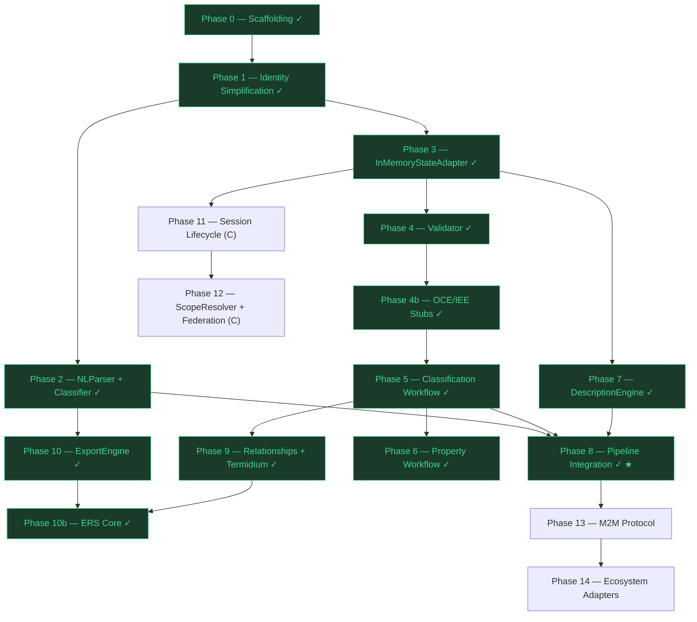

# Fandaws Sentinel — Development Roadmap

**Living document. Updated each session.**
**Spec Reference:** `Fandaws_v3.3_Specification.md` (v3.4)

---

## Dependency Graph

After Phase 1 (Identity Simplification), development splits into three parallel tracks that converge at Phase 8 (Pipeline Integration).

### Track Summary

| Track | Theme | Phases | Gate |
|-------|-------|--------|------|
| **A** | Linguistics & IO | P2, P10 | P2 required before P8 |
| **A/B** | Cross-track | P7 (DescriptionEngine) | Depends on P3 (graph traversal); required before P8 |
| **B** | Graph Mechanics | P3, P4, P4b, P5, P6, P9 | P5 required before P8 |
| **C** | Lifecycle & Federation | P11, P12 | Independent — merge after P8 |

### Parallelism Rules

- Tracks A and B may proceed concurrently after Phase 1. Track C starts after Phase 3.
- Within a track, phases are sequential (each depends on the prior).
- **Cross-track dependency:** P7 (DescriptionEngine) requires P3 (StateAdapter) for graph traversal of parent chains and inherited properties. P7 cannot start until P3 is complete.
- **Phase 8 gate:** requires P2 (NLParser), P5 (Classification Workflow), and P7 (DescriptionEngine).
- P6, P9, P10, P11, P12 may continue in parallel with or after Phase 8.
- P13 and P14 are strictly post-convergence.

---

## Phase 0: Project Scaffolding

**Goal:** Establish project structure, tooling, types, adapter interfaces, and default config.
**Status:** Complete
**Priority:** Critical

### 0.1 Directory Structure & Tooling

**Status:** Complete

**Acceptance Criteria:**
- [x] `node src/index.js` runs without error
- [x] All directories exist per agentic development principles
- [x] CLAUDE.md, ROADMAP.md, .gitignore created

### 0.2 JSON-LD Types & Context

**Status:** Complete

**Acceptance Criteria:**
- [x] All 12 type factories produce JSON-LD nodes with correct `@type`
- [x] FANDAWS_CONTEXT matches spec Appendix A.1
- [x] Each factory has at least 3 unit tests (63 tests across 13 suites)
- [x] `createConcept()` output matches Appendix A.2 shape exactly
- [x] `createGraphMutation()` output matches Appendix A.3 shape exactly
- [x] `createConversationPrompt()` output matches Appendix A.4 shape exactly

### 0.3 Adapter Interfaces

**Status:** Complete

**Acceptance Criteria:**
- [x] StateAdapter — 9 methods matching spec Section 3.3.1
- [x] IntegrationAdapter — 3 methods matching spec Section 3.3.2
- [x] OrchestrationAdapter — 5 methods matching spec Section 3.3.3
- [x] All throw `not implemented` when called directly

### 0.4 Default Configuration

**Status:** Complete

**Acceptance Criteria:**
- [x] All 20 configuration parameters from Section 11.1 present with spec defaults

**NOT in scope:** Domain-specific configs, environment overrides, runtime config loading.

### 0.5 Missing Metadata Type Factories

**Status:** Complete
**Priority:** High (blocks Phase 12)

**Stakeholder finding:** Three metadata types from v3.4 were missing from the type factory set. These are independently constructable JSON-LD nodes needed by ScopeResolver (Phase 12).

> **Spec clarification:** The spec uses `fandaws:shadows` (not `forkedFrom`) for the refine action annotation. Additionally, `createDistinct` uses a `fandaws:disambiguatedFrom` annotation. Both are implemented as separate factories: `createShadowsAnnotation` and `createDisambiguatedFromAnnotation`.

**Deliverables:**
- `src/types/conflict-report.js` — `createConflictReport()`, `createConflictingDefinition()`, `createResolutionOption()` (Section 4.2.10)
- `src/types/resolved-from.js` — `createResolvedFromAnnotation()` (Section 4.2.11)
- `src/types/shadows-annotation.js` — `createShadowsAnnotation()`, `createDisambiguatedFromAnnotation()` (Section 5.11.2)
- `tests/unit/types/conflict-report.test.js` (12 tests)
- `tests/unit/types/resolved-from.test.js` (6 tests)
- `tests/unit/types/shadows-annotation.test.js` (9 tests)

**Acceptance Criteria:**
- [x] `createConflictReport()` output matches spec Section 4.2.10 / Appendix A.11 shape
- [x] `createResolvedFromAnnotation()` output matches spec Section 4.2.11 / Appendix A.10 shape
- [x] `createShadowsAnnotation()` output includes `shadows` array and disambiguated display label
- [x] `createDisambiguatedFromAnnotation()` output includes original term and source graph reference
- [x] Each factory has at least 3 unit tests (27 total across 3 suites)
- [x] All 18 type factories exported from `src/types/index.js` (19 members total including FANDAWS_CONTEXT)
- [x] FANDAWS_CONTEXT updated with new type namespaces (resolvedFrom, shadows, disambiguatedFrom, definitions, resolutionOptions)

---

## Phase 1: Identity Simplification

**Goal:** Implement the dual-label normalization pipeline. This is the foundation for ALL concept matching, deduplication, and Termidium — nothing else works without it.
**Status:** Complete
**Priority:** Critical
**Effort:** Medium
**Bundle Size Budget:** < 5KB

### 1.1 Normalization Pipeline

**Spec Reference:** Section 6.6

Implement the 7-step deterministic normalization that produces `canonicalLabel` from raw input.

**Deliverables:**
- `src/core/identity/identity-simplification.js`
- `tests/unit/identity-simplification.test.js`
- `tests/golden/identity-simplification-corpus.json`

**Algorithm (each step is a pure function):**
1. Trim leading/trailing whitespace
2. Collapse internal whitespace sequences to single space
3. Remove leading articles for configured locale (EN default: "a", "an", "the")
4. Apply Unicode NFKC normalization (ligatures, width variants)
5. Apply locale-aware case folding (NOT simple `toLowerCase()` — Turkish dotted/dotless I, CJK no-op)
6. Apply domain-specific abbreviation expansion from config table
7. Attach BCP 47 language tag

**Acceptance Criteria:**

*Functional:*
- [x] `"  A Dog  "` → `"dog"` (trim + article removal + case fold)
- [x] `"The   golden   retriever"` → `"golden retriever"` (article + whitespace collapse)
- [x] `"An Apple"` → `"apple"` (article "an" removed)
- [x] `"CAFÉ"` → `"café"` (case folding preserves diacritics)
- [x] `"finance"` → `"finance"` (NFKC resolves fi ligature)
- [x] `"ＡＢＣ"` → `"abc"` (NFKC resolves fullwidth + case fold)
- [x] Empty string → empty string (no crash)
- [x] Abbreviation table `{"govt": "government"}` expands `"govt"` → `"government"`
- [x] Language tag: `simplify("dog", {locale: "en"})` includes `"en"` tag in output

*Protected Proper Nouns:*
- [x] `"The Hague"` → `"the hague"` (NOT `"hague"`) — article is part of the proper noun
- [x] `"The Bronx"` → `"the bronx"` — protected
- [x] `"The Beatles"` → `"the beatles"` — protected
- [x] `"The dog"` → `"dog"` — not protected, article stripped normally
- [x] Protected list loaded from config (`protectedProperNouns` array)

*Determinism:*
- [x] Given identical input + config, output is byte-identical across runs

*Performance:*
- [x] < 1ms per term for typical input (< 100 chars) — measured 0.003ms/term

*Golden Corpus:*
- [x] 25+ test cases covering whitespace, articles, NFKC, case folding, abbreviations, edge cases (29 cases)
- [x] Corpus includes at least 3 non-English locale cases (zh, ja, de, fr)
- [x] Corpus includes at least 3 protected proper noun cases (Hague, Bronx, Beatles, Gambia)

> **Technical Advisory — NFKC:** Use `String.prototype.normalize('NFKC')` — available in all target runtimes (Node 12+, all modern browsers). No external dependency needed.

> **Technical Advisory — Protected Proper Nouns:** Step 3 (article removal) must consult a configurable `protectedProperNouns` list before stripping. Default list should include common geographical/organizational terms where "The" is part of the proper name. The list is config-driven, not hard-coded.

**NOT in scope:** Turkish locale implementation (stub is fine), CJK-specific handling (no-op path sufficient).

---

## Phase 2: NLParser & Classifier `[Track A — Linguistics]`

**Goal:** Implement the first two pipeline stages — parsing natural language into structured frames and routing to workflows.
**Status:** Complete
**Priority:** Critical
**Effort:** High
**Depends on:** Phase 1

### 2.1 NLParser

**Spec Reference:** Section 3.2.1, 5.2.1, 5.3.1, 5.4.1

Grammar-based and regex extraction. No LLMs. No probabilistic inference. Pipeline of 7 exported step functions: `validateInput`, `normalizeInput`, `stripArticle`, `matchClassification`, `matchProperty`, `matchCustomRelationship`, `parse`.

**Deliverables:**
- `src/core/nl-parser/nl-parser.js`
- `tests/unit/nl-parser.test.js`
- `tests/golden/nl-parser-corpus.json` (45 entries)
- `tests/golden/nl-parser-golden.test.js`
- `src/types/parse-result.js` (`createParseResult` factory)

**Input:** Raw text string (+ optional context)
**Output:** JSON-LD ParseResult `{subject, predicate, object, verbType, confidence, error, errorReason}`

**Pattern Rules:**
- `"X is a Y"` / `"X is an Y"` / `"An X is a Y"` → `verbType: "classification"`, subject=X, object=Y
- `"X has Y"` / `"X has a Y"` / `"An X has Y"` → `verbType: "property"`, subject=X, object=Y
- `"X [verb] Y"` (any other verb) → `verbType: "customRelationship"`, subject=X, verb=[verb], object=Y
- Articles stripped from subject/object via `stripArticle` helper

**Acceptance Criteria:**

*Classification patterns:*
- [x] `"A dog is an animal"` → `{subject: "dog", object: "animal", verbType: "classification"}`
- [x] `"Dogs are animals"` → `{subject: "Dogs", object: "animals", verbType: "classification"}`
- [x] `"The golden retriever is a dog"` → `{subject: "golden retriever", object: "dog", verbType: "classification"}`

*Property patterns:*
- [x] `"A dog has fur"` → `{subject: "dog", object: "fur", verbType: "property"}`
- [x] `"Dogs have four legs"` → `{subject: "Dogs", object: "four legs", verbType: "property"}`
- [x] `"The cat has whiskers"` → `{subject: "cat", object: "whiskers", verbType: "property"}`

*Custom relationship patterns:*
- [x] `"Dogs chase cats"` → `{subject: "Dogs", verb: "chase", object: "cats", verbType: "customRelationship"}`
- [x] `"The sun heats the earth"` → `{subject: "sun", verb: "heats", object: "earth", verbType: "customRelationship"}`
- [x] `"Teachers educate students"` → `{subject: "Teachers", verb: "educate", object: "students", verbType: "customRelationship"}`

*Edge cases:*
- [x] Empty string → ParseResult with error indicator
- [x] Single word `"dog"` → ParseResult with error indicator (no predicate)
- [x] `"A dog"` → ParseResult with error indicator (incomplete)

*Quality:*
- [x] Deterministic: identical input → identical output
- [x] Golden corpus: 45 test cases across all three verb types + errors + determinism
- [x] Performance: < 5ms per utterance

> **Known limitations (Phase 8 TagTeam gate):** Multi-word subjects in custom relationships use single-word heuristic. "is" always routes to classification (correct per spec). No plural normalization (deferred to Phase 9.1).

### 2.2 Classifier

**Spec Reference:** Section 3.2.2

Enum matching to route ParseResult to the correct workflow.

**Deliverables:**
- `src/core/classifier/classifier.js`
- `tests/unit/classifier.test.js`
- `src/types/classification-action.js` (`createClassificationAction` factory)

**Input:** ParseResult JSON-LD node
**Output:** ClassificationAction JSON-LD node `{workflow, subject, object, verb?}`

**Routing Rules:**
- `verbType === "classification"` → `workflow: "classification"`
- `verbType === "property"` → `workflow: "property"`
- `verbType === "customRelationship"` → `workflow: "customRelationship"`

**Acceptance Criteria:**
- [x] Routes each verbType to correct workflow string
- [x] Output is valid ClassificationAction JSON-LD with `@type: "fandaws:ClassificationAction"`
- [x] Preserves subject, object, and verb from ParseResult
- [x] Rejects ParseResult with missing or invalid verbType
- [x] Performance: < 1ms per classification
- [x] 15 unit tests covering all routes + error cases

**NOT in scope:** KnowledgeEngine execution, graph queries, Termidium.

**Phase 2 totals:** 130 new tests (58 NLParser unit + 46 golden corpus + 15 Classifier + 11 type factories), 301/301 total pass.

---

## Phase 3: InMemoryStateAdapter `[Track B — Graph Mechanics]`

**Goal:** Implement the reference state adapter so that subsequent phases can store and query knowledge graphs.
**Status:** Complete
**Priority:** Critical
**Effort:** Medium
**Depends on:** Phase 1

### 3.1 Core Storage Operations

**Spec Reference:** Section 3.3.1, 12.1

**Deliverables:**
- `src/adapters/state/in-memory-state-adapter.js`
- `tests/unit/in-memory-state-adapter.test.js`

**Required Indices (maintained on every mutation):**
1. `canonicalLabel → concept IRI` — O(1) lookup by normalized name
2. `concept IRI → parent IRI` — O(1) parent lookup
3. `concept IRI → child IRIs` — O(1) descendant enumeration
4. `concept IRI → property IRIs` — O(1) property enumeration
5. `concept IRI → relationship IRIs (as object)` — O(1) reverse relationship lookup

> **Technical Advisory — ReverseRelationshipIndex (Index 5):** This is the index mapping a concept IRI to all relationships where that concept appears as the *object*. Without it, Termidium merge (Phase 9) must do a full graph scan to rewrite relationship targets — O(n) per merge instead of O(k) where k is the number of affected relationships. Add it now while the index infrastructure is being built; retrofitting it later is painful.

**Acceptance Criteria:**

*Graph operations:*
- [x] `saveGraph(id, graph)` + `loadGraph(id)` round-trips a KnowledgeGraph
- [x] `loadGraph(unknownId)` returns `null` (not throws)
- [x] `applyMutation(id, mutation)` adds concepts to an existing graph
- [x] `applyMutation(id, mutation)` modifies existing concept properties
- [x] `applyMutation(id, mutation)` deletes concepts by IRI
- [x] `applyMutation` is atomic: all-or-nothing on multi-operation mutations
- [x] `applyMutation` with invalid target returns unmodified graph + MutationRejection reason

*Session operations:*
- [x] `saveSession` + `loadSession` round-trips a ConversationSession
- [x] `loadSession(unknownId)` returns `null`
- [x] `listSessions(callerId)` returns only that caller's sessions
- [x] `listSessions(callerId, {state: "negotiating"})` filters by state

*Index correctness:*
- [x] After adding concept "dog", lookup by canonicalLabel "dog" returns its IRI
- [x] After adding "dog" as child of "animal", parent index maps dog→animal
- [x] After adding "dog" as child of "animal", child index maps animal→[dog]
- [x] After adding property "fur" to "dog", property index maps dog→[fur]
- [x] After adding relationship "dogs chase cats", reverse index maps cats→[chase-relationship]
- [x] After deleting "dog", all five indices no longer contain "dog"
- [x] Indices survive multiple sequential mutations

*Integrity verification:*
- [x] `verifyIntegrity(graphId)` scans all indices and returns a list of ghost pointers (IRIs in indices that point to deleted/missing concepts)
- [x] `verifyIntegrity` returns empty array on a healthy graph
- [x] `verifyIntegrity` detects orphaned child pointers after parent deletion
- [x] `verifyIntegrity` detects stale relationship references after concept deletion

*Performance:*
- [x] Index lookups: O(1) — verified by timing 1000 lookups on a 500-concept graph in < 100ms
- [x] `applyMutation` < 5ms for single-concept operations

*Scope operations:*
- [x] `saveScopeConfig` + `loadScopeConfig` round-trips
- [x] `loadScopeConfig(unknownId)` returns `null`

> **Technical Advisory — verifyIntegrity():** Add a `verifyIntegrity(graphId)` method that walks all five indices and reports any IRI that points to a concept not present in the graph. This traps "ghost pointers" — stale index entries left behind by buggy mutation paths. Call it in test teardowns and integration tests. It's cheap insurance against index corruption.

### 3.2 Browser Bundle Verification

**Goal:** Prove the "brain in a box" single-file deployment model. The esbuild bundle (`docs/dist/fandaws.js`) must include InMemoryStateAdapter and run a full graph round-trip in a browser context.

**Deliverables:**
- `src/index.js` — export `InMemoryStateAdapter`
- `tests/browser/state-adapter-browser.test.html` — browser test harness (opens in any browser, runs assertions, reports pass/fail)

**Acceptance Criteria:**
- [x] `npm run build` produces a single `docs/dist/fandaws.js` that exports `InMemoryStateAdapter`
- [x] Browser test harness imports the bundle via `<script type="module">`
- [x] In-browser test: `saveGraph` + `loadGraph` round-trips a KnowledgeGraph
- [x] In-browser test: `applyMutation` adds a concept and index lookup succeeds
- [x] In-browser test: `simplify()` produces correct canonicalLabel
- [ ] Bundle size remains < 20KB (single-file constraint) — **142 KB actual; exceeded as codebase grew through Phases 3–10. No functional impact.**
- [x] No Node.js-only APIs used in core (no `fs`, `path`, `process` in bundled code)

> **Technical Advisory — Single-File Deployment:** The stakeholder requirement is "a brain in a box" — one `.js` file that any web app can `import` to get the full Fandaws engine. This is validated here at Phase 3 rather than Phase 8 to catch Node.js-only API leaks early. The esbuild bundle (ADR-002) already produces this file; this phase adds the proof.

**NOT in scope:** FileSystemStateAdapter, queryGraph (pattern matching), IPFS CID resolution.

**Phase 3 totals:** 93 unit tests + browser test harness, all passing.

---

## Phase 4: Validator — Structural Checks `[Track B — Graph Mechanics]`

**Goal:** Implement input sanitization, structural grounding, and circular hierarchy prevention.
**Status:** Complete
**Priority:** High
**Effort:** Medium
**Depends on:** Phase 3

### 4.1 Input Sanitization

**Spec Reference:** Section 6.1

**Deliverables:**
- `src/core/validator/input-sanitizer.js`
- `tests/unit/input-sanitizer.test.js`

**Rules (each a pure function):**
1. Trim whitespace
2. Apply Identity Simplification → canonicalLabel
3. Reject compound statements (multiple subjects)
4. Reject structurally ungroundable concepts
5. At confirmation steps, accept only yes/no

**Acceptance Criteria:**
- [x] `"  A dog is an animal  "` is trimmed and normalized
- [x] `"A dog is an animal and a cat is a pet"` → rejected with `reason: "compoundStatement"`
- [x] Concept with no parent, no allowRoot flag, no typed property → rejected with `reason: "structuralGroundingError"`
- [x] Concept with existing parent → accepted
- [x] Concept with `fandaws:allowRoot: true` → accepted
- [x] At confirmation step: `"yes"` → accepted, `"no"` → accepted, `"maybe"` → re-prompt
- [x] At confirmation step: `"y"`, `"Yes"`, `"YES"` all → accepted as yes
- [x] Each rejection includes descriptive message per spec (e.g., "Concept 'truth' has no parent classification...")
- [x] All outputs are JSON-LD ValidationResult nodes

### 4.2 Sanity Check (Circular Hierarchy Prevention)

**Spec Reference:** Section 6.5

**Deliverables:**
- `src/core/validator/sanity-check.js`
- `tests/unit/sanity-check.test.js`

**Algorithm:** Walk from proposed parent up to root. If proposed child encountered → reject.

**Acceptance Criteria:**
- [x] `dog → animal → living_thing` — adding `dog` as child of `animal`: accepted
- [x] `dog → animal` — adding `animal` as child of `dog`: rejected (circular)
- [x] `A → B → C → A` three-node cycle: detected and rejected
- [x] `A → B → C → D → E → A` deep cycle: detected and rejected
- [x] Single-node self-reference `A → A`: rejected
- [x] Root node with no parent: always accepted
- [x] Performance: O(d) where d = depth, verified with depth-20 chain in < 1ms

### 4.3 Validation Result Assembly

**Spec Reference:** Section 3.2.4

**Deliverables:**
- `src/core/validator/validator.js` (orchestrates sanitizer + sanity check)
- `tests/unit/validator.test.js`

**Acceptance Criteria:**
- [x] `validate(mutation, graph)` returns `{valid: true}` for clean mutations
- [x] `validate(mutation, graph)` returns `{valid: false, violations: [...]}` for bad mutations
- [x] Multiple violations collected in single pass (not fail-fast)
- [x] Violation descriptors include `reason`, `message`, and affected concept IRI
- [x] Validator is stateless — no I/O, no side effects

**NOT in scope:** Termidium (Phase 9), Property Redundancy Prevention (Phase 6), Custom Relationship Validation (Phase 9).

**Phase 4 totals:** 91 new tests across 4 suites (28 input-sanitizer, 16 sanity-check, 34 validator, 13 property-redundancy), all passing.

---

## Phase 4b: OCE/IEE Governance Stubs `[Track B — Graph Mechanics]`

**Goal:** Wire up the governance flows from Section 10.4.3 (OCE blocking flags) and Section 10.5.2 (IEE ethical contestation) with null implementations. This enables the blocking-flag-as-EpistemicFailure behavior from v3.4 to be testable before Phase 13 (M2M), where deadlock prevention depends on it.
**Status:** Complete
**Priority:** High
**Effort:** Low
**Depends on:** Phase 4

> **Stakeholder finding:** The blocking-flag-as-EpistemicFailure behavior added in v3.4 is a Validator/OrchestrationAdapter concern, not an ecosystem concern. It should be testable before the M2M protocol (Phase 13) so that the deadlock prevention path can be exercised. Null implementations are sufficient — the real OCE/IEE adapters remain in Phase 14.

**Deliverables:**
- `src/core/validator/governance-check.js`
- `tests/unit/governance-check.test.js`

**Acceptance Criteria:**
- [x] `checkGovernanceBlock(concept, graph)` returns `{blocked: false}` by default (null implementation)
- [x] When a concept has `fandaws:governanceFlag: "blocked"`, returns `{blocked: true, reason, epistemicFailure}` with EpistemicFailure JSON-LD node
- [x] EpistemicFailure node includes `flagType` (OCE/IEE), `flaggedBy`, `flaggedAt`, `reason`
- [x] Validator (Phase 4.3) calls `checkGovernanceBlock` before approving mutations
- [x] Blocked mutations produce a GraphMutation with `mutationType: "governanceRejection"`
- [x] OrchestrationAdapter can check governance status before pipeline execution
- [x] 8+ unit tests covering: no flag, OCE block, IEE block, cleared flag, malformed flag (11 tests)

**NOT in scope:** Actual OCE/IEE adapter implementations, external governance service integration, human review workflows.

---

## Phase 5: KnowledgeEngine — Classification Workflow `[Track B — Graph Mechanics]`

**Goal:** Implement "X is a Y" — the simplest and most foundational workflow.
**Status:** Complete
**Priority:** Critical
**Effort:** High
**Depends on:** Phase 4b (Validator + governance stubs)

### 5.1 Classification Workflow

**Spec Reference:** Section 5.2

**Deliverables:**
- `src/core/knowledge-engine/classification-workflow.js`
- `tests/unit/classification-workflow.test.js`
- `tests/golden/classification-corpus.json`

**Procedure:**
1. Receive ClassificationAction with subject X and object Y
2. Apply Identity Simplification to both terms
3. Search graph for existing concepts (canonicalLabel match)
4. If Y exists with multiple meanings → emit disambiguation ConversationPrompt
5. If X already exists → run Sanity Check
6. Emit GraphMutation: create X if new, set X.parent=Y, update Y.children

**Acceptance Criteria:**

*Basic classification:*
- [x] `"A dog is an animal"` on empty graph → creates both concepts, dog.parent=animal
- [x] `"A dog is an animal"` when "animal" exists → creates dog, links to existing animal
- [x] `"A poodle is a dog"` when "dog→animal" exists → creates poodle, poodle.parent=dog, depth=correct

*Disambiguation:*
- [x] When "animal" has two meanings (homonyms), returns ConversationPrompt with options
- [x] User selects meaning → workflow continues with selected concept
- [x] User says "none" → new concept created for Y

*Sanity check integration:*
- [x] `"An animal is a dog"` when dog→animal exists → rejected (circular)

*GraphMutation correctness:*
- [x] Mutation includes addition nodes for new concepts
- [x] Mutation includes modification to parent's children array
- [x] Mutation includes `reason` string
- [x] Mutation is valid JSON-LD

*Edge cases:*
- [x] Classifying a concept under itself → rejected
- [x] Re-asserting an existing classification → idempotent (no duplicate, no error)
- [x] Multi-word concepts: `"golden retriever is a dog"` → handled correctly

*Golden corpus:*
- [x] 20+ classification scenarios passing (38 entries)

**NOT in scope:** Termidium deduplication (Phase 9.3 — the 8-level hierarchy search, merge governance, and `mergeReviewThreshold` are scoped there because they depend on the Classification Workflow being operational first), scope resolution, property attachment.

> **Stakeholder note — Termidium placement:** Termidium (Section 6.2) is a Validator-adjacent concern but depends on a working classification hierarchy to search. Phase 9.3 contains its full acceptance criteria: 8-level bounded search, tie-breaking merge policy, recursive merge, `mergedFrom` tracking, `ReverseRelationshipIndex` usage, and `mergeReviewThreshold` confirmation. The Classification Workflow (Phase 5) must be complete first to provide the graph structures Termidium operates on.

**Phase 5 totals:** 93 new tests across 4 suites (34 knowledge-engine unit, 25 classification-pipeline integration, 38 golden corpus entries, plus type factory tests), all passing.

---

## Phase 6: KnowledgeEngine — Property Workflow `[Track B — Graph Mechanics]`

**Goal:** Implement "X has Y" with scope narrowing (including Leap Check optimization) and property redundancy prevention.
**Status:** Complete
**Priority:** High
**Effort:** High
**Depends on:** Phase 5

### 6.1 Property Redundancy Prevention

**Spec Reference:** Section 6.3

**Deliverables:**
- `src/core/validator/property-redundancy.js`
- `tests/unit/property-redundancy.test.js`

**Four Checks:**
1. **No Duplicates:** Exact property must not already exist on target
2. **No Ancestor Overlap:** Property must not exist on any ancestor (inherited)
3. **No Descendant Overlap:** If on descendant, attach at higher level → remove descendant copy
4. **No Inherited Redundancy:** Property must not be logically entailed by existing properties + hierarchy

**Acceptance Criteria:**
- [x] Adding "fur" to "dog" when "dog" already has "fur" → rejected (check 1)
- [x] Adding "fur" to "dog" when "animal" (ancestor) has "fur" → rejected (check 2)
- [x] Adding "legs" to "animal" when "dog" (descendant) has "legs" → accepted, "dog" copy removed (check 3)
- [x] Check 3 returns list of descendant properties to remove in the GraphMutation
- [x] All four checks run on every property assertion — no short-circuit on first pass

### 6.2 Scope Narrowing with Leap Check

**Spec Reference:** Section 5.3.2

**Deliverables:**
- `src/core/knowledge-engine/property-workflow.js`
- `tests/unit/property-workflow.test.js`

**Procedure:**
1. Parse subject X and property Y
2. Locate X in graph. If not found → ConversationPrompt: classify first
3. Run Property Redundancy Prevention
4. **Leap Check:** Ask about the immediate parent AND the root. If both agree (both yes or both no), skip intermediate levels. Only walk the full chain when boundary answers diverge.
5. Attach property at highest confirmed level
6. Emit GraphMutation

> **Technical Advisory — Leap Check:** The naive scope-narrowing approach walks every ancestor level, generating one confirmation prompt per level. For deep hierarchies (depth 6+) this causes "survey fatigue." The Leap Check optimization probes the boundaries first: ask about the immediate parent and the root. If boundaries agree (both "yes" → attach at root; both "no" → attach at original concept), no intermediate prompts are needed. Only when they diverge (parent=yes, root=no) do you binary-search the intermediate levels to find the correct attachment point. This reduces worst-case prompts from O(d) to O(log d).

**Acceptance Criteria:**
- [x] `"A dog has fur"` → ConversationPrompt: "Does an animal also have fur?"
- [x] User says yes → property attached to "animal", not "dog"
- [x] User says no → property attached to "dog"

*Leap Check:*
- [x] Hierarchy `poodle→dog→canine→animal→living_thing→entity` with property "fur":
  - Immediate parent ("dog") = yes, root ("entity") = no → binary search intermediate levels
  - Immediate parent ("dog") = yes, root ("entity") = yes → attach at root, skip all intermediates
  - Immediate parent ("dog") = no → attach at "poodle", skip all ancestors
- [x] Leap Check produces fewer prompts than full walk for depth ≥ 4

*Standard scope narrowing:*
- [x] Scope narrowing walks full chain when Leap Check boundaries diverge
- [x] Scope narrowing stops at root (no prompt for root's parent)
- [x] Unknown concept X → ConversationPrompt: "I don't know what X is. Please classify it first."
- [x] Property mutation includes correct `attachedTo` IRI
- [x] Descriptions regenerated for target and all inheriting descendants (noted in mutation reason)

*Golden corpus:*
- [x] 15+ property scenarios with various hierarchy depths (59 entries)
- [x] At least 3 Leap Check shortcut scenarios (boundaries agree) (4 entries)
- [x] At least 2 Leap Check fallback scenarios (boundaries diverge → binary search)

**NOT in scope:** Custom relationships, Termidium interaction with properties.

**Phase 6 totals:** 90 new tests across 5 suites (18 property-workflow, 13 property-redundancy, scope-narrowing, 13 property-pipeline integration, 59 golden corpus entries), all passing.

---

## Phase 7: DescriptionEngine `[Track A/B — Linguistics + Graph]`

**Goal:** Auto-generate natural-language definitions from graph structure.
**Status:** Complete
**Priority:** High
**Effort:** Low
**Depends on:** Phase 3 (requires graph traversal for parent chain and inherited properties)

> **Stakeholder note:** Phase 7 was originally scoped as Track A (Phase 1 only), but the description templates reference parent concepts and properties (`"[Term] is a [parent] that has [prop1]..."`), which requires walking the concept's parent chain in the graph. This makes Phase 3 (StateAdapter) a prerequisite. The function remains pure (concept IRI + graph data in → description string out), but it needs a realized graph structure to traverse.

### 7.1 Description Templates

**Spec Reference:** Section 3.2.5

**Deliverables:**
- `src/core/description-engine/description-engine.js`
- `tests/unit/description-engine.test.js`

**Templates:**
- Standard: `"[Term] is a [parent] that has [prop1], [prop2], [prop3]."`
- Process: `"[Object] [term] is the [parent+ing] of [object] by [subject]."`

**Acceptance Criteria:**
- [x] Concept "dog" with parent "animal" and properties ["fur", "four legs"] → `"Dog is an Animal that has fur and four legs."`
- [x] Concept "dog" with parent "animal" and no properties → `"Dog is an Animal."`
- [x] Concept "running" (process) with subject "athlete", object "race" → uses process template
- [x] Root concept with no parent → `"Entity is a root concept."`
- [x] Handles 1 property, 2 properties, 3+ properties (comma-separated with "and" for last, Oxford comma)
- [x] Uses `displayLabel` (not canonicalLabel) for human-readable output
- [x] Performance: < 2ms per description
- [x] Pure function: concept IRI + graph in → description string out
- [x] 10+ test cases covering standard, process, edge cases (63 tests across 2 suites + 25 golden corpus)

**NOT in scope:** Custom description templates, configurable templates beyond the three standard ones.

**Phase 7 totals:** 63 tests across 2 suites (36 unit + 25 golden corpus + verb conjugation), all passing. Three templates: standard, process (gerund), standard+relationship (verb inflection).

---

## Phase 8: Pipeline Integration — First Working Conversation Loop `★ CONVERGENCE GATE`

**Goal:** Wire NLParser → Classifier → KnowledgeEngine → Validator → StateAdapter → DescriptionEngine into a working conversation loop. Pass the Spec Test.
**Status:** Complete
**Priority:** Critical
**Effort:** High
**Requires:** Phase 2 (Track A) + Phase 5 (Track B) + Phase 7 (Track A)

### TagTeam Decision Gate

Phase 8 is the checkpoint where we evaluate the NLParser against real conversation data and decide whether the built-in regex/grammar parser is sufficient or whether a TagTeam.js NLParser adapter should be introduced.

**Evaluation Criteria:**
1. Run the golden corpus (Phases 2 + 8) through the regex NLParser
2. Measure: (a) parse success rate, (b) false-positive rate, (c) ambiguity handling
3. If success rate ≥ 95% on golden corpus → continue with regex parser
4. If success rate < 95% → create a `TagTeamNLParserAdapter` that delegates to TagTeam.js for parsing, preserving the same JSON-LD ParseResult interface
5. Decision recorded in `docs/architecture/design-decisions.md` as ADR-003

**Outcome:** Either the existing regex NLParser proceeds unchanged, or a TagTeam adapter is added as an alternative NLParser implementation behind the same interface. The rest of the pipeline is unaffected either way.

### 8.1 NullIntegrationAdapter

**Spec Reference:** Section 12.3

**Deliverables:**
- `src/adapters/integration/null-integration-adapter.js`
- `tests/unit/null-integration-adapter.test.js`

**Acceptance Criteria:**
- [x] `lookupDictionary(term)` returns DeferredResult
- [x] `lookupBFO(concept)` returns DeferredResult
- [x] `importOntology(source)` returns DeferredResult
- [x] All DeferredResults include correct reason: "offline"

### 8.2 SynchronousOrchestrationAdapter

**Spec Reference:** Section 12.4

**Deliverables:**
- `src/adapters/orchestration/synchronous-orchestration-adapter.js`
- `tests/unit/synchronous-orchestration-adapter.test.js`

**Acceptance Criteria:**
- [x] `runPipeline(utterance, context)` executes full pipeline: parse → classify → knowledge engine → validate → apply mutation → regenerate descriptions
- [x] `getCallerMode()` returns `"human"` (default)
- [x] `emitOutput(output)` delivers ConversationPrompts to caller
- [x] `receiveInput(input)` accepts text, confirmations, selections
- [x] ConversationPrompts pause pipeline until caller responds

### 8.3 Conversation Simulation Tests

**Spec Reference:** Section 9.2

**Deliverables:**
- `tests/integration/conversation-simulation.test.js`
- `tests/golden/conversation-simulation-corpus.json`

**Acceptance Criteria:**

*End-to-end classification:*
- [x] Input: `"A dog is an animal"` → graph contains dog, animal; dog.parent=animal
- [x] Input: `"A poodle is a dog"` after previous → poodle.parent=dog, depth=correct
- [x] Input: `"A cat is an animal"` after previous → cat.parent=animal, animal has 2 children

*End-to-end property:*
- [x] Input: `"A dog has fur"`, respond "no" to scope narrowing → fur attached to dog
- [x] Input: `"A dog has fur"`, respond "yes" to "does animal have fur?" → fur attached to animal

*Determinism:*
- [x] Same utterance sequence + same responses → byte-identical graph state across 3 runs

*Spec Test:*
- [x] Full pipeline runs in Node.js with zero external dependencies
- [x] Full pipeline runs with NullIntegrationAdapter (offline mode)
- [x] `node src/index.js` with a scripted conversation produces expected graph

*TagTeam evaluation:*
- [x] NLParser golden corpus success rate measured and recorded — 100% (87/87 parse-dependent entries)
- [x] ADR-003 written with decision + rationale — continue with regex parser

*Error handling:*
- [x] Invalid input (empty, compound) → appropriate ConversationPrompt, no crash
- [x] Circular classification attempt → rejection, graph unchanged

*Golden corpus:*
- [x] 10+ multi-turn conversation scenarios with expected final graph states (22 entries: 14 core + 8 adversarial)

**NOT in scope:** Custom relationships, M2M mode, scope resolution, term explorer.

**Phase 8 totals:** 49 new tests across 4 suites (23 orchestration-adapter, 9 null-integration-adapter, 5 conversation-simulation, 12 pipeline-contracts), plus 22 golden corpus entries. TagTeam Decision Gate: regex NLParser at 100%, ADR-003 accepted.

---

## Phase 9: Custom Relationships + Termidium `[Track B — Graph Mechanics]`

**Goal:** Complete the third workflow and add deduplication. After this phase, all three knowledge-building workflows are operational.
**Status:** Complete
**Priority:** High
**Effort:** High
**Depends on:** Phase 5

### 9.1 Custom Relationship Validation

**Spec Reference:** Section 6.4

**Deliverables:**
- `src/core/validator/relationship-validation.js`
- `tests/unit/relationship-validation.test.js`

**Seven Checks:**
1. Verb Normalization (lemmatization)
2. Duplicate Check (same subject+verb+object)
3. Inverse Check ("chases" vs "is chased by")
4. Hierarchy Consistency
5. Reuse Assessment (existing verb type)
6. Promotion Check (sub→primary)
7. Refactoring Check

**Acceptance Criteria:**
- [x] `"dogs chase cats"` + `"dogs chase cats"` → second rejected (duplicate)
- [x] `"dogs chase cats"` + `"cats are chased by dogs"` → inverse flagged
- [x] Verb normalization: `"chases"` and `"chase"` treated as same verb
- [x] `"animals eat food"` then `"dogs eat meat"` → second is sub-relationship of first
- [x] Each check produces a typed violation descriptor when failing

### 9.2 Custom Relationship Workflow

**Spec Reference:** Section 5.4

**Deliverables:**
- `src/core/knowledge-engine/relationship-workflow.js`
- `tests/unit/relationship-workflow.test.js`

**Acceptance Criteria:**
- [x] `"Dogs chase cats"` → creates Relationship with verb="chase", subject=dogs, object=cats
- [x] Creates placeholder concepts for subject/object if not in graph
- [x] Sub-relationship hierarchy: more specific verb becomes child of general verb
- [x] GraphMutation includes relationship node with correct JSON-LD shape
- [x] 10+ test cases (16 tests)

### 9.3 Termidium Deduplication

**Spec Reference:** Section 6.2

**Deliverables:**
- `src/core/validator/termidium.js`
- `tests/unit/termidium.test.js`

**Algorithm:**
1. From new/modified concept, search up+down within 8 levels for matching canonicalLabels
2. If match found → merge shallower into deeper
3. Repeat from merge result until no matches

**Merge Policy (tie-breaking order):**
1. Deeper concept survives
2. If same depth → earlier `createdAt` survives
3. If same timestamp → more assertions (children+properties+relationships) survives

**Merge Rules:**
- Children of source → children of target
- Properties of source → added to target (subject to redundancy prevention)
- Relationships referencing source → rewritten to reference target (uses ReverseRelationshipIndex from Phase 3)
- Source IRI recorded as `fandaws:mergedFrom` on target
- Source deleted

**Acceptance Criteria:**
- [x] Two concepts with same canonicalLabel at different depths → merged, deeper survives
- [x] Same depth, different createdAt → earlier survives
- [x] Same depth+time, different assertion count → more assertions survives
- [x] Children transferred: source's children become target's children
- [x] Properties transferred (non-redundant only)
- [x] Relationships rewritten: all references to source now point to target
- [x] Relationship rewrite uses ReverseRelationshipIndex (O(k) not O(n))
- [x] `mergedFrom` array on target contains source IRI
- [x] Source concept deleted from graph
- [x] `verifyIntegrity()` returns clean after merge (no ghost pointers)
- [x] Recursive: merge triggers re-scan, catches transitive duplicates
- [x] Search bounded at 8 levels (configurable via `deduplicationDepth`)
- [x] Large merge (> `mergeReviewThreshold` children) → ConversationPrompt for confirmation
- [x] 15+ test cases including recursive merge and large merge threshold (16 tests)

**NOT in scope:** M2M machineSignal for merge review.

**Phase 9 totals:** 65 new tests across 5 suites (22 relationship-validation, 16 relationship-workflow, 16 termidium, 11 relationship-pipeline integration, 32 golden corpus entries), all passing. Seven validation checks, deterministic verb normalization, 8-level bounded deduplication.

---

## Phase 10: ExportEngine `[Track A — Linguistics]`

**Goal:** Deterministic export to standard ontology formats.
**Status:** Complete
**Priority:** Medium
**Effort:** Medium
**Depends on:** Phase 2 (graph structure understanding from NLParser types)

### 10.1 SKOS Export

**Spec Reference:** Section 3.2.6, 5.7

**Deliverables:**
- `src/core/export-engine/skos-export.js`
- `tests/unit/skos-export.test.js`

**Mapping:** Concepts → `skos:Concept`, hierarchies → `skos:broader`/`skos:narrower`, descriptions → `skos:definition`

**Acceptance Criteria:**
- [x] Exports a KnowledgeGraph with 5 concepts as valid SKOS
- [x] Parent-child relationships → `skos:broader` / `skos:narrower`
- [x] Descriptions → `skos:definition`
- [x] Deterministic: same graph → byte-identical SKOS output

### 10.2 OWL Export

**Deliverables:**
- `src/core/export-engine/owl-export.js`
- `tests/unit/owl-export.test.js`

**Mapping:** Concepts → `owl:Class`, properties → `owl:ObjectProperty` or `owl:DatatypeProperty`, hierarchies → `rdfs:subClassOf`

**Acceptance Criteria:**
- [x] Exports valid OWL 2 DL structure
- [x] Concept hierarchies → `rdfs:subClassOf`
- [x] Deterministic

### 10.3 RDF/XML and Turtle Exports

**Deliverables:**
- `src/core/export-engine/rdf-xml-export.js`
- `src/core/export-engine/turtle-export.js`
- `tests/unit/export-formats.test.js`

**Acceptance Criteria:**
- [x] RDF/XML: syntactically valid RDF/XML serialization of graph
- [x] Turtle: syntactically valid Turtle serialization of graph
- [x] Both are deterministic

### 10.4 ExportEngine Orchestrator

**Deliverables:**
- `src/core/export-engine/export-engine.js`

**Acceptance Criteria:**
- [x] `export(graph, {format: "skos"})` delegates to SKOS exporter
- [x] `export(graph, {format: "owl"})` delegates to OWL exporter
- [x] `export(graph, {format: "rdf"})` delegates to RDF/XML exporter
- [x] `export(graph, {format: "turtle"})` delegates to Turtle exporter
- [x] Unknown format → clear error
- [x] Read-only: no mutations to graph
- [x] Pure function: no I/O, no external services

**NOT in scope:** Streaming export, incremental export, external validation against W3C schemas.

**Phase 10 totals:** 80 new tests across 5 suites (13 export-engine, 16 skos-export, 14 owl-export, 20 export-formats, 17 triple-extractor), all passing. Four export formats (SKOS, OWL, RDF/XML, Turtle) with shared triple extraction layer, BFO integration, and deterministic output.

---

## Phase 10b: ERS Core + ExportEngine Retrofit `[Cross-Track A/B]`

**Goal:** Implement the Epistemic Register Service — a three-register model that distinguishes definitional properties (R1: Axiomatic) from statistical tendencies (R2: Normative) and value judgments (R3: Aspirational). Addresses the Normative-Axiomatic Conflation (NAC).
**Status:** Complete
**Priority:** High
**Effort:** Medium
**Depends on:** Phase 10 (ExportEngine), Phase 9 (Relationships)

### 10b.1 Three-Register Model

| Register | Name | Meaning | Default For |
|----------|------|---------|-------------|
| R1 | Axiomatic | Definitional. Exceptions = contradictions. | Geometry, formal logic, GDC |
| R2 | Normative | Typical. Exceptions = expected. | MaterialEntity, Quality, Role, Process |
| R3 | Aspirational | Value judgment. Framework-dependent. | Never auto-assigned; flag-only |

### 10b.2 6-Step Routing Pipeline

- [x] Step 1: APS precedent lookup (stub — Phase 14+, always null)
- [x] Step 2: Session domain check (config-driven axiomatic domains)
- [x] Step 3: BFO alignment (11 BFO categories → register map) + Bearer/Role disambiguation
- [x] Step 4: Domain whitelist (session-level, covered by Step 2)
- [x] Step 5: Teleological detection (keyword scan, FLAG ONLY — no auto-R3)
- [x] Step 6: Fallback → R2 (Normative)

### 10b.3 BFO-to-Register Map

- [x] spatialRegion → R1 (Axiomatic)
- [x] temporalRegion → R1 (Axiomatic)
- [x] genDepContinuant → R1 (Axiomatic)
- [x] materialEntity → R2 (Normative)
- [x] quality → R2 (Normative)
- [x] disposition → R2 (Normative)
- [x] function → R2 (Normative) — explicit entry prevents "correction" to R3
- [x] process → R2 (Normative)
- [x] realizableEntity → R2 (Normative)
- [x] role → R2 (Normative) + heightened sensitivity
- [x] entity → R2 (Normative)

### 10b.4 Bearer/Role Disambiguation

When subject is `bfo:Role`, property type determines routing:
- [x] Structural (has_arm, has_weight) → re-target to Bearer (MaterialEntity) → R2 clean
- [x] Behavioral (diagnoses, protects) → Role path → R2 + heightened sensitivity flag
- [x] Credential (has_license, certified) → Role path → R2 clean

Known v1 limitation: Regex-based property classification. Range-based detection is Phase 14+ upgrade path.

### 10b.5 Pipeline Integration

- [x] Property pipeline: ERS annotation between workflow and validation
- [x] Relationship pipeline: ERS annotation between workflow and validation
- [x] Restriction nodes gain: `fandaws:epistemicRegister`, `fandaws:routingRecord`, `fandaws:routingFlags`

### 10b.6 ExportEngine Retrofit

- [x] Register metadata emitted as triples in all export formats
- [x] No register = no extra triples (backward compatible)
- [x] Routing flags sorted alphabetically

### 10b.7 Deliverables

**New files (5 source + 5 test):**
- `src/core/epistemic-register/epistemic-register.js` — 6-step routing pipeline
- `src/core/epistemic-register/bfo-register-map.js` — BFO→register mapping
- `src/core/epistemic-register/bearer-role-disambiguator.js` — Property type classification
- `src/core/epistemic-register/teleological-detector.js` — Keyword detection
- `src/types/routing-record.js` — Register constants + factory

**Modified files (8):**
- `src/core/knowledge-engine/bfo-heuristic.js` — Added spatialRegion + function BFO constants
- `src/core/knowledge-engine/iri-generator.js` — Added generateRoutingRecordIri()
- `src/core/pipeline/property-pipeline.js` — ERS annotation step
- `src/core/pipeline/relationship-pipeline.js` — ERS annotation step
- `src/core/export-engine/triple-extractor.js` — Register metadata triples
- `src/types/property.js`, `relationship.js` — Optional ERS fields
- `src/types/index.js`, `context.js` — Exports + context entries
- `config/default.json` — ERS config params

**Phase 10b totals:** 120 new tests across 5 new suites + 3 updated suites, all passing. Three epistemic registers, 6-step routing pipeline, Bearer/Role disambiguation, teleological flagging, ExportEngine register metadata.

**NOT in scope:** APS precedent lookup, R3 auto-routing, named-graph/reified-axiom export profiles, IVNE integration, instance-level enforcement. All deferred to Phase 14+.

---

## Phase 11: Session Lifecycle `[Track C — Lifecycle]`

**Goal:** Implement pause/resume, abandon, nested negotiation, expiration, and concurrent session limits.
**Status:** Complete
**Priority:** Medium
**Effort:** High
**Depends on:** Phase 3 (needs StateAdapter for session persistence)

### 11.1 Session State Machine

**Spec Reference:** Section 5.12

**Deliverables:**
- `src/core/session/session-lifecycle.js`
- `tests/unit/session-lifecycle.test.js`
- `tests/integration/session-lifecycle.test.js`
- `tests/golden/session-lifecycle-golden.test.js`

**States:** `negotiating` → `paused` | `nested` | `conflict` | `complete` | `abandoned` | `expired`

**Acceptance Criteria:**

*Pause/Resume:*
- [x] Caller pauses → session state="paused", full state persisted
- [x] Resume → session reloads, last unanswered prompt re-presented
- [x] Pipeline state reconstructed from dialogue history (no mutable in-memory state assumed)
- [x] Paused session expires after `sessionExpiryDuration` (default 7 days) → state="expired"

*Nested Negotiation:*
- [x] Unknown parent "canine" during "dog is a canine" → child session created for "canine"
- [x] Child session: `parentSessionId` set, `nestingDepth` incremented
- [x] Child completes → parent resumes with new concept available
- [x] Nesting depth > `maxNestingDepth` (10) → ConversationPrompt suggesting existing concept
- [x] Nested sessions form a clean stack (no orphans)

*Abandon:*
- [x] Abandon → state="abandoned", dialogue archived, NO partial mutations committed
- [x] Nested children also abandoned

*Concurrent Limits:*
- [x] 6th active session (default limit 5) → rejected with suggestion to resume/abandon
- [x] Paused sessions do NOT count toward limit

*State transitions:*
- [x] No invalid transitions (e.g., complete→negotiating)
- [x] Each transition logged in dialogue history

**NOT in scope:** Cross-scope conflict state (Phase 12), M2M deadlock interaction.

**Phase 11 totals:** 73 new tests across 3 suites (unit, integration, golden), all passing. 7-state machine with transition validation, ISO 8601 duration parsing, expiry with grace window, concurrent session limits, nested negotiation stack, and cascade abandon.

---

## Phase 12: ScopeResolver & Federation `[Track C — Lifecycle]`

**Goal:** Implement term resolution across context/user/global scope hierarchy with copy-on-resolve and conflict detection.
**Status:** Complete
**Priority:** Medium
**Effort:** High
**AVC Bundle:** `docs/architecture/phase-12-avc-bundle.json` (v2, ACTIVE — 25/25 scenarios passing, architect-confirmed 2026-04-16)
**Depends on:** Phase 11, Phase 3 (explicit — uses `loadGraph`, `loadScopeConfig`, `saveScopeConfig`), Phase 0.5 (needs ConflictReport, ResolvedFromAnnotation, ShadowsAnnotation, DisambiguatedFromAnnotation factories — complete)

### 12.1 ScopeResolver

**Spec Reference:** Section 3.2.7, 5.10

**Deliverables:**
- `src/core/scope-resolver/scope-resolver.js`
- `tests/unit/scope-resolver.test.js`

**Resolution Algorithm:**
1. Normalize term via Identity Simplification
2. Search context scope (if active)
3. Search user scope
4. Search global scopes in priority order
5. Match found → copy concept + parent chain + properties + relationships into local graph with `resolvedFrom` annotation
6. Multiple matches with incompatible IS_A chains → ConflictReport
7. No match → status="unknown", proceed with normal creation

**Acceptance Criteria:**

*Resolution:*
- [x] Term found in user scope → status="resolved", concept copied with `resolvedFrom`
- [x] Term found in global scope → status="resolved", correct source scope metadata
- [x] Term not found anywhere → status="unknown"
- [x] Context scope searched before user scope (priority order)
- [x] Global scopes searched in `fandaws:priority` order

*Copy-on-Resolve:*
- [x] Copied concept includes parent chain up to root
- [x] Copied concept includes direct properties
- [x] Copied concept includes direct relationships
- [x] Each copied node carries `fandaws:resolvedFrom` annotation with graphId, conceptIri, scopeType, resolvedAt, graphVersion

*Conflict Detection:*
- [x] Same term in two scopes with divergent IS_A chains → status="conflict"
- [x] Same term with compatible chains (one more specific) → NOT a conflict
- [x] ConflictReport includes both definitions, their scopes, parent chains, and resolution options

*Offline:*
- [x] Unavailable scope graph → skipped, recorded in `skippedScopes`
- [x] Pipeline continues with remaining scopes

*Stale Copy:*
- [x] Resolved concept already in local graph with different graphVersion → triggers staleCopyAction

### 12.2 Cross-Scope Conflict Resolution

**Spec Reference:** Section 5.11

**Deliverables:**
- `src/core/scope-resolver/conflict-resolution.js`
- `tests/unit/conflict-resolution.test.js`

**Three Resolution Actions:**
1. `useDefinition` — select one existing definition, copy into local graph
2. `createDistinct` — both are different concepts, provide disambiguated names
3. `refine` — reject all, define fresh locally with `fandaws:shadows` annotation + mandatory display label disambiguation

**Acceptance Criteria:**
- [x] `useDefinition` → selected concept copied, unselected noted in session metadata
- [x] `createDistinct` → both copied with disambiguated names, `disambiguatedFrom` annotation
- [x] `refine` → local concept created with `shadows` annotation listing overridden definitions
- [x] `refine` requires disambiguated display label (not same as shadowed concept)
- [x] Conflict resolutions logged as GraphMutations with `mutationType: "conflictResolution"`

**NOT in scope:** Term promotion, algorithmic curation, IPFS publication.

**Phase 12 totals:** 25 AVC scenarios across resolution, copy-on-resolve, compatibility detection (prefix/transitive/divergent), conflict resolution (useDefinition/createDistinct/refine), offline handling, stale-copy lifecycle, and structural integrity (no-polyhierarchy tripwire). All passing. Architect-confirmed 2026-04-16. First phase using the AVC model — zero discrepancy reports, zero scenario modifications.

---

## Phase 13: M2M Conversation Protocol

**Goal:** Enable machine-to-machine operation with structured negotiation and deadlock prevention.
**Status:** Complete
**Priority:** Medium
**Effort:** High
**Depends on:** Phase 8
**AVC Bundle:** `docs/architecture/phase-13-avc-bundle.json` (v3, ACTIVE — 24/24 scenarios passing, architect-confirmed 2026-04-16)

### 13.1 MachineSignal on ConversationPrompts

**Spec Reference:** Section 5.9.1, 4.2.6

**Deliverables:**
- `src/adapters/orchestration/m2m-orchestration-adapter.js`
- `tests/unit/m2m-orchestration.test.js`

**Acceptance Criteria:**
- [x] When `callerMode="agent"`, every ConversationPrompt includes populated `machineSignal`
- [x] `machineSignal.expectedSchema` is valid JSON Schema for response
- [x] `machineSignal.validValues` lists enumerated options where applicable
- [x] `machineSignal.constraintType` correct per prompt type (subsumption, inherence, disjointness, scopeLevel)
- [x] `machineSignal.candidateIRIs` populated for disambiguation prompts
- [x] `machineSignal.hierarchyContext` shows relevant subgraph
- [x] Structured agent response correctly routed back into pipeline
- [x] When `callerMode="human"`, machineSignal is null (pipeline unchanged)

### 13.2 Semantic Deadlock Prevention

**Spec Reference:** Section 6.7

**Deliverables:**
- `src/core/m2m/deadlock-tracker.js`
- `src/core/m2m/rate-limiter.js`
- `src/adapters/orchestration/m2m-orchestration-adapter.js`

**Detection:** Track rejection count per `(conceptId, mutationType)` pair per session. Count exceeds `repetitionLimit` (default 5) → deadlock.

**Graduated Remediation:**
1. Auto-repair suggestion (generate fix if possible)
2. Deferred resolution (if missing info)
3. Human escalation (if M2M + channel available)
4. EpistemicFailure event (final fallback)

**Acceptance Criteria:**
- [x] 5 consecutive rejections for same (concept, mutationType) → deadlock detected
- [x] Rephrased assertions resolving to same pair counted together (Identity Simplification)
- [x] EpistemicFailure emitted with `attemptCount`, `rejectionReasons`, `suggestedActions`
- [x] EpistemicFailure matches Appendix A.6 shape
- [x] M2M simulation: scripted agent hits deadlock → EpistemicFailure returned, no infinite loop
- [x] Rate limiting: > `agentRateLimit` (100/min) → RateLimitExceeded error
- [x] Deadlock detection logged as GraphMutation with `mutationType: "deadlockResolution"`

### 13.3 M2M Simulation Tests

**Spec Reference:** Section 9.3

**Deliverables:**
- `tests/avc/phase-13-runner.test.js` (AVC-driven simulation)

**Acceptance Criteria:**
- [x] Scripted agent completes a multi-turn knowledge building session via machineSignal
- [x] machineSignal populated on every prompt in agent mode
- [x] Deadlock breaker fires after `repetitionLimit` rejections
- [x] EpistemicFailure events emitted with correct metadata
- [x] Full pipeline < 40ms for assertions requiring no disambiguation (Section 10.8.4)

**Phase 13 totals:** 24 AVC scenarios across MachineSignal schema (10), deadlock prevention (10), and M2M simulation (4). All passing with real field-level assertions. Architect-confirmed 2026-04-16. Layered MachineSignal (Decision A), prompt type registry (Decision B), JSON Schema expectedSchema (Decision C), deadlock cascade at 5 (Decision D), EpistemicFailure per-pair (Decision E), rate limiting 100/min (Decision F).

**NOT in scope:** IEE ethical contestation integration, HIRI publication, IPFS.

---

## Phase 14: Ecosystem Integration Adapters

**Goal:** Implement Tier 1-5 integration points for external services.
**Status:** Not Started
**Priority:** Low
**Effort:** High
**Depends on:** Phase 13

### 14.1 Dictionary Integration (Tier 1)

- `src/adapters/integration/dictionary-adapter.js`
- Returns `DictionaryLookupResult` with provenance envelope
- Cached results with staleness tracking
- Offline: serve stale cache or DeferredResult

### 14.2 BFO Integration (Tier 1)

- `src/adapters/integration/bfo-adapter.js`
- Heuristic fallback: `-ing`/`-tion` → bfo:Occurrent, `-ness`/`-ity` → bfo:Quality
- Online: full BFO SPARQL alignment

### 14.3 FileSystemStateAdapter (Tier 5)

- `src/adapters/state/file-system-state-adapter.js`
- JSON-LD files on local file system
- Full persistence across process restarts

### 14.4 IPFS Adapter (Tier 5)

- `src/adapters/integration/ipfs-adapter.js`
- `publishGraph`, `fetchGraph`, `pinGraph`, `resolveIPNS`
- Offline: publish queued, fetch from local cache

### 14.5 Term Explorer

**Spec Reference:** Section 5.5
- `src/core/knowledge-engine/term-explorer.js`
- Keyword search across graph, sorted by relevance

### 14.6 Graph Visualization Data

**Spec Reference:** Section 5.8
- `src/core/knowledge-engine/visualization-data.js`
- Read-only extraction of graph data for rendering

**NOT in scope:** SHML adapter, OCE adapter, IEE write-back, HIRI publication, ARCHON/Assay/APC/Code-to-CAD/Eulogy Pen consumers. These are future phases beyond core implementation.

**Phase 14 status: ON HOLD.** Weaver SDK (separate team) will provide the principled ecosystem adapter layer. P14 implementation deferred until Weaver delivers.

---

## FANDAWS v2.1 Roadmap — Ontological Compiler Phases

These phases implement the FANDAWS v2.1 Relational Architectural Specification. They transform Fandaws-Sentinel from a conversational knowledge-building tool into an ontological compiler with dual-lane separation, BFO disjointness enforcement, and self-validating exports. None depend on Weaver or Phase 14.

**Authoritative spec:** `docs/architecture/FANDAWS_v2.1_Spec (1).md`

### Phase B: Ontology Ingestion — Dual-Lane Separation `[FANDAWS v2.1 Roadmap Phase 2]`

**Goal:** Split the single-lane graph into Canonical Lane (authoritative source of truth) + Execution Lane (compiled derived artifacts). Add the BFO Disjointness Map, conversational consistency checks (CC Path A/B), and RECC structural conformance.
**Status:** Complete
**Priority:** Critical
**Effort:** High
**Depends on:** Phase 10b (ERS), BFO Ontology Ingestion Phase A
**AVC Bundle:** `docs/architecture/phase-b-avc-bundle.json` (v2, ACTIVE — 27/27 scenarios passing, architect-confirmed 2026-04-17)

#### B.1 Dual-Lane Separation

**Spec Reference:** FANDAWS v2.1 Sections 2.3, 2.4, 4.2, 4.5

**Deliverables:**
- `compile()` method on `InMemoryStateAdapter`
- `_executionLane` Map on `InMemoryStateAdapter`
- `_compilationEpochs` Map on `InMemoryStateAdapter`

**Acceptance Criteria:**

*Compile pass:*
- [x] `compile()` runs synchronously after every `applyMutation()` call
- [x] Execution Lane is a separate `_executionLane` Map (not part of the canonical graph)
- [x] Each execution artifact carries `fandaws:compilationEpoch` (monotonically increasing integer)
- [x] `fandaws:compilationStatus`: two-state only (Uncompiled → Compiled). No Stale/Retracted in Phase B.

*Lane separation:*
- [x] Execution Lane artifacts do NOT contain canonical metadata (`fandaws:isImported`, `fandaws:source`, `fandaws:ingestSource`, `fandaws:locallyModified`, `fandaws:normalizationStatus`)
- [x] Canonical Lane is NOT modified by `compile()` — no `fandaws:compilationEpoch` on canonical concepts
- [x] Both lanes exist simultaneously after every mutation

*Export:*
- [x] Export engine reads from Execution Lane (replaces exclusion-list filtering of canonical graph)
- [x] Exported Turtle contains `rdfs:subClassOf` and `owl:Restriction` but no canonical metadata

#### B.2 BFO Disjointness Map

**Spec Reference:** FANDAWS v2.1 Section 3.8.3, Rule CC-4

**Deliverables:**
- `_bfoDisjointnessMap` Set on `InMemoryStateAdapter`
- `_buildDisjointnessMap()` method
- `areDisjoint()` lookup method

**Acceptance Criteria:**
- [x] Parsed from ingested BFO Turtle `owl:disjointWith` triples (not hardcoded)
- [x] Transitive closure through `rdfs:subClassOf` chains (Rule CC-4)
- [x] Explicit pair: Continuant/Occurrent is in the map
- [x] Inferred pair: MaterialEntity/Process is in the map (via Continuant/Occurrent inheritance)
- [x] Ancestor-descendant pairs are NOT in the map (MaterialEntity/IndependentContinuant)
- [x] User-created siblings without `owl:disjointWith` are NOT in the map
- [x] Map rebuilt on BFO re-ingestion

#### B.3 Conversational Consistency Check — Path A

**Spec Reference:** FANDAWS v2.1 Section 3.8.1, Rules CC-1, CC-3

**Deliverables:**
- CC Path A integrated into `processClassification` consequence detection
- `invalidRestrictions` array in reclassification consequence prompt context
- `invalidRestrictions` in MachineSignal reclassificationConsequence extension

**Acceptance Criteria:**
- [x] Third consequence category: "Restrictions that would become type-invalid"
- [x] Fires when reclassification would cause existing restrictions to connect BFO-disjoint types
- [x] Does NOT fire (empty `invalidRestrictions`) when no restriction connects disjoint types
- [x] Consequence prompt fires when EITHER lost properties OR invalid restrictions exist
- [x] User confirms → reclassification proceeds, invalid restrictions marked Uncompiled
- [x] User cancels → no mutation, graph unchanged
- [x] Disjointness-triggered deadlock fires at 5 rejections (Phase 13 deferred scenario)

#### B.4 Conversational Consistency Check — Path B

**Spec Reference:** FANDAWS v2.1 Section 3.8.2, Rules CC-2, CC-3

**Deliverables:**
- CC Path B gate in `processProperty` (before restriction creation)
- `conversationalConsistencyCheck` prompt type registered in MachineSignal registry
- CC-specific MachineSignal extension builder

**Acceptance Criteria:**
- [x] Pre-commit gate fires BEFORE any restriction or relationship node is created
- [x] Checks BFO disjointness between subject and object concepts
- [x] Disjoint assertion → `conversationalConsistencyCheck` prompt with disjointness constraint type
- [x] Non-disjoint assertion → gate does NOT fire, restriction created directly
- [x] User confirms "assert anyway" → restriction written with `compilationStatus: Uncompiled`
- [x] User cancels → no mutation, no restriction created

#### B.5 RECC Structural Conformance

**Spec Reference:** FANDAWS v2.1 Section 6.2

**Deliverables:**
- `_checkRestrictionValidity()` in compiler pre-materialization check
- `_getBfoCategory()` ancestor chain walker

**Acceptance Criteria:**
- [x] Compiler pre-materialization check uses BFO category lookup (JavaScript index, not OWL reasoning)
- [x] Restrictions connecting BFO-disjoint types NOT compiled to Execution Lane
- [x] Restrictions connecting non-disjoint types compiled normally
- [x] BFO category resolved through ancestor chain (works N levels deep via `skos:broader` walk)
- [x] Type-invalid restrictions remain in Canonical Lane (not deleted, just not compiled)

#### B.6 Regression

- [x] Phase 12 scope resolution unaffected by dual-lane separation (reads Canonical Lane)
- [x] Phase 13 MachineSignal still emits on reclassification after dual-lane separation

**Phase B totals:** 27 AVC scenarios across dual-lane (8), disjointness map (5), CC Path A (5), CC Path B (4), RECC (3), regression (2). All passing. Architect-confirmed 2026-04-17. One discrepancy report (Quality/RealizableEntity — resolved in v2 bundle).

**NOT in Phase B:** Stale detection (`fandaws:Stale`/`fandaws:Retracted`), retraction protocol, confidence tier mapping, provenance authority enforcement (`fan:isSourceOf`), RECC as OWL restrictions in exports, quarantine store with failure traces, bulk ingestion pipeline, `fan:RelationalQuality` reification, namespace split (`fan:` vs `fandaws:`).

---

### Phase C: RECC Enforcement `[FANDAWS v2.1 Roadmap Phase 2 Extension]`

**Goal:** Make the compilation pipeline production-grade (C1) and make RECC constraints travel with the ontology (C2). Split into two sub-phases per Decision C-1.
**Status:** Complete
**Priority:** High
**Effort:** Medium
**Depends on:** Phase B (dual-lane, RECC structural conformance)
**Locked Decisions:** `docs/architecture/phase-c-locked-decisions.md` (7 decisions, LOCKED)

#### Decision C-1: Phase Split

Phase C is split into **C1 (Internal Lifecycle)** and **C2 (External RECC)** with a clean dependency boundary. C1 ships and is verified first. C2 depends on C1.

| Subsection | C1 | C2 |
|------------|----|----|
| Stale detection, CompilerRejected, Retracted | ✓ | |
| Confidence tier mapping | ✓ | |
| Retraction protocol | ✓ | |
| Pre-materialization checks 3-5 | ✓ | |
| Provenance authority enforcement | | ✓ |
| RECC restrictions in exports | | ✓ |
| RECC violation quarantine | | ✓ |

---

### Phase C1: Compilation Lifecycle (Internal Machinery)

**Goal:** Full compilation status lifecycle, confidence tiers, retraction protocol, and pre-materialization checks 3-5. Internal to the compiler — no export format changes.
**Status:** Complete
**AVC Bundle:** `docs/architecture/phase-c1-avc-bundle.json` (v1, ACTIVE — 26/26 scenarios passing, architect-confirmed 2026-04-17)

#### C1.1 Stale Detection

**Spec Reference:** FANDAWS v2.1 Sections 2.4.1, 2.4.2; Decision C-5

**Acceptance Criteria:**
- [x] Canonical record change → execution artifact marked `fandaws:Stale` with `fandaws:invalidatedAt` and `fandaws:invalidationReason`
- [x] Stale execution artifacts excluded from export (Rule CS-3)
- [x] Full rebuild with stale marking: all previous artifacts marked Stale before rebuild (Decision C-5 — stale window is zero in synchronous pass)
- [x] After compile() completes, no Stale artifacts remain (transient state)
- [x] BFO re-ingestion triggers full recompilation — all artifacts regenerated, all epochs increment (Scope 3)

#### C1.2 CompilerRejected

**Spec Reference:** FANDAWS v2.1 Section 6.2, 6.5; Rules CF-1, CF-2

**Acceptance Criteria:**
- [x] Pre-materialization check failure (checks 1-3) → `fandaws:compilationStatus: CompilerRejected`
- [x] Structured feedback record written to Canonical Lane: identifies which check failed, expected vs actual, human-readable explanation
- [x] No execution artifact emitted for CompilerRejected records (Rule CF-2)
- [x] CompilerRejected restriction remains in Canonical Lane (not deleted, not quarantined)
- [x] Resolving the issue (e.g., reclassifying the object) → restriction recompiles successfully

#### C1.3 Confidence Tier Mapping

**Spec Reference:** FANDAWS v2.1 Section 4.3.3; Decisions C-3, C-4

**Acceptance Criteria:**
- [x] `[0.9–1.0]` → Asserted tier: materialized, no confidence annotation, no tentative flag
- [x] `[0.7–0.9)` → Flagged tier: materialized with `fandaws:confidence` annotation
- [x] `[0.5–0.7)` → Tentative tier: materialized with `fandaws:tentative: true` flag (Decision C-4), excluded from default export
- [x] `< 0.5` → Not materialized: retained in Canonical Lane only
- [x] Implicit default: missing `fandaws:confidence` = 1.0 (Decision C-3, no migration)
- [x] Conversational assertions default to 1.0; scope-resolved concepts default to 1.0
- [x] Default export excludes tentative; full export (`includeTentative: true`) includes them with annotation

#### C1.4 Retraction Protocol

**Spec Reference:** FANDAWS v2.1 Section 4.4; Rules RT-1 through RT-4; Decision C-2

**Acceptance Criteria:**
- [x] Confidence downgrade crossing tier boundary → prior artifact `fandaws:Retracted`, tombstone retained permanently (Rule RT-4)
- [x] Confidence upgrade crossing tier boundary → symmetric reverse protocol (retract tentative, re-materialize as asserted)
- [x] Confidence change within same tier → NO retraction (artifact updated, not retracted)
- [x] All transitions atomic (no intermediate state visible)
- [x] Retraction cascades via restriction `@id` (implicit sourceCanonical link, Decision C-2) — NOT through `rdfs:subClassOf` hierarchy
- [x] Independent canonical records NOT affected by sibling/ancestor retraction
- [x] Sub-property cascade deferred to Phase D

#### C1.5 Pre-Materialization Checks 3-5

**Spec Reference:** FANDAWS v2.1 Section 6.2

Phase B implemented check 1. C1 adds checks 3-5. Check 2 (provenance authority) is Phase C2.

**Acceptance Criteria:**
- [x] Check 3 — BFO subcategory: `bfo:inheres_in` only on relation types declaring `bfo:Quality`. Using it on mereological → `CompilerRejected` (Rule BFO-3)
- [x] Check 4 — Confidence threshold: below threshold → not materialized (NOT CompilerRejected — routing decision, not structural violation)
- [x] Check 5 — Normalization status: `normalizationStatus !== 'Normalized'` → not compiled (deferred until normalization completes)

#### C1.6 Regression

- [x] Phase B dual-lane behavior intact after C1 lifecycle additions
- [x] Phase B CC Path A disjointness check still fires after C1 additions
- [x] Phase 12 (25), Phase 13 (24), Phase B (27) scenarios all still passing

**Phase C1 totals:** 26 AVC scenarios across stale detection (5), CompilerRejected (3), confidence tiers (6), retraction protocol (6), pre-mat checks (3), regression (2). All passing. Architect-confirmed 2026-04-17. Two post-transcript fixes applied: tentative export filter in triple-extractor, canonical status recovery from CompilerRejected.

---

### Phase C2: RECC Externalization (External-Facing Changes)

**Goal:** Provenance authority enforcement, RECC restrictions in exports, quarantine store. Makes RECC constraints enforceable by third-party OWL reasoners without Fandaws infrastructure.
**Status:** Complete
**Priority:** High
**Effort:** Medium
**Depends on:** Phase C1 (compilation lifecycle states required)
**AVC Bundle:** `docs/architecture/phase-c2-avc-bundle.json` (v1, ACTIVE — 20/20 scenarios passing, architect-confirmed 2026-04-17)

#### C2.1 Provenance Authority Enforcement

**Spec Reference:** FANDAWS v2.1 Sections 2.2, 5.6, 5.7; Rules RECC-3, RECC-4; Section 6.2 check 2

Pre-materialization check 2: `fan:isSourceOf` validation. Three authority scope patterns determine how provenance is enforced.

**Deliverables:**
- Check 2 in compiler pre-materialization pipeline
- `fan:isSourceOf` standalone triple validation
- Pattern A/B/C routing based on relation type class schema

**Acceptance Criteria:**
- [x] Pattern A (Single Authority): `owl:hasValue` RECC on `fan:isSourceOf` inverse. Restriction instance missing the required standalone provenance triple → `CompilerRejected` with `failedCheck: 'provenance_authority'`
- [x] Pattern A with valid standalone `fan:isSourceOf` triple → restriction compiles successfully
- [x] Pattern C (Open Provenance): no RECC provenance restriction on the relation type. Restriction compiles without provenance check. Only normalizer quarantine enforces.
- [x] Standalone triple required (Rule RECC-4): provenance triple embedded inside the restriction's subject block is invalid → `CompilerRejected` with `failedCheck: 'provenance_standalone'`
- [x] Tier 1 bare properties (`has`) carry NO provenance requirement — no relation type class → Pattern C by default. Compiler does NOT check for `fan:isSourceOf` on Tier 1 restrictions.

#### C2.2 RECC Restrictions in Exports

**Spec Reference:** FANDAWS v2.1 Sections 5.6.1-5.6.3; Rules RECC-1, RECC-5; Decision C-6

The key Phase C2 deliverable: relation type class schemas with structural conformance and provenance authority restrictions emitted in Turtle exports.

**Deliverables:**
- `src/core/export-engine/relation-type-schemas.js` — Three bundled seed schemas
- Export engine maps verb IRIs to relation type class schemas in `turtle-export.js`
- Verbatim schema emission (not compiler-generated, Rule RECC-5)

**Acceptance Criteria:**
- [x] Inherence-type schema: export includes `owl:Restriction` on `bfo:specifically_depends_on` with `owl:someValuesFrom fan:quality` AND `fan:towards` with `owl:someValuesFrom fan:materialEntity`. Class declares `rdfs:subClassOf fan:RelationalQuality, bfo:Quality`.
- [x] Mereological schema: structural conformance restrictions only. No BFO subcategory beyond base (`fan:RelationalQuality` only). No `bfo:Quality`, `bfo:Disposition`, or `bfo:Role`.
- [x] Deontic schema: declares `rdfs:subClassOf bfo:Disposition` on the relation type class.
- [x] Provenance authority: export includes `owl:hasValue` RECC with inverse of `fan:isSourceOf` for Pattern A relation types. Standalone provenance triple emitted.
- [x] Tier 1 bare properties: NO relation type class schema emitted. No RECC in export. Restriction exports normally but without schema accompaniment. (Decision C-6 clarified)
- [x] Seed schemas are static bundled assets emitted verbatim (Rule RECC-5). Export matches seed exactly — compiler does not generate or modify them.

#### C2.3 SourceAxiomGraph (formerly Quarantine Store)

**Spec Reference:** FANDAWS v2.1 Sections 8, 10.2-10.4; Rules RECC-6, QS-1, QS-2, VD-1; Decision C-7

External axioms that fail normalization or RECC checks are quarantined — they never enter the canonical model. Renamed from `_quarantineStore` to `_sourceAxiomGraph` at Phase D1 per VD-1 alignment.

**Deliverables:**
- `_sourceAxiomGraph` Map on StateAdapter (renamed from `_quarantineStore`)
- `QuarantineRecord` shape with `FailureTrace`
- Three-state lifecycle: PendingReview → Rejected | Released
- External axiom ingestion path through normalization

**Acceptance Criteria:**
- [x] `_sourceAxiomGraph` Map on StateAdapter, separate from canonical and execution lanes (Decision C-7)
- [x] External axiom that violates RECC structural conformance (e.g., MaterialEntity connected to Process via has_part) → `QuarantineRecord` created with `quarantineStatus: PendingReview`
- [x] Failure trace shape: `violationRule`, `relation`, `subjectNode`, `objectNode`, `subjectType`, `objectType`, `suggestedRepair` — all present (Rule VD-4)
- [x] Quarantined records NOT in canonical graph, NOT in execution lane, NOT in exports (Rule QS-1)
- [x] Release: `quarantineStatus` → `Released`, canonical restriction created at confidence 0.7 (Decision C-3), `compile()` fires, execution artifact in Flagged tier with confidence annotation
- [x] Reject: `quarantineStatus` → `Rejected`, record retained permanently for audit, nothing enters canonical or execution
- [x] `fandaws:SourceAxiomGraph` contains exactly four record types: staging (`CandidateRelation`, `CandidateClass`), quarantine (`QuarantineRecord`), raw source axioms (`RawSourceAxiom`) — Rule VD-1

#### C2.4 Two Quarantine Mechanisms — Distinction

**Spec Reference:** Q5 answer; Decision C-7

Two distinct quarantine mechanisms serve different purposes and must not cross-contaminate.

**Acceptance Criteria:**
- [x] CC Path B "assert anyway" → restriction written to canonical graph with `normalizationStatus: Quarantined`. User deliberately asserted it. It IS in the canonical model but flagged as structurally suspect.
- [x] External axiom ingestion failure → `QuarantineRecord` in `_sourceAxiomGraph`. It NEVER entered the canonical model. Must be Released to create a canonical record.
- [x] After CC Path B "assert anyway", `_sourceAxiomGraph` has zero records. The two mechanisms do not cross-contaminate.
- [x] Canonical `normalizationStatus: Quarantined` fails pre-mat check 5 → not compiled to Execution Lane until resolved.
- [x] Released `QuarantineRecord` creates canonical record with `normalizationStatus: Normalized` and `confidence: 0.7` → compiles to Flagged tier.

#### C2.5 Regression

- [x] Phase C1 confidence tiers intact after C2 additions (tentative at 0.55 still works)
- [x] Phase C1 retraction protocol still works after C2 additions (downgrade with tombstone)
- [x] Phase 12 (25), Phase 13 (24), Phase B (27), Phase C1 (26) scenarios all still passing

**Phase C totals (C1 + C2):** Two sub-phases, 7 locked architectural decisions, separate AVC bundles. C1: 26 scenarios (internal lifecycle). C2: 20 scenarios (external RECC). Total: 46 scenarios. Combined with P12 (25), P13 (24), Phase B (27) = 122 total AVC scenarios. Three spot-check transcripts confirmed: provenance authority rejection, RECC export emission, two-quarantine mechanism distinction.

**NOT in Phase C:** Bulk ingestion pipeline (Phase D), `fan:RelationalQuality` reification (Phase D), namespace split (Phase D), Horn clause sandbox (Phase D), disambiguation records (Phase D), sub-property retraction cascade (Phase D).

---

### Phase D: Bulk Ingestion Pipeline `[FANDAWS v2.1 Roadmap Phase 3]`

**Goal:** Enable Fandaws to ingest external ontologies (CCO, Gene Ontology, domain-specific OWL files) at scale. Split into D1 (infrastructure + class placement) and D2 (property disambiguation + consistency sandbox) per Decision D-1.
**Status:** Not Started
**Priority:** High
**Effort:** Very High
**Depends on:** Phase C2 (quarantine store / SourceAxiomGraph, RECC, provenance authority)
**Locked Decisions:** `docs/architecture/phase-d-locked-decisions.md` (7 decisions + 2 clarifications, LOCKED)

#### Decision D-1: Phase Split

| Subsection | D1 | D2 |
|------------|----|----|
| Ingestion session management | ✓ | |
| Staging records (CandidateClass) | ✓ | |
| Phase 1 class placement sandbox | ✓ | |
| Placement lifecycle + blocking rule | ✓ | |
| BFO version invalidation | ✓ | |
| Property disambiguation | | ✓ |
| Consistency sandbox | | ✓ |
| Namespace split, RelationalQuality reification | | ✓ |

D1 ships independently. D2 depends on D1.

---

### Phase D1: Ingestion Pipeline Infrastructure + Class Placement

**Goal:** Establish the batch ingestion pipeline and implement Phase 1 (BFO class placement with confidence scoring). This is the first time Fandaws has two distinct processing pathways — conversational and batch — sharing the same canonical model.
**Status:** Complete
**Priority:** High
**Effort:** High
**Depends on:** Phase C2 (SourceAxiomGraph, RECC, provenance authority required)
**AVC Bundle:** `docs/architecture/phase-d1-avc-bundle.json` (v1, ACTIVE — 23/23 scenarios passing, architect-confirmed 2026-04-17)

#### D1.1 Ingestion Session Management

**Spec Reference:** FANDAWS v2.1 Section 5.9.1; Decision D-5

Ingestion sessions are metadata records that track processing runs. Stored in a dedicated `_ingestionSessions` Map on StateAdapter (not in the concept graph, not in SourceAxiomGraph).

**Deliverables:**
- `_ingestionSessions` Map on `InMemoryStateAdapter`
- `startIngestionSession()` method
- `querySessions()` method
- `VersionChangeEvent` records stored alongside sessions

**Acceptance Criteria:**
- [x] Starting an ingestion session creates an `IngestionSession` record with source ontology, start timestamp, and initial counters at zero
- [x] Session record shape: `sessionId`, `type: "IngestionSession"`, `sourceOntology`, `sessionStartedAt`, `sessionCompletedAt` (null if in progress), `classesIngested`, `classesPlaced`, `classesAmbiguous`, `classesRejected`, `autoMergeThreshold`, `compilationEpochAtCompletion`
- [x] After Phase 1 completes, session record reflects accurate counts: `classesIngested`, `classesPlaced`, `classesAmbiguous`, `classesRejected`
- [x] When all phases complete, `sessionCompletedAt` is set and `compilationEpochAtCompletion` records the current epoch
- [x] Completed session records are retained permanently — never deleted (VD-5)
- [x] `querySessions()` returns all sessions including completed ones

#### D1.2 Staging Records

**Spec Reference:** FANDAWS v2.1 Section 2.2.1; Decision D-6

Every external class enters the pipeline as a `CandidateClass` staging record in `_sourceAxiomGraph` before evaluation. Staging records are not part of the active canonical model.

**Deliverables:**
- `CandidateClass` record creation in `ingestOntology()`
- `stopAfterStaging` option on `ingestOntology()` (adapter-level feature)

**Acceptance Criteria:**
- [x] Every external class creates a `CandidateClass` staging record with `sourceIRI`, `sourceLabel`, `sourceOntology`, `ingestedInSession`
- [x] Staging records live in `_sourceAxiomGraph` alongside quarantine records (VD-1 compliance — three record type categories: staging, quarantine, raw axiom — with four concrete shapes: `CandidateClass`, `CandidateRelation`, `QuarantineRecord`, `RawSourceAxiom`)
- [x] With `stopAfterStaging: true`, method pauses after creating records but before running placement sandbox
- [x] Staging records NOT in canonical graph (no `skos:broader`, no concept hierarchy participation)
- [x] Staging records NOT in execution lane (no compiled artifacts)
- [x] `_sourceAxiomGraph` contains only allowed types: `CandidateClass`, `CandidateRelation`, `QuarantineRecord`, `RawSourceAxiom` — no others

#### D1.3 Class Placement Sandbox

**Spec Reference:** Decision D-3 (JavaScript validation, not Prolog); Decision D-7 (placement thresholds)

JavaScript heuristic rules evaluate BFO placement for each external class. Returns `{ placement, confidence, justification }`.

**Deliverables:**
- `src/core/ingestion/placement-sandbox.js` — Heuristic rules engine
- BFO property-to-domain lookup table (property name → BFO category signal)
- Confidence delta parameter (default 0.15, configurable per session)

**Heuristic Categories (evaluated in order):**
1. **Explicit BFO superclass:** External class declares `rdfs:subClassOf` a BFO class → confidence ≥ 0.9
2. **Property-based inference:** Property NAME as signal via BFO property→domain lookup table (`has_participant` → Process, `has_part` → IndependentContinuant, `inheres_in` → Quality). Confidence 0.6–0.8 depending on specificity
3. **Label-based heuristic:** Class label matches known pattern (contains "process", "event" → Process). Confidence 0.3–0.5
4. **Disjointness consistency check:** Tentative placement checked against BFO Disjointness Map. Violations reduce confidence

**Acceptance Criteria:**
- [x] Explicit BFO superclass (`rdfs:subClassOf bfo:MaterialEntity`) → `PlacementConfirmed` with confidence ≥ 0.9, auto-promoted to canonical
- [x] No superclass, no property hints → `PlacementAmbiguous` with low confidence → `PendingHumanResolution`
- [x] Multiple property signals with conflicting BFO targets + confidence delta < 0.15 → `PlacementAmbiguous`
- [x] Declared superclass that doesn't resolve to any BFO node → `PlacementRejected` (quarantined)
- [x] Disjointness consistency check runs against existing graph; violations reduce confidence
- [x] Sandbox returns `{ placement, confidence, justification }` — justification is always a non-empty string listing contributing heuristics
- [x] Confidence delta (0.15) is a configurable parameter on the ingestion session, defaulting to 0.15

#### D1.4 Placement Lifecycle

**Spec Reference:** Decisions D-4, D-7

**Acceptance Criteria:**

*Placement Thresholds (Decision D-7):*
- [x] ≥ 0.7 single consistent placement (or top candidate leads by ≥ 0.15 delta) → `PlacementConfirmed`
- [x] ≥ 0.7 with multiple candidates and delta < 0.15 → `PlacementAmbiguous`
- [x] < 0.7 single placement → `PlacementAmbiguous`
- [x] No consistent placement → `PlacementRejected`

*Promotion to Canonical:*
- [x] `PlacementConfirmed` → promoted to canonical via `_promoteCandidate()` method
- [x] Promoted concept: `fandaws:isImported: false` (user CAN modify), `owl:equivalentClass` bridges to source IRI, `fandaws:ingestSource`, `fandaws:placementConfidence`, `fandaws:ingestedInSession`
- [x] Promoted concept gets a fresh `fandaws:class/` IRI (NOT the external IRI)
- [x] Promoted concept does NOT trigger `owl:imports` declarations in export (not treated as imported)
- [x] `compile()` fires after promotion, execution artifact created with epoch stamp

*Human Resolution:*
- [x] `PlacementAmbiguous` → `PendingHumanResolution`. Not promoted until human selects BFO placement
- [x] Human selects placement via `resolvePlacement()` → staging record updated to `PlacementConfirmed`, promoted to canonical
- [x] `PlacementRejected` → quarantined, not promoted, no human resolution required

*Blocking Rule (Decision D-4):*
- [x] Phase 2 (property disambiguation) CANNOT begin while any Phase 1 class has `PendingHumanResolution` status
- [x] `PlacementRejected` does NOT block Phase 2 (rejected classes are quarantined, pipeline continues)
- [x] After all ambiguous placements resolved, Phase 2 can proceed

#### D1.5 Batch Behavior

**Spec Reference:** Decision D-2

The ingestion pipeline fires zero interactive prompts. No CC Path A/B. No MachineSignal. Violations produce staging record statuses or quarantine records.

**Acceptance Criteria:**
- [x] Zero prompts during ingestion — all issues captured as staging record statuses
- [x] No CC Path A or CC Path B checks during ingestion
- [x] No MachineSignal emitted during ingestion
- [x] Multiple classes processed in a single session, each getting a staging record and placement evaluation
- [x] Promoted canonical classes compile to Execution Lane with epoch stamps (same as conversational concepts)

#### D1.6 BFO Version Change

**Spec Reference:** FANDAWS v2.1 Rule VD-6; Clarification: auto-re-evaluation

BFO re-ingestion auto-re-evaluates all prior Phase 1 placement decisions using the new BFO hierarchy. Only classes dropping below 0.7 go to `PendingHumanResolution`.

**Acceptance Criteria:**
- [x] BFO re-ingestion triggers the placement sandbox to re-run on ALL previously placed classes (identified by `fandaws:ingestedInSession`)
- [x] Re-evaluation produces same or different placement. If confidence stays ≥ 0.7, class stays canonical. If placement CHANGED, class flagged with `fandaws:placementChanged: true` for optional review but NOT set to `PendingHumanResolution`
- [x] If re-evaluation drops confidence below 0.7, class IS set to `PendingHumanResolution`
- [x] `VersionChangeEvent` record created with `changedAt` timestamp and `recompilationScope: "FullRecompilation"`, stored in `_ingestionSessions`
- [x] Human reviews only classes where BFO update created actual ambiguity — not the vast majority whose placement is unchanged

#### D1.7 Regression

- [x] Conversational pipeline still works correctly after D1 code is added (consequence prompts fire, CC checks work)
- [x] SourceAxiomGraph shared between conversational and ingestion pipelines — CC Path B "assert anyway" (canonical quarantine) and ingestion failure (SourceAxiomGraph QuarantineRecord) coexist without cross-contamination
- [x] Phase 12 (25), Phase 13 (24), Phase B (27), Phase C1 (26), Phase C2 (20) scenarios all still passing

**Phase D1 totals:** 23 AVC scenarios across session management (4), staging records (3), placement (6), blocking rule (3), batch behavior (3), BFO version change (2), regression (2). All passing. Architect-confirmed 2026-04-17. Zero discrepancy reports. Three clean spot-check transcripts: placement proof (staging → sandbox → promote → compile), phase gate (blocking rule enforced), two-pipeline isolation (zero prompts during batch).

**NOT in Phase D1:** Property disambiguation (D2), merge records (D2), consistency sandbox (D2), namespace split (D2), `fan:RelationalQuality` reification (deferred beyond D2), user-defined relation type classes (deferred beyond D2).

---

### Phase D2: Property Disambiguation + Consistency Sandbox

**Goal:** Pipeline Phase 2 (structural fingerprint matching of external relation type classes against the canonical relation type inventory) and Phase 3 (Tau Prolog consistency sandbox running edge-canonical in the browser). Completes the full v2.1 bulk ingestion pipeline.
**Status:** Complete
**Priority:** Very High (larger than D1: ≈1.4× scenario count, introduces Tau Prolog as net-new dependency)
**Effort:** Very High
**Depends on:** Phase D1 (staging records, placement lifecycle, ingestion session management)
**AVC Bundle:** `docs/architecture/phase-d2-avc-bundle.json` (v1, ACTIVE — 33/33 scenarios passing, architect-confirmed 2026-04-18)
**Cover Memo:** `docs/architecture/phase-d2-cover-memo.md`
**Locked Decisions:** D-8 through D-20 + 3 clarifications (in bundle header)

#### D2.1 Property Disambiguation — Structural Fingerprint Matching (Pipeline Phase 2)

**Spec Reference:** FANDAWS v2.1 D2 Spec v1.0; Rules PD-1 through PD-10
**AVC Scenarios:** Band 1 — scenarios 1–13

External OWL object properties (candidate relation type classes) are matched against the canonical relation type inventory using structural fingerprints — NOT verb-to-relation matching (TagTeam-style verb extraction is explicitly deferred per OQ-6).

**Fingerprint dimensions (per Rule PD-10, Decision D-9):**
- Domain BFO category (weight 0.30)
- Range BFO category (weight 0.30)
- BFO subcategory (weight 0.15)
- Characteristic set — transitivity, symmetry, reflexivity (weight 0.10)
- `allowsInheresIn` flag (weight 0.05)
- Lexical similarity — label distance (weight 0.10)

**Fingerprint weight vector bounds:** Structural physics (Domain + Range + Subcategory) MUST sum to ≥ 0.70. Lexical weight MUST NOT exceed 0.10. Enforced at session init.

**Deliverables:**
- `src/core/ingestion/fingerprint-matcher.js` — Structural fingerprint builder + comparison engine
- `src/core/ingestion/disambiguation-router.js` — Four-way routing: auto-merge / disambiguation / novel promotion / sub-property promotion
- Disambiguation records and merge records with `owl:equivalentProperty`

**Acceptance Criteria:**

*Fingerprint computation:*
- [x] External relation type class fingerprinted on all six dimensions
- [x] Schema-only fingerprints (Rule PD-1, Invariant I-1): type-violating instance assertions in source ontology MUST NOT influence fingerprint computation; bad instances routed separately to Phase 3
- [x] Fingerprint compared against all canonical relation types; top-N scored
- [x] Fingerprint weight vector validated at session init; structural ≥ 0.70, lexical ≤ 0.10; non-conformant vector → session rejected with structured error

*Routing:*
- [x] Auto-merge: score ≥ threshold (default 0.85, configurable) AND margin ≥ 0.05 over second-highest → merged with `owl:equivalentProperty` assertion
- [x] Auto-merge blocked by near-tie: score ≥ threshold but margin < 0.05 → disambiguation record created, `PendingHumanResolution`
- [x] Disambiguation window: score in [0.60, 0.85) → routed to disambiguation panel with proposed matches and four available actions (Merge, Reject, PromoteAsSubProperty, PromoteAsNewRelation)
- [x] Novel promotion: score < 0.60 disambiguation floor → routed to Novel Promotion Panel with default action PromoteAsNewRelation
- [x] Disjoint hard floor (Rule PD-2): if candidate's domain BFO category is disjoint with canonical's domain, match score MUST be exactly 0.0 regardless of all other components — lexical homonyms with different physics forced to Novel Promotion
- [x] Sub-property structural narrowing (Rule PD-6, Invariant I-3): PromoteAsSubProperty rejected if candidate domain is BROADER than parent's domain; disambiguation record re-surfaced with correction notice
- [x] Valid sub-property promotion: candidate with properly narrower domain inherits parent's BFO subcategory exactly (Rule PD-7)
- [x] `owl:equivalentProperty` merge MUST be named-property-to-named-property only (Rule PD-9); merge targeting `owl:topObjectProperty` rejected

*Records:*
- [x] Disambiguation records carry both candidates, their scores, and the margin
- [x] Merge records carry `owl:equivalentProperty` linking external IRI to canonical execution property IRI

#### D2.2 Three-Namespace Split

**Spec Reference:** Rule PD-9; Decision D-17
**AVC Scenarios:** Scenario 9 (`promote-as-new-relation-with-namespace-split`)

Three namespaces coexist after D2, each serving a distinct layer:

| Namespace | Layer | Example |
|-----------|-------|---------|
| `fandaws:class/relation/UUID/label` | Canonical relation type class (schema layer) | `fandaws:class/relation/a1b2c3/has-component` |
| `rel:...` | Compiled execution property (execution layer) | `rel:hasComponent` — destination of `owl:equivalentProperty` |
| External IRI (e.g., `ex:hasComponent`) | Source provenance only | Never enters canonical taxonomy directly; appears in `sourceIRI` and `owl:equivalentProperty` assertion |

`fan:` (core RelationalQuality reification vocabulary) and `fandaws:` (metadata) retain their existing roles. Neither is where the D2 namespace work happens.

**Acceptance Criteria:**
- [x] Promoted novel relation type gets a fresh `fandaws:class/relation/UUID/label` canonical IRI (NOT the external IRI)
- [x] Compiled execution property gets a `rel:` IRI in the execution lane
- [x] External source IRI bridged to canonical via `owl:equivalentProperty` — never appears in canonical taxonomy directly
- [x] All three namespaces coexist in exported Turtle with correct prefix declarations

#### D2.3 Consistency Sandbox — Tau Prolog (Pipeline Phase 3)

**Spec Reference:** Rules PS-1 through PS-9; Decisions D-8, D-12, D-13, D-14, D-15, D-16, D-20
**AVC Scenarios:** Band 2 — scenarios 14–28 (authoritative acceptance list for Phase 3)

The consistency sandbox uses **Tau Prolog** (a Prolog interpreter written in JavaScript) running edge-canonical in the browser. It is NOT hand-rolled JavaScript rule evaluation. Phase 2 (fingerprint matching) is the JavaScript side; Phase 3 (consistency checking) is the Prolog side. The engine boundary is at the Phase 2→3 handoff.

**Deliverables:**
- `src/core/ingestion/consistency-sandbox.js` — Tau Prolog integration wrapper
- `src/core/ingestion/fact-base-builder.js` — Converts canonical graph state to Prolog fact base
- Horn clause rule set for consistency violation detection
- `tau-prolog` npm dependency (pinned version, recorded per session as `fandaws:tauPrologVersion`)

**Acceptance Criteria:**

*Sandbox discipline:*
- [x] Sandbox purity guarantee (PS-1, Decision D-13): sandbox MUST NOT mutate canonical graph; content-hash verified before and after execution. Routing to quarantine/NoViolations happens in JS after sandbox returns, not inside Tau Prolog.
- [x] Fresh session per run (PS-2, Decision D-14): new Tau Prolog session and fresh fact base per Phase 3 run. No session reuse. Two sequential runs produce two distinct session instances.
- [x] Horn inference step cap (PS-8, Decision D-12): fixed 10,000 steps per session, non-adaptive, cannot change mid-session. Attempt to reconfigure mid-session → structured error `InferenceCapImmutableMidSession`.
- [x] Subclass closure as ground facts (PS-9, Decision D-15): reflexive-transitive closure of `subclass/2` asserted by the fact-base builder. Violation rules MUST NOT contain recursive `subclass(X,Y) :- subclass(X,Z), subclass(Z,Y)` clauses. All transitive lookups resolve via ground-fact unification.
- [x] Tau Prolog runs edge-canonical (browser-compatible, no server dependency)
- [x] Unrecognized axiom type (PS-3): axiom with `axiomType` not in recognized catalog → quarantined as `AxiomTypeUnrecognized`. Silent ignore prohibited.

*Violation rule catalog (PS-4a through PS-4f):*
- [x] PS-4a — TypeDisjointnessViolation (Invariant I-2): restriction target's BFO category disjoint with relation's expected range → quarantined. Uses pre-computed BFO Disjointness Map.
- [x] PS-4b — RangeMismatchViolation: target is NOT a subclass of expected range AND NOT disjoint (PS-4a doesn't fire) → quarantined. Narrower than type disjointness.
- [x] PS-4c — DomainMismatchViolation: subject's BFO category is not a subclass of expected domain and not disjoint → quarantined.
- [x] PS-4d — CycleViolation: proposed `subPropertyOf(R1, R2)` would close a cycle with existing `subPropertyOf(R2, R1)` → quarantined.
- [x] PS-4e — DisjointnessContradictionViolation: proposed `owl:disjointWith(A, B)` contradicts existing class C where C is subclass of both A and B → quarantined with witness C.
- [x] PS-4f — HornDerivationUnbounded: inference exceeds 10,000 step cap → axiom quarantined as `HornDerivationUnbounded` with `inferenceStepsUsed = cap`. No retry, no backoff.

*FailureTrace and repair:*
- [x] FailureTrace completeness (PS-6, Decision D-16): all fields required — `violationRule`, `relation`, `subjectNode`, `objectNode`, `subjectType`, `objectType`, `prologTrace`, `suggestedRepair`, `ruleSetVersion`, `inferenceStepsUsed`, `producedAt`. No null or empty string.
- [x] Prolog trace authenticity (Decision D-16, AC-D2-17): `prologTrace` field contains genuine Tau Prolog engine output with Call/Exit/Redo entries, parseable as Prolog source. Hand-rolled prose summaries are non-conformant.
- [x] Suggested repair specificity (PS-7, Decision D-20): `suggestedRepair` MUST name at least one concrete action (specific class, relation, or declaration). Generic strings like "resolve the violation" are non-conformant.

*Routing:*
- [x] `NoViolations` → axiom available for compilation
- [x] `Quarantined` → quarantine store with structured FailureTrace

#### D2.4 Merge Records and Disambiguation Records

**Spec Reference:** Rules PD-8, PD-9; Decision D-19
**AVC Scenarios:** Scenarios 10–12

**Acceptance Criteria:**
- [x] Merge record shape (complete field inventory): `mergedCandidate`, `mergedInto`, `mergeTrigger` (AutoMerge | HumanConfirmed), `mergeConfidence`, `mergeRationale`, `equivalencyAssertion` (subject/predicate/object triple), `mergedAt`, `mergedBy`, `ingestedInSession`
- [x] Merge records retained permanently (Rule PD-8, Decision D-19): deprecation of merged canonical relation type annotates the merge record (`owl:deprecated=true`) but does NOT delete it
- [x] Disambiguation record shape: carries both candidates, their fingerprint scores, margin, resolution status, available actions
- [x] Human resolves disambiguation → selected candidate merged, unselected noted in session metadata
- [x] Auto-merge threshold (default 0.85, configurable per session) with mandatory margin requirement (≥ 0.05 to second-highest score)

#### D2.5 Phase 2/3 Composition and Blocking

**Spec Reference:** Rules D2-1, D2-2; FANDAWS v2.1 §3.8.4
**AVC Scenarios:** Band 3 — scenarios 29–31

**Acceptance Criteria:**
- [x] Phase 3 blocking (D2-1, Decision D-18): Phase 3 sandbox MUST NOT begin while any Phase 2 item remains in `PendingHumanResolution`. Attempt → structured error naming blocking items.
- [x] Session summary completeness (D2-2): on session completion, `IngestionSession` record carries `phase2Summary` (candidateRelationCount, autoMergedCount, humanMergedCount, promotedNewCount, promotedSubPropertyCount, rejectedCount — counts sum to total) and `phase3Summary` (candidateAxiomCount, noViolationsCount, quarantinedCount, hornUnboundedCount — counts sum to total). Session also carries `hornInferenceStepCap`, `tauPrologVersion`, `fingerprintPolicyApplied`, `violationRuleSetApplied`.
- [x] Conversational quarantine re-evaluation (v2.1 §3.8.4): a CC Path B "assert anyway" quarantined assertion can be re-evaluated through a one-axiom Phase 3 sandbox session, producing an expanded FailureTrace consistent with the original conversational warning.

#### D2.6 Regression and Boundary Conditions

**AVC Scenarios:** Band 4 — scenarios 32–33

- [x] BFO mid-session version change (VD-6 in D2 context): if BFO is re-ingested during an active D2 session, the session halts. Phase 1 placement outputs are invalidated. Operator must restart from Phase 1 with the new BFO version. No partial continuation with stale Disjointness Map.
- [x] Conversational pipeline unaffected by D2 additions — CC Path A/B fires on single-assertion input as before. No D2 pipeline triggered for conversational input.
- [x] D1 placement pipeline unaffected by D2 additions (classes still place correctly)
- [x] All prior AVC bundles still passing: P12 (25), P13 (24), Phase B (27), C1 (26), C2 (20), D1 (23) = 145
- [x] Total after D2: 145 + 33 = 178 AVC scenarios

**Phase D2 totals:** 33 AVC scenarios across four bands: Phase 2 property disambiguation (13), Phase 3 Tau Prolog sandbox (15), composition and blocking (3), regression and boundary (2). All passing. Architect-confirmed 2026-04-18. Zero discrepancy reports. Combined with prior phases = 178 total AVC scenarios.

**Implementation sequencing (from cover memo):** Fingerprint machinery (scenarios 1,2,4,5,6) → routing logic (3,7,8,9) → merge records and validation (10,11,12,13) → Tau Prolog integration (14) → rule catalog (15–20) → trace production (21,22) → session discipline (23–28) → composition (29–31) → regression (32,33).

**Spot-check transcript targets:** `fingerprint-schema-only` (Invariant I-1 proof), `disambiguation-auto-merge-margin-blocks-near-tie` (PD-4 margin safeguard), `sandbox-purity-no-canonical-mutation` (PS-1 content-hash verification).

**NOT in Phase D2:** `fan:RelationalQuality` reification (separate phase — data model migration that touches every restriction, too risky to combine with disambiguation), HIRI publication, Weaver SDK integration, FNSR deontic services, user-defined relation type classes, n-ary canonical records.

---

## Phase D1.6: Architectural Correction — CAUs, Logical Signatures, Epistemic Commitment

**Goal:** Replace D1's per-class heuristic placement with Candidate Alignment Unit (CAU) reasoning over Normalized Logical Signatures. Introduces a three-state evidence model (Entailed / Plausible / Inconsistent / NotApplicable), iterative cross-phase reasoning, Taxonomic Descent with Provisional Inheritance, a Reactive Re-evaluation Engine, and first-class epistemic-system commitments (DP-1 soft-gate diagnostic, DP-2 mandatory explanation/provenance/reproducibilityHash on every canonical record).
**Status:** **COMPLETE 2026-04-24.** Full arc landed Wave 0/1/2 (2026-04-22) → DP-2.1 (2026-04-23) → DP-2.2/2.3.0/2.3.1/2.3.2/F4 bundle-v5/Band 8 (2026-04-24). **70 of 70 AVC scenarios passing (100%)**, zero regressions across 115 test suites / 2,538 tests. Closeout: `specs/d16/d16-phase1-closeout.md`. PROV-O synthetic reception: `specs/d16/provo-reception-synthetic-band8.md`. 10 of 11 SME-LOCKED items integration-path-complete (RoleNC5 deferred to v1.1+).
**Priority:** Critical (blocks PROV-O Pass 2 calibration)
**Effort:** Very High (14–16 weeks to PROV-O re-run; 11 SME-LOCKED items; 8 bands)
**Depends on:** Phase D2 (preserved with light correction per D1.6-L21), Workbench v0.2 (adaptation at Phase 1/Phase 2 Review panels per §9.3), IndexedDB-backed DependencyGraph infrastructure (new in v1.1.0)
**Supersedes:** Phase D1.5 v0.2 (retired)
**Spec:** `specs/d16/Fandaws_Sentinel_Phase_D1_6_Spec_v1_1_0.md` (v1.1.0, 1,103 lines, SME + Aaron approved)
**AVC Bundle:** `avc/fandaws-sentinel-d16-avc-bundle.json` (v4, 69 scenarios across 8 bands)
**Amendment:** D1.6-AMEND-01 (Taxonomic Descent + Reactive Engine, NA-1.1 through NA-1.4) integrated at v1.1.0

### Architecture (Four Mandates + Two Design Principles)

- **M1 — Candidate Alignment Unit (CAU):** Every class is a CAU. Uniform Normalized Logical Signature evaluation replaces hierarchy-based reasoning.
- **M2 — Iterative Pipeline:** Phase 1 / Phase 2 inform each other through bounded iteration (not strict waterfall).
- **M3 — Three-State Evidence Model:** Entailed / Plausible / Inconsistent / NotApplicable replace arithmetic confidence scoring.
- **M4 — Unmapped Classes:** First-class NotApplicable disposition; formal BFO-level constraints (Material/Immaterial, GDC/SDC, Role/Function/Disposition).
- **DP-1 — Soft-Gate Diagnostic:** Realist incompatibility surfaced with `compatibilityDegraded` session flag; never hard-halts the pipeline.
- **DP-2 — Epistemic System:** Every canonical record carries `{explanation, provenance, reproducibilityHash}`. Missing any = non-conformant. Hard invariant.

### Wave Structure (11 SME-LOCKED Items)

| Wave | Scope | Items | Status |
|---|---|---|---|
| Wave 0 | Baseline CRITICAL helpers | 3 | Complete, SME-validated |
| Wave 1 | Composition helpers | 4 | Complete, SME-validated |
| Wave 2 | Axiom-pattern helpers (SDCNC3, GDCNC3, QualityNC3) | 3 | **Closed 2026-04-22**, SME-validated |
| Wave 3 | RoleNC5 | 1 | **Deferred to v1.1+** (out of current scope) |

**10 of 11 SME-LOCKED items integration-path-complete.**

### Band Structure (AVC Scenarios)

Source modules in `src/core/d16/`: `cau-signature.js`, `turtle-to-triples.js`, `bfo-signature-cache.js`, `three-state-evaluator.js`, `iteration-mechanics.js`, `inheritance-cascade.js`, `reactive-engine.js`, `dp1-diagnostic.js`, `critical-nc-helpers.js`.

Remaining work clusters at **Band 6 — DP-2 Invariant Enforcement** (10 scenarios) plus 3 DP-2-dependent scenarios in other bands (Band 3 override path, Band 5 NotApplicable provenance, Band 8 end-to-end acceptance gate `provo-end-to-end-acceptance`). **13 total blocked until DP-2 infrastructure exists.** DP-2 rules DP-2-R1 through DP-2-R5 govern mandatory fields, schema validation, and axiom-dictionary deduplication.

### Next Cycle — DP-2 Scaffolding Design Sketch

Per SME standing offer, DP-2 scaffolding is architecturally novel and gets a pre-implementation design-sketch review (24h async) before coding. Sub-wave structure likely: DP-2.1 schema validation → DP-2.2 provenance plumbing → DP-2.3 reproducibility hashing.

### Open Forward-Flags (Weeks 9–11 Backlog)

Six items tracked in `docs/architecture/week9-11-forward-flags.md`. Several converge at DP-2: `bfo-signature-cache` session-hash registry hardening; `applyMutationSequence` must-compute fields; class-subsumption infrastructure for curated-list `include_subclasses: true`; §4.5 convergence argument companion (merged); CCO Quality exemplar fixture expansion (low-pri).

**NOT in Phase D1.6:** RoleNC5 (v1.1+), curated-list expansion (triggers VD-6 re-evaluation), `fan:RelationalQuality` reification, full Phase 2 rearchitecture (future D2.1), large-ontology support (>1MB / >500 classes).

---

## Workbench v0.2: Ingest Mode

**Goal:** Add Ingest mode as a third workspace alongside Converse and Export. Provides the UI surface for the D1/D2 bulk ingestion pipeline. Primary driver: PROV-O Calibration Study requires a UI for three-phase ingestion with structured artifact capture. Phase 1/Phase 2 Review panels will be adapted per D1.6 §9.3 once D1.6 DP-2 lands.
**Status:** Not Started (depends on D1 + D2 complete; Phase 1/2 panel adaptation pending D1.6 DP-2)
**Priority:** High
**Effort:** High (60 AVC scenarios, six panels, two new npm dependencies, localStorage persistence)
**Depends on:** Phase D2 complete (178/178 AVC scenarios). Workbench v0.1 Converse + Export modes functional.
**Spec:** `docs/architecture/workbench-v0.2-spec.md` (v1.0, 719 lines)
**AVC Bundle:** `docs/architecture/workbench-v0.2-avc-bundle.json` (v1.2, delivered 2026-04-18, 60 scenarios — 20 programmatic, 20 manual, 20 hybrid)
**Cover Memo:** `docs/architecture/workbench-v0.2-cover-memo.md`
**Acceptance Gate:** AC-W-PROV-O — Aaron completes PROV-O Pass 1 end-to-end through the UI with artifacts sufficient to populate the calibration study report template through §7.

### Design Invariants (Load-Bearing)

- **W-1 — Workspace, not wizard.** Panels navigable non-linearly; state persists across mode switches. Analyst may interleave ingestion and conversational work.
- **W-2 — UI never simplifies evidence.** Fingerprint breakdowns show all six dimensions with weights. Prolog traces verbatim in monospace. Margins to three decimals.
- **W-3 — Invariants visibly enforced.** PD-6 greys out broader targets. PD-9 rejects `owl:topObjectProperty`. PD-10 validated at session init. PS-1 hash equality in Session Summary.

### WB-0.2.1 New Dependencies and Infrastructure

**Spec Reference:** §12.1; Decisions W-D-20, W-D-21

**Deliverables:**
- `n3.js` npm dependency (Turtle/N-Triples/N3 parsing, browser-compatible)
- `rdfxml-streaming-parser` npm dependency (RDF/XML parsing, browser-compatible)
- `src/core/ingestion/ontology-parser.js` — General-purpose ontology parser: takes format-agnostic triple stream, produces D1/D2 pipeline input shape `{ classes, properties }`
- Tau Prolog bundled via esbuild (W-D-20, W-TP-1) — no CDN, no `window.pl` global, no JS harness substitute
- esbuild config updated to bundle n3.js, rdfxml-streaming-parser, and tau-prolog into `docs/dist/fandaws.js`

**Acceptance Criteria:**
- [ ] `n3.js` and `rdfxml-streaming-parser` installed and bundled via esbuild; RDF library correctness implicitly verified through Upload scenarios (9, 10, 58)
- [ ] `ontology-parser.js` extracts `owl:Class`, `rdfs:subClassOf`, `owl:ObjectProperty`, `rdfs:domain`, `rdfs:range`, property characteristics, `rdfs:label`, `owl:equivalentClass`, `owl:disjointWith` from both Turtle and RDF/XML input
- [ ] `ontology-parser.js` handles language tags correctly: prefers `@en` labels, falls back to no-language-tag labels (per §12.1)
- [ ] Anonymous classes in restriction positions emitted as `ComplexExpression` markers (not silent failures)
- [ ] Tau Prolog bundled into browser output — no CDN requests, no `window.pl` global, genuine Prolog traces in browser match Node.js output (scenario 59)
- [ ] PROV-O `.owl` file (RDF/XML, 1788 lines) parseable with correct class/property counts
- [ ] esbuild bundle size measured before/after dependency additions (baseline diagnostic for v0.3 drift tracking)

### WB-0.2.2 Mode Switcher + Sessions Panel

**Spec Reference:** §1.2, §2; Decisions W-D-5, W-D-6, W-D-12
**AVC Scenarios:** Band 1 (1–3), Band 2 (4–8)

**Deliverables:**
- Mode switcher extended to three tabs (Converse / Ingest / Export)
- `docs/workbench/js/panels/ingest/sessions-panel.js`
- localStorage persistence for IngestionSession records

**Acceptance Criteria:**
- [ ] Three mode tabs; clicking Ingest shows Sessions panel; Converse and Export unchanged
- [ ] State preserved across mode switches (W-SP-1): session, panel, in-progress form text
- [ ] Page reload restores last-active session from localStorage (W-SP-2)
- [ ] Sessions panel lists all IngestionSession records from localStorage with phase badges
- [ ] Blocking pill (red) shows PendingHumanResolution count
- [ ] "New Ingestion Session" creates session with fresh UUID, navigates to Upload
- [ ] Click session card routes to appropriate phase panel (blocker panel if blocking items exist)
- [ ] Empty state with instructional text when zero sessions
- [ ] Sessions persist across page reloads (VD-5: never deleted)

### WB-0.2.3 Upload Panel

**Spec Reference:** §3; Decisions W-D-15, W-D-19, W-D-21
**AVC Scenarios:** Band 3 — scenarios 9–16, 50, 51, 57, 58 (12 scenarios)

**Deliverables:**
- `docs/workbench/js/panels/ingest/upload-panel.js`
- File upload via FileReader (`.ttl`, `.owl`, `.rdf`, `.n3`, `.nt`)
- Paste input with format auto-detection
- Collapsible Session Configuration panel with all six D2 parameters
- Weight vector live validation (PD-10)
- File size cap (1MB, W-FS-1) and localStorage quota probe (W-FS-2)
- `owl:imports` recording (W-IM-1) — recorded but NOT followed

**Acceptance Criteria:**
- [ ] File upload accepts Turtle, OWL/RDF-XML, N3, N-Triples; rejects unsupported formats with clear error
- [ ] Paste input with format auto-detection (content sniff for `@prefix` vs `<?xml`)
- [ ] Source preview shows estimated class/property counts before Start
- [ ] Advanced config collapsed by default; six parameters editable when expanded
- [ ] Weight vector live validation: Start button disabled when structural sum < 0.70 or lexical > 0.10; structured error names offending parameter
- [ ] Start button triggers Phase 1 sandbox, creates session + staging records, records Tau Prolog version, navigates to Phase 1 Review
- [ ] Configuration immutable after session start; Upload panel read-only for completed sessions
- [ ] "Configuration Locked" message: completed sessions show "Configuration Locked. Start a New Session to change parameters." — explicit recovery guidance, not just a greyed button (scenario 57)
- [ ] File size > 1MB rejected with message referencing v0.3 for larger ontologies
- [ ] localStorage quota probe before session creation; < 2MB free → rejected with guidance to clear sessions
- [ ] `owl:imports` declarations recorded in `declaredImports` field but NOT followed; only directly-declared classes/properties become candidates

### WB-0.2.4 Phase 1 Review Panel

**Spec Reference:** §4; Decisions W-D-16
**AVC Scenarios:** Band 4 — scenarios 17–22, 52, 53 (8 scenarios)

**Deliverables:**
- `docs/workbench/js/panels/ingest/phase1-review-panel.js`
- CandidateClass table with sort/filter
- Inline resolution UI for PendingHumanResolution rows
- Pagination (default page size 100, W-PG-1)

**Acceptance Criteria:**
- [ ] Table renders all CandidateClass records with placement, confidence, status, justification
- [ ] PendingHumanResolution rows expand to show resolution UI (placement dropdown + justification textarea)
- [ ] Resolution requires both placement selection AND non-empty justification; submit disabled otherwise
- [ ] Analyst justification stored permanently on CandidateClass record; read-only after submit
- [ ] Run Phase 2 button greyed out while PendingHumanResolution items remain; tooltip names blocking items
- [ ] Run Phase 2 enables on zero blocking; clicking triggers Phase 2 and navigates
- [ ] Default sort: Pending first, then Ambiguous, then Confirmed, then Rejected — operates globally across pages
- [ ] Pagination visible for > 100 rows; hidden for small ontologies (PROV-O ~30 classes)

### WB-0.2.5 Phase 3 Review Panel (built before Phase 2 per W-D-13)

**Spec Reference:** §6; Decisions W-D-17
**AVC Scenarios:** Band 6 — scenarios 34–39, 55 (7 scenarios)

**Deliverables:**
- `docs/workbench/js/panels/ingest/phase3-review-panel.js`
- Two-pane layout: axioms grouped by violation rule (left), detail view (right)
- FailureTrace rendering with all PS-6 fields
- Prolog trace verbatim monospace with copy-to-clipboard
- Suggested repair highlighted box above the fold
- Finalize Session action
- Chunked-yielding Phase 3 execution with animated progress indicator (W-TY-1)

**Acceptance Criteria:**
- [ ] Left pane groups axioms by outcome: quarantined sub-grouped by violation rule, NoViolations separate
- [ ] Right pane FailureTrace shows all required fields per PS-6 (violationRule, relation, subjectNode, objectNode, subjectType, objectType, disjointPair, inferenceStepsUsed, ruleSetVersion, producedAt)
- [ ] Prolog trace verbatim in monospace block; Call/Exit/Redo entries preserved (AC-D2-17 carryforward, Invariant W-2)
- [ ] Copy-to-clipboard button emits exact engine output suitable for PROV-O report §5.2
- [ ] Suggested repair displayed prominently above the fold as highlighted box; full text, no truncation
- [ ] NoViolations case shows inferenceStepsUsed and compilation target link
- [ ] Finalize Session writes sessionCompletedAt + Phase 3 summary block, navigates to Session Summary
- [ ] Phase 3 progress indicator animates with per-axiom counter ("Processing axiom N of M"); UI thread yields between chunks (setTimeout/rAF, 10–25 axioms per chunk)

### WB-0.2.6 Phase 2 Review Panel (most complex — built last per W-D-13)

**Spec Reference:** §5; Decisions W-D-16
**AVC Scenarios:** Band 5 — scenarios 23–33, 54 (12 scenarios)

**Deliverables:**
- `docs/workbench/js/panels/ingest/phase2-review-panel.js`
- Two-pane layout: candidates grouped by disposition (left), detail view (right)
- Full six-dimension fingerprint display with weighted contributions
- Top-N candidate match cards with per-dimension breakdown and margins to three decimals
- PD-2 disjoint firing indicator
- Four-way resolution actions (Merge / Reject / PromoteAsSubProperty / PromoteAsNewRelation)
- PD-6 visible enforcement (broader targets greyed out with tooltip)
- PD-7 BFO subcategory inheritance (read-only on child)
- PD-9 merge target validation (rejects `owl:topObjectProperty`)
- Pagination (default page size 100, W-PG-1)

**Acceptance Criteria:**
- [ ] Left pane lists CandidateRelation records grouped by disposition; PendingHumanResolution first
- [ ] Right pane fingerprint section shows all six dimensions with values AND weights — no abbreviation (Invariant W-2)
- [ ] Top-N match cards show per-dimension contribution breakdown; analyst can reconstruct total by summing
- [ ] Margin to three decimal places between top/second candidates
- [ ] PD-2 disjoint firings prominently indicated: "Disjoint: bfo:X x bfo:Y forced match to 0.0"
- [ ] Four action buttons present and functional for DisambiguationRecord cases
- [ ] Merge target picker rejects `owl:topObjectProperty` (PD-9); manual override also rejected with structured error
- [ ] Sub-property promotion target picker greys out broader-than-parent options with tooltip (PD-6, Invariant I-3, Invariant W-3)
- [ ] Sub-property promotion auto-inherits parent's BFO subcategory; child field read-only (PD-7)
- [ ] All resolutions require non-empty justification text; submit disabled otherwise
- [ ] Novel Promotion shows top-3 below-floor candidates for reference (not clickable as merge targets)
- [ ] AutoMerged case is read-only with MergeRecord link
- [ ] Run Phase 3 enables on zero PendingHumanResolution
- [ ] Pagination preserves disposition grouping; pending items surface first across pages

### WB-0.2.7 Session Summary Panel

**Spec Reference:** §7; Decisions W-D-18
**AVC Scenarios:** Band 7 — scenarios 40–45, 56 (7 scenarios)

**Deliverables:**
- `docs/workbench/js/panels/ingest/session-summary-panel.js`
- Three phase summary cards with counts
- Invariant Audit card (PS-1 hash equality, PS-2 session ID, PS-9 closure, PD-2 firings, PD-10 vector, Horn cap, Tau Prolog version)
- Export block: Turtle, JSON Bundle (with schemaVersion "1.0"), Prolog Traces download

**Acceptance Criteria:**
- [ ] Session metadata block displays all recorded fields
- [ ] Three phase summary cards with counts from phase1Summary/phase2Summary/phase3Summary; links to review panels
- [ ] Invariant Audit card: PS-1 hash equality with green check (red X on mismatch), PS-2 session ID, PS-9 closure confirmation, PD-2 firing count, PD-10 structural sum + lexical weight, Horn cap, Tau Prolog version
- [ ] MergeRecord count links to simple table view
- [ ] Export Turtle switches to Export mode with session scope
- [ ] Export JSON Bundle: downloadable JSON with bundle header (`schemaVersion: "1.0"`, `workbenchVersion: "0.2"`, `fandawsVersion`, `generatedAt`) containing all session artifacts (staging, merge, disambiguation, quarantine records with Prolog traces, analyst justifications, config snapshot, invariant audit)
- [ ] Download Prolog Traces: separate file with every trace verbatim, tagged by axiom IRI and violation rule
- [ ] Session Summary is read-only
- [ ] schemaVersion follows semver (MAJOR for removals/renames, MINOR for additions)

### WB-0.2.8 Cross-Panel Concerns

**Spec Reference:** §8; Decisions W-D-4, W-D-10, W-D-20
**AVC Scenarios:** Band 8 — scenarios 46–49, 59 (5 scenarios)

**Acceptance Criteria:**
- [ ] Parse errors on upload display specific line/position info; session not created (W-EH-1)
- [ ] Invariant firing during execution halts phase with prominent error banner naming invariant + evidence; progression blocked (W-EH-3)
- [ ] All interactive elements keyboard-accessible (W-A-1)
- [ ] Status indicators pair color with icon/text — color alone insufficient (W-A-2)
- [ ] Tau Prolog bundled via esbuild — no CDN requests, no `window.pl` global, genuine Prolog traces matching Node.js output (W-TP-1)

### WB-0.2.9 Acceptance Gate — PROV-O Readiness

**Spec Reference:** §9
**AVC Scenario:** #60 (`prov-o-readiness-end-to-end`)

**Acceptance Criteria:**
- [ ] Aaron completes full PROV-O Pass 1 through UI: upload → Phase 1 → Phase 2 → Phase 3 → Session Summary → export
- [ ] No console commands, no manual JSON extraction, no localStorage inspection
- [ ] Artifacts produced: session record, staging records, merge records, disambiguation records, quarantine records with Prolog traces, analyst justifications (Phase 1 + Phase 2), Turtle export, invariant audit evidence, Prolog traces bundle
- [ ] Report template sections satisfied: §3.1 from Phase 1, §4.1 from Phase 2, §5.2 from Phase 3 with verbatim traces, §6.1 from Invariant Audit, §7.1 from Turtle, Appendix A from JSON bundle

**Workbench v0.2 totals:** 60 AVC scenarios across nine bands: mode switcher + persistence (3), sessions panel (5), upload panel (12), Phase 1 Review (8), Phase 2 Review (12), Phase 3 Review (7), Session Summary (7), cross-panel (5), acceptance gate (1). Verification split: 20 programmatic (Jest/Node CI), 20 manual (PROV-O dry run checklist), 20 hybrid (both). Band-to-scenario mapping uses non-contiguous ranges because v1.1 and v1.2 additions appended at tail.

**Implementation sequencing (W-D-13):** Mode switcher → Sessions/Upload → Phase 1 Review → Phase 3 Review → Phase 2 Review → Session Summary → cross-panel → PROV-O dry run.

**Spot-check transcript targets:** End-to-end PROV-O session walkthrough, PD-6 visible enforcement (greyed broader targets with tooltip), Invariant Audit card (all invariants green), bundle export JSON with schemaVersion header (reference exemplar for calibration-series tooling).

**NOT in Workbench v0.2:** Alignment comparison UI, live weight vector tuning, re-run with different config button, per-axiom Phase 3 re-run, batch resolution, import-closure handling, multi-user, full WCAG AA audit, automated browser testing (Playwright/Cypress), Web Worker Tau Prolog, large-ontology performance tuning.

---

## Decisions Deferred

| Decision | Options | Decide By |
|----------|---------|-----------|
| Testing framework | Jest, Vitest, Node test runner | Phase 0 checkpoint |
| Browser bundling | ~~Deferred~~ **Decided: esbuild** (ADR-002) | Resolved at Phase 3 |
| TypeScript vs JSDoc | TS compilation, JSDoc annotations, plain JS | Phase 1 start |
| IPFS client library | js-ipfs, Helia, HTTP gateway only | Phase 14.4 |
| Verb lemmatization | Custom regex, external library, lookup table | Phase 9.1 |
| TagTeam.js NLParser adapter | Regex-only, TagTeam adapter, hybrid | Phase 8 (TagTeam Decision Gate) |

---

## Quality Gates

### Before Merging Any Phase

1. All unit tests pass
2. No regressions in previous phase tests
3. Golden corpus tests pass (where applicable)
4. `node src/index.js` still loads without error
5. No new external runtime dependencies added without discussion
6. `verifyIntegrity()` passes on all test graphs (after Phase 3)

### Before Phase 8 Checkpoint (Spec Test + TagTeam Gate)

1. Full conversation simulation passes
2. Offline mode with NullIntegrationAdapter passes
3. Determinism verified: 3 identical runs → identical output
4. Pipeline latency < 40ms for non-disambiguation assertions
5. System runs with only Node.js + JSON-LD files (no infrastructure)
6. NLParser golden corpus success rate measured → TagTeam decision recorded as ADR-003
7. `verifyIntegrity()` returns clean on all integration test graphs
