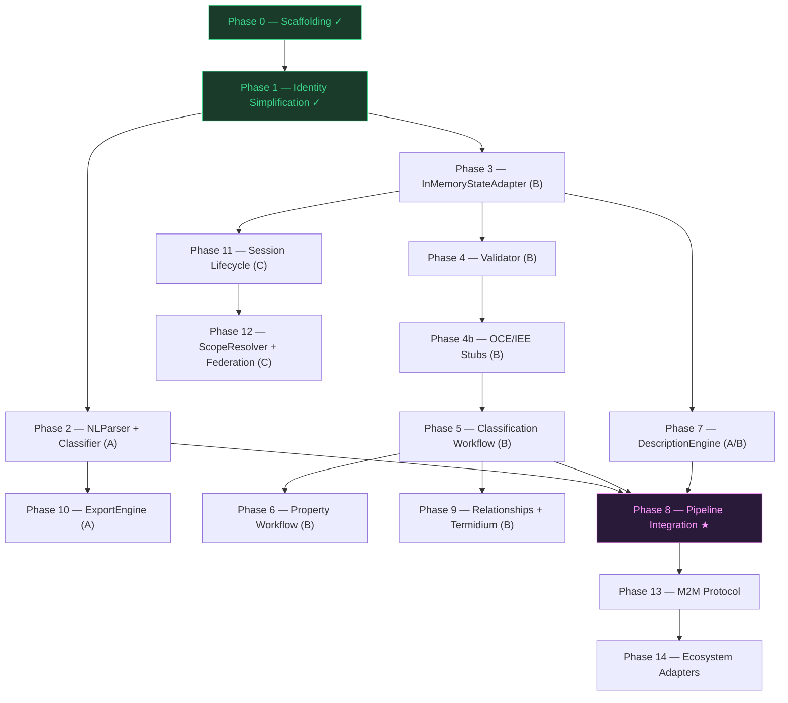

# Fandaws Sentinel — Development Roadmap

**Living document. Updated each session.**
**Spec Reference:** `Fandaws_v3.3_Specification.md` (v3.4)

---

## Dependency Graph

After Phase 1 (Identity Simplification), development splits into three parallel tracks that converge at Phase 8 (Pipeline Integration).

### Track Summary

| Track | Theme | Phases | Gate |
|-------|-------|--------|------|
| **A** | Linguistics & IO | P2, P10 | P2 required before P8 |
| **A/B** | Cross-track | P7 (DescriptionEngine) | Depends on P3 (graph traversal); required before P8 |
| **B** | Graph Mechanics | P3, P4, P4b, P5, P6, P9 | P5 required before P8 |
| **C** | Lifecycle & Federation | P11, P12 | Independent — merge after P8 |

### Parallelism Rules

- Tracks A and B may proceed concurrently after Phase 1. Track C starts after Phase 3.
- Within a track, phases are sequential (each depends on the prior).
- **Cross-track dependency:** P7 (DescriptionEngine) requires P3 (StateAdapter) for graph traversal of parent chains and inherited properties. P7 cannot start until P3 is complete.
- **Phase 8 gate:** requires P2 (NLParser), P5 (Classification Workflow), and P7 (DescriptionEngine).
- P6, P9, P10, P11, P12 may continue in parallel with or after Phase 8.
- P13 and P14 are strictly post-convergence.

---

## Phase 0: Project Scaffolding

**Goal:** Establish project structure, tooling, types, adapter interfaces, and default config.
**Status:** Complete
**Priority:** Critical

### 0.1 Directory Structure & Tooling

**Status:** Complete

**Acceptance Criteria:**
- [x] `node src/index.js` runs without error
- [x] All directories exist per agentic development principles
- [x] CLAUDE.md, ROADMAP.md, .gitignore created

### 0.2 JSON-LD Types & Context

**Status:** Complete

**Acceptance Criteria:**
- [x] All 12 type factories produce JSON-LD nodes with correct `@type`
- [x] FANDAWS_CONTEXT matches spec Appendix A.1
- [x] Each factory has at least 3 unit tests (63 tests across 13 suites)
- [x] `createConcept()` output matches Appendix A.2 shape exactly
- [x] `createGraphMutation()` output matches Appendix A.3 shape exactly
- [x] `createConversationPrompt()` output matches Appendix A.4 shape exactly

### 0.3 Adapter Interfaces

**Status:** Complete

**Acceptance Criteria:**
- [x] StateAdapter — 9 methods matching spec Section 3.3.1
- [x] IntegrationAdapter — 3 methods matching spec Section 3.3.2
- [x] OrchestrationAdapter — 5 methods matching spec Section 3.3.3
- [x] All throw `not implemented` when called directly

### 0.4 Default Configuration

**Status:** Complete

**Acceptance Criteria:**
- [x] All 20 configuration parameters from Section 11.1 present with spec defaults

**NOT in scope:** Domain-specific configs, environment overrides, runtime config loading.

### 0.5 Missing Metadata Type Factories

**Status:** Complete
**Priority:** High (blocks Phase 12)

**Stakeholder finding:** Three metadata types from v3.4 were missing from the type factory set. These are independently constructable JSON-LD nodes needed by ScopeResolver (Phase 12).

> **Spec clarification:** The spec uses `fandaws:shadows` (not `forkedFrom`) for the refine action annotation. Additionally, `createDistinct` uses a `fandaws:disambiguatedFrom` annotation. Both are implemented as separate factories: `createShadowsAnnotation` and `createDisambiguatedFromAnnotation`.

**Deliverables:**
- `src/types/conflict-report.js` — `createConflictReport()`, `createConflictingDefinition()`, `createResolutionOption()` (Section 4.2.10)
- `src/types/resolved-from.js` — `createResolvedFromAnnotation()` (Section 4.2.11)
- `src/types/shadows-annotation.js` — `createShadowsAnnotation()`, `createDisambiguatedFromAnnotation()` (Section 5.11.2)
- `tests/unit/types/conflict-report.test.js` (12 tests)
- `tests/unit/types/resolved-from.test.js` (6 tests)
- `tests/unit/types/shadows-annotation.test.js` (9 tests)

**Acceptance Criteria:**
- [x] `createConflictReport()` output matches spec Section 4.2.10 / Appendix A.11 shape
- [x] `createResolvedFromAnnotation()` output matches spec Section 4.2.11 / Appendix A.10 shape
- [x] `createShadowsAnnotation()` output includes `shadows` array and disambiguated display label
- [x] `createDisambiguatedFromAnnotation()` output includes original term and source graph reference
- [x] Each factory has at least 3 unit tests (27 total across 3 suites)
- [x] All 18 type factories exported from `src/types/index.js` (19 members total including FANDAWS_CONTEXT)
- [x] FANDAWS_CONTEXT updated with new type namespaces (resolvedFrom, shadows, disambiguatedFrom, definitions, resolutionOptions)

---

## Phase 1: Identity Simplification

**Goal:** Implement the dual-label normalization pipeline. This is the foundation for ALL concept matching, deduplication, and Termidium — nothing else works without it.
**Status:** Complete
**Priority:** Critical
**Effort:** Medium
**Bundle Size Budget:** < 5KB

### 1.1 Normalization Pipeline

**Spec Reference:** Section 6.6

Implement the 7-step deterministic normalization that produces `canonicalLabel` from raw input.

**Deliverables:**
- `src/core/identity/identity-simplification.js`
- `tests/unit/identity-simplification.test.js`
- `tests/golden/identity-simplification-corpus.json`

**Algorithm (each step is a pure function):**
1. Trim leading/trailing whitespace
2. Collapse internal whitespace sequences to single space
3. Remove leading articles for configured locale (EN default: "a", "an", "the")
4. Apply Unicode NFKC normalization (ligatures, width variants)
5. Apply locale-aware case folding (NOT simple `toLowerCase()` — Turkish dotted/dotless I, CJK no-op)
6. Apply domain-specific abbreviation expansion from config table
7. Attach BCP 47 language tag

**Acceptance Criteria:**

*Functional:*
- [x] `"  A Dog  "` → `"dog"` (trim + article removal + case fold)
- [x] `"The   golden   retriever"` → `"golden retriever"` (article + whitespace collapse)
- [x] `"An Apple"` → `"apple"` (article "an" removed)
- [x] `"CAFÉ"` → `"café"` (case folding preserves diacritics)
- [x] `"finance"` → `"finance"` (NFKC resolves fi ligature)
- [x] `"ＡＢＣ"` → `"abc"` (NFKC resolves fullwidth + case fold)
- [x] Empty string → empty string (no crash)
- [x] Abbreviation table `{"govt": "government"}` expands `"govt"` → `"government"`
- [x] Language tag: `simplify("dog", {locale: "en"})` includes `"en"` tag in output

*Protected Proper Nouns:*
- [x] `"The Hague"` → `"the hague"` (NOT `"hague"`) — article is part of the proper noun
- [x] `"The Bronx"` → `"the bronx"` — protected
- [x] `"The Beatles"` → `"the beatles"` — protected
- [x] `"The dog"` → `"dog"` — not protected, article stripped normally
- [x] Protected list loaded from config (`protectedProperNouns` array)

*Determinism:*
- [x] Given identical input + config, output is byte-identical across runs

*Performance:*
- [x] < 1ms per term for typical input (< 100 chars) — measured 0.003ms/term

*Golden Corpus:*
- [x] 25+ test cases covering whitespace, articles, NFKC, case folding, abbreviations, edge cases (29 cases)
- [x] Corpus includes at least 3 non-English locale cases (zh, ja, de, fr)
- [x] Corpus includes at least 3 protected proper noun cases (Hague, Bronx, Beatles, Gambia)

> **Technical Advisory — NFKC:** Use `String.prototype.normalize('NFKC')` — available in all target runtimes (Node 12+, all modern browsers). No external dependency needed.

> **Technical Advisory — Protected Proper Nouns:** Step 3 (article removal) must consult a configurable `protectedProperNouns` list before stripping. Default list should include common geographical/organizational terms where "The" is part of the proper name. The list is config-driven, not hard-coded.

**NOT in scope:** Turkish locale implementation (stub is fine), CJK-specific handling (no-op path sufficient).

---

## Phase 2: NLParser & Classifier `[Track A — Linguistics]`

**Goal:** Implement the first two pipeline stages — parsing natural language into structured frames and routing to workflows.
**Status:** Complete
**Priority:** Critical
**Effort:** High
**Depends on:** Phase 1

### 2.1 NLParser

**Spec Reference:** Section 3.2.1, 5.2.1, 5.3.1, 5.4.1

Grammar-based and regex extraction. No LLMs. No probabilistic inference. Pipeline of 7 exported step functions: `validateInput`, `normalizeInput`, `stripArticle`, `matchClassification`, `matchProperty`, `matchCustomRelationship`, `parse`.

**Deliverables:**
- `src/core/nl-parser/nl-parser.js`
- `tests/unit/nl-parser.test.js`
- `tests/golden/nl-parser-corpus.json` (45 entries)
- `tests/golden/nl-parser-golden.test.js`
- `src/types/parse-result.js` (`createParseResult` factory)

**Input:** Raw text string (+ optional context)
**Output:** JSON-LD ParseResult `{subject, predicate, object, verbType, confidence, error, errorReason}`

**Pattern Rules:**
- `"X is a Y"` / `"X is an Y"` / `"An X is a Y"` → `verbType: "classification"`, subject=X, object=Y
- `"X has Y"` / `"X has a Y"` / `"An X has Y"` → `verbType: "property"`, subject=X, object=Y
- `"X [verb] Y"` (any other verb) → `verbType: "customRelationship"`, subject=X, verb=[verb], object=Y
- Articles stripped from subject/object via `stripArticle` helper

**Acceptance Criteria:**

*Classification patterns:*
- [x] `"A dog is an animal"` → `{subject: "dog", object: "animal", verbType: "classification"}`
- [x] `"Dogs are animals"` → `{subject: "Dogs", object: "animals", verbType: "classification"}`
- [x] `"The golden retriever is a dog"` → `{subject: "golden retriever", object: "dog", verbType: "classification"}`

*Property patterns:*
- [x] `"A dog has fur"` → `{subject: "dog", object: "fur", verbType: "property"}`
- [x] `"Dogs have four legs"` → `{subject: "Dogs", object: "four legs", verbType: "property"}`
- [x] `"The cat has whiskers"` → `{subject: "cat", object: "whiskers", verbType: "property"}`

*Custom relationship patterns:*
- [x] `"Dogs chase cats"` → `{subject: "Dogs", verb: "chase", object: "cats", verbType: "customRelationship"}`
- [x] `"The sun heats the earth"` → `{subject: "sun", verb: "heats", object: "earth", verbType: "customRelationship"}`
- [x] `"Teachers educate students"` → `{subject: "Teachers", verb: "educate", object: "students", verbType: "customRelationship"}`

*Edge cases:*
- [x] Empty string → ParseResult with error indicator
- [x] Single word `"dog"` → ParseResult with error indicator (no predicate)
- [x] `"A dog"` → ParseResult with error indicator (incomplete)

*Quality:*
- [x] Deterministic: identical input → identical output
- [x] Golden corpus: 45 test cases across all three verb types + errors + determinism
- [x] Performance: < 5ms per utterance

> **Known limitations (Phase 8 TagTeam gate):** Multi-word subjects in custom relationships use single-word heuristic. "is" always routes to classification (correct per spec). No plural normalization (deferred to Phase 9.1).

### 2.2 Classifier

**Spec Reference:** Section 3.2.2

Enum matching to route ParseResult to the correct workflow.

**Deliverables:**
- `src/core/classifier/classifier.js`
- `tests/unit/classifier.test.js`
- `src/types/classification-action.js` (`createClassificationAction` factory)

**Input:** ParseResult JSON-LD node
**Output:** ClassificationAction JSON-LD node `{workflow, subject, object, verb?}`

**Routing Rules:**
- `verbType === "classification"` → `workflow: "classification"`
- `verbType === "property"` → `workflow: "property"`
- `verbType === "customRelationship"` → `workflow: "customRelationship"`

**Acceptance Criteria:**
- [x] Routes each verbType to correct workflow string
- [x] Output is valid ClassificationAction JSON-LD with `@type: "fandaws:ClassificationAction"`
- [x] Preserves subject, object, and verb from ParseResult
- [x] Rejects ParseResult with missing or invalid verbType
- [x] Performance: < 1ms per classification
- [x] 15 unit tests covering all routes + error cases

**NOT in scope:** KnowledgeEngine execution, graph queries, Termidium.

**Phase 2 totals:** 130 new tests (58 NLParser unit + 46 golden corpus + 15 Classifier + 11 type factories), 301/301 total pass.

---

## Phase 3: InMemoryStateAdapter `[Track B — Graph Mechanics]`

**Goal:** Implement the reference state adapter so that subsequent phases can store and query knowledge graphs.
**Status:** Not Started
**Priority:** Critical
**Effort:** Medium
**Depends on:** Phase 1

### 3.1 Core Storage Operations

**Spec Reference:** Section 3.3.1, 12.1

**Deliverables:**
- `src/adapters/state/in-memory-state-adapter.js`
- `tests/unit/in-memory-state-adapter.test.js`

**Required Indices (maintained on every mutation):**
1. `canonicalLabel → concept IRI` — O(1) lookup by normalized name
2. `concept IRI → parent IRI` — O(1) parent lookup
3. `concept IRI → child IRIs` — O(1) descendant enumeration
4. `concept IRI → property IRIs` — O(1) property enumeration
5. `concept IRI → relationship IRIs (as object)` — O(1) reverse relationship lookup

> **Technical Advisory — ReverseRelationshipIndex (Index 5):** This is the index mapping a concept IRI to all relationships where that concept appears as the *object*. Without it, Termidium merge (Phase 9) must do a full graph scan to rewrite relationship targets — O(n) per merge instead of O(k) where k is the number of affected relationships. Add it now while the index infrastructure is being built; retrofitting it later is painful.

**Acceptance Criteria:**

*Graph operations:*
- [ ] `saveGraph(id, graph)` + `loadGraph(id)` round-trips a KnowledgeGraph
- [ ] `loadGraph(unknownId)` returns `null` (not throws)
- [ ] `applyMutation(id, mutation)` adds concepts to an existing graph
- [ ] `applyMutation(id, mutation)` modifies existing concept properties
- [ ] `applyMutation(id, mutation)` deletes concepts by IRI
- [ ] `applyMutation` is atomic: all-or-nothing on multi-operation mutations
- [ ] `applyMutation` with invalid target returns unmodified graph + MutationRejection reason

*Session operations:*
- [ ] `saveSession` + `loadSession` round-trips a ConversationSession
- [ ] `loadSession(unknownId)` returns `null`
- [ ] `listSessions(callerId)` returns only that caller's sessions
- [ ] `listSessions(callerId, {state: "negotiating"})` filters by state

*Index correctness:*
- [ ] After adding concept "dog", lookup by canonicalLabel "dog" returns its IRI
- [ ] After adding "dog" as child of "animal", parent index maps dog→animal
- [ ] After adding "dog" as child of "animal", child index maps animal→[dog]
- [ ] After adding property "fur" to "dog", property index maps dog→[fur]
- [ ] After adding relationship "dogs chase cats", reverse index maps cats→[chase-relationship]
- [ ] After deleting "dog", all five indices no longer contain "dog"
- [ ] Indices survive multiple sequential mutations

*Integrity verification:*
- [ ] `verifyIntegrity(graphId)` scans all indices and returns a list of ghost pointers (IRIs in indices that point to deleted/missing concepts)
- [ ] `verifyIntegrity` returns empty array on a healthy graph
- [ ] `verifyIntegrity` detects orphaned child pointers after parent deletion
- [ ] `verifyIntegrity` detects stale relationship references after concept deletion

*Performance:*
- [ ] Index lookups: O(1) — verified by timing 1000 lookups on a 500-concept graph in < 100ms
- [ ] `applyMutation` < 5ms for single-concept operations

*Scope operations:*
- [ ] `saveScopeConfig` + `loadScopeConfig` round-trips
- [ ] `loadScopeConfig(unknownId)` returns `null`

> **Technical Advisory — verifyIntegrity():** Add a `verifyIntegrity(graphId)` method that walks all five indices and reports any IRI that points to a concept not present in the graph. This traps "ghost pointers" — stale index entries left behind by buggy mutation paths. Call it in test teardowns and integration tests. It's cheap insurance against index corruption.

### 3.2 Browser Bundle Verification

**Goal:** Prove the "brain in a box" single-file deployment model. The esbuild bundle (`docs/dist/fandaws.js`) must include InMemoryStateAdapter and run a full graph round-trip in a browser context.

**Deliverables:**
- `src/index.js` — export `InMemoryStateAdapter`
- `tests/browser/state-adapter-browser.test.html` — browser test harness (opens in any browser, runs assertions, reports pass/fail)

**Acceptance Criteria:**
- [ ] `npm run build` produces a single `docs/dist/fandaws.js` that exports `InMemoryStateAdapter`
- [ ] Browser test harness imports the bundle via `<script type="module">`
- [ ] In-browser test: `saveGraph` + `loadGraph` round-trips a KnowledgeGraph
- [ ] In-browser test: `applyMutation` adds a concept and index lookup succeeds
- [ ] In-browser test: `simplify()` produces correct canonicalLabel
- [ ] Bundle size remains < 20KB (single-file constraint)
- [ ] No Node.js-only APIs used in core (no `fs`, `path`, `process` in bundled code)

> **Technical Advisory — Single-File Deployment:** The stakeholder requirement is "a brain in a box" — one `.js` file that any web app can `import` to get the full Fandaws engine. This is validated here at Phase 3 rather than Phase 8 to catch Node.js-only API leaks early. The esbuild bundle (ADR-002) already produces this file; this phase adds the proof.

**NOT in scope:** FileSystemStateAdapter, queryGraph (pattern matching), IPFS CID resolution.

---

## Phase 4: Validator — Structural Checks `[Track B — Graph Mechanics]`

**Goal:** Implement input sanitization, structural grounding, and circular hierarchy prevention.
**Status:** Not Started
**Priority:** High
**Effort:** Medium
**Depends on:** Phase 3

### 4.1 Input Sanitization

**Spec Reference:** Section 6.1

**Deliverables:**
- `src/core/validator/input-sanitizer.js`
- `tests/unit/input-sanitizer.test.js`

**Rules (each a pure function):**
1. Trim whitespace
2. Apply Identity Simplification → canonicalLabel
3. Reject compound statements (multiple subjects)
4. Reject structurally ungroundable concepts
5. At confirmation steps, accept only yes/no

**Acceptance Criteria:**
- [ ] `"  A dog is an animal  "` is trimmed and normalized
- [ ] `"A dog is an animal and a cat is a pet"` → rejected with `reason: "compoundStatement"`
- [ ] Concept with no parent, no allowRoot flag, no typed property → rejected with `reason: "structuralGroundingError"`
- [ ] Concept with existing parent → accepted
- [ ] Concept with `fandaws:allowRoot: true` → accepted
- [ ] At confirmation step: `"yes"` → accepted, `"no"` → accepted, `"maybe"` → re-prompt
- [ ] At confirmation step: `"y"`, `"Yes"`, `"YES"` all → accepted as yes
- [ ] Each rejection includes descriptive message per spec (e.g., "Concept 'truth' has no parent classification...")
- [ ] All outputs are JSON-LD ValidationResult nodes

### 4.2 Sanity Check (Circular Hierarchy Prevention)

**Spec Reference:** Section 6.5

**Deliverables:**
- `src/core/validator/sanity-check.js`
- `tests/unit/sanity-check.test.js`

**Algorithm:** Walk from proposed parent up to root. If proposed child encountered → reject.

**Acceptance Criteria:**
- [ ] `dog → animal → living_thing` — adding `dog` as child of `animal`: accepted
- [ ] `dog → animal` — adding `animal` as child of `dog`: rejected (circular)
- [ ] `A → B → C → A` three-node cycle: detected and rejected
- [ ] `A → B → C → D → E → A` deep cycle: detected and rejected
- [ ] Single-node self-reference `A → A`: rejected
- [ ] Root node with no parent: always accepted
- [ ] Performance: O(d) where d = depth, verified with depth-20 chain in < 1ms

### 4.3 Validation Result Assembly

**Spec Reference:** Section 3.2.4

**Deliverables:**
- `src/core/validator/validator.js` (orchestrates sanitizer + sanity check)
- `tests/unit/validator.test.js`

**Acceptance Criteria:**
- [ ] `validate(mutation, graph)` returns `{valid: true}` for clean mutations
- [ ] `validate(mutation, graph)` returns `{valid: false, violations: [...]}` for bad mutations
- [ ] Multiple violations collected in single pass (not fail-fast)
- [ ] Violation descriptors include `reason`, `message`, and affected concept IRI
- [ ] Validator is stateless — no I/O, no side effects

**NOT in scope:** Termidium (Phase 9), Property Redundancy Prevention (Phase 6), Custom Relationship Validation (Phase 9).

---

## Phase 4b: OCE/IEE Governance Stubs `[Track B — Graph Mechanics]`

**Goal:** Wire up the governance flows from Section 10.4.3 (OCE blocking flags) and Section 10.5.2 (IEE ethical contestation) with null implementations. This enables the blocking-flag-as-EpistemicFailure behavior from v3.4 to be testable before Phase 13 (M2M), where deadlock prevention depends on it.
**Status:** Not Started
**Priority:** High
**Effort:** Low
**Depends on:** Phase 4

> **Stakeholder finding:** The blocking-flag-as-EpistemicFailure behavior added in v3.4 is a Validator/OrchestrationAdapter concern, not an ecosystem concern. It should be testable before the M2M protocol (Phase 13) so that the deadlock prevention path can be exercised. Null implementations are sufficient — the real OCE/IEE adapters remain in Phase 14.

**Deliverables:**
- `src/core/validator/governance-check.js`
- `tests/unit/governance-check.test.js`

**Acceptance Criteria:**
- [ ] `checkGovernanceBlock(concept, graph)` returns `{blocked: false}` by default (null implementation)
- [ ] When a concept has `fandaws:governanceFlag: "blocked"`, returns `{blocked: true, reason, epistemicFailure}` with EpistemicFailure JSON-LD node
- [ ] EpistemicFailure node includes `flagType` (OCE/IEE), `flaggedBy`, `flaggedAt`, `reason`
- [ ] Validator (Phase 4.3) calls `checkGovernanceBlock` before approving mutations
- [ ] Blocked mutations produce a GraphMutation with `mutationType: "governanceRejection"`
- [ ] OrchestrationAdapter can check governance status before pipeline execution
- [ ] 8+ unit tests covering: no flag, OCE block, IEE block, cleared flag, malformed flag

**NOT in scope:** Actual OCE/IEE adapter implementations, external governance service integration, human review workflows.

---

## Phase 5: KnowledgeEngine — Classification Workflow `[Track B — Graph Mechanics]`

**Goal:** Implement "X is a Y" — the simplest and most foundational workflow.
**Status:** Not Started
**Priority:** Critical
**Effort:** High
**Depends on:** Phase 4b (Validator + governance stubs)

### 5.1 Classification Workflow

**Spec Reference:** Section 5.2

**Deliverables:**
- `src/core/knowledge-engine/classification-workflow.js`
- `tests/unit/classification-workflow.test.js`
- `tests/golden/classification-corpus.json`

**Procedure:**
1. Receive ClassificationAction with subject X and object Y
2. Apply Identity Simplification to both terms
3. Search graph for existing concepts (canonicalLabel match)
4. If Y exists with multiple meanings → emit disambiguation ConversationPrompt
5. If X already exists → run Sanity Check
6. Emit GraphMutation: create X if new, set X.parent=Y, update Y.children

**Acceptance Criteria:**

*Basic classification:*
- [ ] `"A dog is an animal"` on empty graph → creates both concepts, dog.parent=animal
- [ ] `"A dog is an animal"` when "animal" exists → creates dog, links to existing animal
- [ ] `"A poodle is a dog"` when "dog→animal" exists → creates poodle, poodle.parent=dog, depth=correct

*Disambiguation:*
- [ ] When "animal" has two meanings (homonyms), returns ConversationPrompt with options
- [ ] User selects meaning → workflow continues with selected concept
- [ ] User says "none" → new concept created for Y

*Sanity check integration:*
- [ ] `"An animal is a dog"` when dog→animal exists → rejected (circular)

*GraphMutation correctness:*
- [ ] Mutation includes addition nodes for new concepts
- [ ] Mutation includes modification to parent's children array
- [ ] Mutation includes `reason` string
- [ ] Mutation is valid JSON-LD

*Edge cases:*
- [ ] Classifying a concept under itself → rejected
- [ ] Re-asserting an existing classification → idempotent (no duplicate, no error)
- [ ] Multi-word concepts: `"golden retriever is a dog"` → handled correctly

*Golden corpus:*
- [ ] 20+ classification scenarios passing

**NOT in scope:** Termidium deduplication (Phase 9.3 — the 8-level hierarchy search, merge governance, and `mergeReviewThreshold` are scoped there because they depend on the Classification Workflow being operational first), scope resolution, property attachment.

> **Stakeholder note — Termidium placement:** Termidium (Section 6.2) is a Validator-adjacent concern but depends on a working classification hierarchy to search. Phase 9.3 contains its full acceptance criteria: 8-level bounded search, tie-breaking merge policy, recursive merge, `mergedFrom` tracking, `ReverseRelationshipIndex` usage, and `mergeReviewThreshold` confirmation. The Classification Workflow (Phase 5) must be complete first to provide the graph structures Termidium operates on.

---

## Phase 6: KnowledgeEngine — Property Workflow `[Track B — Graph Mechanics]`

**Goal:** Implement "X has Y" with scope narrowing (including Leap Check optimization) and property redundancy prevention.
**Status:** Not Started
**Priority:** High
**Effort:** High
**Depends on:** Phase 5

### 6.1 Property Redundancy Prevention

**Spec Reference:** Section 6.3

**Deliverables:**
- `src/core/validator/property-redundancy.js`
- `tests/unit/property-redundancy.test.js`

**Four Checks:**
1. **No Duplicates:** Exact property must not already exist on target
2. **No Ancestor Overlap:** Property must not exist on any ancestor (inherited)
3. **No Descendant Overlap:** If on descendant, attach at higher level → remove descendant copy
4. **No Inherited Redundancy:** Property must not be logically entailed by existing properties + hierarchy

**Acceptance Criteria:**
- [ ] Adding "fur" to "dog" when "dog" already has "fur" → rejected (check 1)
- [ ] Adding "fur" to "dog" when "animal" (ancestor) has "fur" → rejected (check 2)
- [ ] Adding "legs" to "animal" when "dog" (descendant) has "legs" → accepted, "dog" copy removed (check 3)
- [ ] Check 3 returns list of descendant properties to remove in the GraphMutation
- [ ] All four checks run on every property assertion — no short-circuit on first pass

### 6.2 Scope Narrowing with Leap Check

**Spec Reference:** Section 5.3.2

**Deliverables:**
- `src/core/knowledge-engine/property-workflow.js`
- `tests/unit/property-workflow.test.js`

**Procedure:**
1. Parse subject X and property Y
2. Locate X in graph. If not found → ConversationPrompt: classify first
3. Run Property Redundancy Prevention
4. **Leap Check:** Ask about the immediate parent AND the root. If both agree (both yes or both no), skip intermediate levels. Only walk the full chain when boundary answers diverge.
5. Attach property at highest confirmed level
6. Emit GraphMutation

> **Technical Advisory — Leap Check:** The naive scope-narrowing approach walks every ancestor level, generating one confirmation prompt per level. For deep hierarchies (depth 6+) this causes "survey fatigue." The Leap Check optimization probes the boundaries first: ask about the immediate parent and the root. If boundaries agree (both "yes" → attach at root; both "no" → attach at original concept), no intermediate prompts are needed. Only when they diverge (parent=yes, root=no) do you binary-search the intermediate levels to find the correct attachment point. This reduces worst-case prompts from O(d) to O(log d).

**Acceptance Criteria:**
- [ ] `"A dog has fur"` → ConversationPrompt: "Does an animal also have fur?"
- [ ] User says yes → property attached to "animal", not "dog"
- [ ] User says no → property attached to "dog"

*Leap Check:*
- [ ] Hierarchy `poodle→dog→canine→animal→living_thing→entity` with property "fur":
  - Immediate parent ("dog") = yes, root ("entity") = no → binary search intermediate levels
  - Immediate parent ("dog") = yes, root ("entity") = yes → attach at root, skip all intermediates
  - Immediate parent ("dog") = no → attach at "poodle", skip all ancestors
- [ ] Leap Check produces fewer prompts than full walk for depth ≥ 4

*Standard scope narrowing:*
- [ ] Scope narrowing walks full chain when Leap Check boundaries diverge
- [ ] Scope narrowing stops at root (no prompt for root's parent)
- [ ] Unknown concept X → ConversationPrompt: "I don't know what X is. Please classify it first."
- [ ] Property mutation includes correct `attachedTo` IRI
- [ ] Descriptions regenerated for target and all inheriting descendants (noted in mutation reason)

*Golden corpus:*
- [ ] 15+ property scenarios with various hierarchy depths
- [ ] At least 3 Leap Check shortcut scenarios (boundaries agree)
- [ ] At least 2 Leap Check fallback scenarios (boundaries diverge → binary search)

**NOT in scope:** Custom relationships, Termidium interaction with properties.

---

## Phase 7: DescriptionEngine `[Track A/B — Linguistics + Graph]`

**Goal:** Auto-generate natural-language definitions from graph structure.
**Status:** Not Started
**Priority:** High
**Effort:** Low
**Depends on:** Phase 3 (requires graph traversal for parent chain and inherited properties)

> **Stakeholder note:** Phase 7 was originally scoped as Track A (Phase 1 only), but the description templates reference parent concepts and properties (`"[Term] is a [parent] that has [prop1]..."`), which requires walking the concept's parent chain in the graph. This makes Phase 3 (StateAdapter) a prerequisite. The function remains pure (concept IRI + graph data in → description string out), but it needs a realized graph structure to traverse.

### 7.1 Description Templates

**Spec Reference:** Section 3.2.5

**Deliverables:**
- `src/core/description-engine/description-engine.js`
- `tests/unit/description-engine.test.js`

**Templates:**
- Standard: `"[Term] is a [parent] that has [prop1], [prop2], [prop3]."`
- Process: `"[Object] [term] is the [parent+ing] of [object] by [subject]."`

**Acceptance Criteria:**
- [ ] Concept "dog" with parent "animal" and properties ["fur", "four legs"] → `"Dog is an animal that has fur, four legs."`
- [ ] Concept "dog" with parent "animal" and no properties → `"Dog is an animal."`
- [ ] Concept "running" (process) with subject "athlete", object "race" → uses process template
- [ ] Root concept with no parent → `"Dog."` or appropriate root description
- [ ] Handles 1 property, 2 properties, 3+ properties (comma-separated with "and" for last)
- [ ] Uses `displayLabel` (not canonicalLabel) for human-readable output
- [ ] Performance: < 2ms per description
- [ ] Pure function: concept IRI + graph in → description string out
- [ ] 10+ test cases covering standard, process, edge cases

**NOT in scope:** Custom description templates, configurable templates beyond the two standard ones.

---

## Phase 8: Pipeline Integration — First Working Conversation Loop `★ CONVERGENCE GATE`

**Goal:** Wire NLParser → Classifier → KnowledgeEngine → Validator → StateAdapter → DescriptionEngine into a working conversation loop. Pass the Spec Test.
**Status:** Not Started
**Priority:** Critical
**Effort:** High
**Requires:** Phase 2 (Track A) + Phase 5 (Track B) + Phase 7 (Track A)

### TagTeam Decision Gate

Phase 8 is the checkpoint where we evaluate the NLParser against real conversation data and decide whether the built-in regex/grammar parser is sufficient or whether a TagTeam.js NLParser adapter should be introduced.

**Evaluation Criteria:**
1. Run the golden corpus (Phases 2 + 8) through the regex NLParser
2. Measure: (a) parse success rate, (b) false-positive rate, (c) ambiguity handling
3. If success rate ≥ 95% on golden corpus → continue with regex parser
4. If success rate < 95% → create a `TagTeamNLParserAdapter` that delegates to TagTeam.js for parsing, preserving the same JSON-LD ParseResult interface
5. Decision recorded in `docs/architecture/design-decisions.md` as ADR-003

**Outcome:** Either the existing regex NLParser proceeds unchanged, or a TagTeam adapter is added as an alternative NLParser implementation behind the same interface. The rest of the pipeline is unaffected either way.

### 8.1 NullIntegrationAdapter

**Spec Reference:** Section 12.3

**Deliverables:**
- `src/adapters/integration/null-integration-adapter.js`
- `tests/unit/null-integration-adapter.test.js`

**Acceptance Criteria:**
- [ ] `lookupDictionary(term)` returns DeferredResult
- [ ] `lookupBFO(concept)` returns DeferredResult
- [ ] `importOntology(source)` returns DeferredResult
- [ ] All DeferredResults include correct reason: "offline"

### 8.2 SynchronousOrchestrationAdapter

**Spec Reference:** Section 12.4

**Deliverables:**
- `src/adapters/orchestration/synchronous-orchestration-adapter.js`
- `tests/unit/synchronous-orchestration-adapter.test.js`

**Acceptance Criteria:**
- [ ] `runPipeline(utterance, context)` executes full pipeline: parse → classify → knowledge engine → validate → apply mutation → regenerate descriptions
- [ ] `getCallerMode()` returns `"human"` (default)
- [ ] `emitOutput(output)` delivers ConversationPrompts to caller
- [ ] `receiveInput(input)` accepts text, confirmations, selections
- [ ] ConversationPrompts pause pipeline until caller responds

### 8.3 Conversation Simulation Tests

**Spec Reference:** Section 9.2

**Deliverables:**
- `tests/integration/conversation-simulation.test.js`
- `tests/golden/conversation-simulation-corpus.json`

**Acceptance Criteria:**

*End-to-end classification:*
- [ ] Input: `"A dog is an animal"` → graph contains dog, animal; dog.parent=animal
- [ ] Input: `"A poodle is a dog"` after previous → poodle.parent=dog, depth=correct
- [ ] Input: `"A cat is an animal"` after previous → cat.parent=animal, animal has 2 children

*End-to-end property:*
- [ ] Input: `"A dog has fur"`, respond "no" to scope narrowing → fur attached to dog
- [ ] Input: `"A dog has fur"`, respond "yes" to "does animal have fur?" → fur attached to animal

*Determinism:*
- [ ] Same utterance sequence + same responses → byte-identical graph state across 3 runs

*Spec Test:*
- [ ] Full pipeline runs in Node.js with zero external dependencies
- [ ] Full pipeline runs with NullIntegrationAdapter (offline mode)
- [ ] `node src/index.js` with a scripted conversation produces expected graph

*TagTeam evaluation:*
- [ ] NLParser golden corpus success rate measured and recorded
- [ ] ADR-003 written with decision + rationale

*Error handling:*
- [ ] Invalid input (empty, compound) → appropriate ConversationPrompt, no crash
- [ ] Circular classification attempt → rejection, graph unchanged

*Golden corpus:*
- [ ] 10+ multi-turn conversation scenarios with expected final graph states

**NOT in scope:** Custom relationships, M2M mode, scope resolution, term explorer.

---

## Phase 9: Custom Relationships + Termidium `[Track B — Graph Mechanics]`

**Goal:** Complete the third workflow and add deduplication. After this phase, all three knowledge-building workflows are operational.
**Status:** Not Started
**Priority:** High
**Effort:** High
**Depends on:** Phase 5

### 9.1 Custom Relationship Validation

**Spec Reference:** Section 6.4

**Deliverables:**
- `src/core/validator/relationship-validation.js`
- `tests/unit/relationship-validation.test.js`

**Seven Checks:**
1. Verb Normalization (lemmatization)
2. Duplicate Check (same subject+verb+object)
3. Inverse Check ("chases" vs "is chased by")
4. Hierarchy Consistency
5. Reuse Assessment (existing verb type)
6. Promotion Check (sub→primary)
7. Refactoring Check

**Acceptance Criteria:**
- [ ] `"dogs chase cats"` + `"dogs chase cats"` → second rejected (duplicate)
- [ ] `"dogs chase cats"` + `"cats are chased by dogs"` → inverse flagged
- [ ] Verb normalization: `"chases"` and `"chase"` treated as same verb
- [ ] `"animals eat food"` then `"dogs eat meat"` → second is sub-relationship of first
- [ ] Each check produces a typed violation descriptor when failing

### 9.2 Custom Relationship Workflow

**Spec Reference:** Section 5.4

**Deliverables:**
- `src/core/knowledge-engine/relationship-workflow.js`
- `tests/unit/relationship-workflow.test.js`

**Acceptance Criteria:**
- [ ] `"Dogs chase cats"` → creates Relationship with verb="chase", subject=dogs, object=cats
- [ ] Creates placeholder concepts for subject/object if not in graph
- [ ] Sub-relationship hierarchy: more specific verb becomes child of general verb
- [ ] GraphMutation includes relationship node with correct JSON-LD shape
- [ ] 10+ test cases

### 9.3 Termidium Deduplication

**Spec Reference:** Section 6.2

**Deliverables:**
- `src/core/validator/termidium.js`
- `tests/unit/termidium.test.js`

**Algorithm:**
1. From new/modified concept, search up+down within 8 levels for matching canonicalLabels
2. If match found → merge shallower into deeper
3. Repeat from merge result until no matches

**Merge Policy (tie-breaking order):**
1. Deeper concept survives
2. If same depth → earlier `createdAt` survives
3. If same timestamp → more assertions (children+properties+relationships) survives

**Merge Rules:**
- Children of source → children of target
- Properties of source → added to target (subject to redundancy prevention)
- Relationships referencing source → rewritten to reference target (uses ReverseRelationshipIndex from Phase 3)
- Source IRI recorded as `fandaws:mergedFrom` on target
- Source deleted

**Acceptance Criteria:**
- [ ] Two concepts with same canonicalLabel at different depths → merged, deeper survives
- [ ] Same depth, different createdAt → earlier survives
- [ ] Same depth+time, different assertion count → more assertions survives
- [ ] Children transferred: source's children become target's children
- [ ] Properties transferred (non-redundant only)
- [ ] Relationships rewritten: all references to source now point to target
- [ ] Relationship rewrite uses ReverseRelationshipIndex (O(k) not O(n))
- [ ] `mergedFrom` array on target contains source IRI
- [ ] Source concept deleted from graph
- [ ] `verifyIntegrity()` returns clean after merge (no ghost pointers)
- [ ] Recursive: merge triggers re-scan, catches transitive duplicates
- [ ] Search bounded at 8 levels (configurable via `deduplicationDepth`)
- [ ] Large merge (> `mergeReviewThreshold` children) → ConversationPrompt for confirmation
- [ ] 15+ test cases including recursive merge and large merge threshold

**NOT in scope:** M2M machineSignal for merge review.

---

## Phase 10: ExportEngine `[Track A — Linguistics]`

**Goal:** Deterministic export to standard ontology formats.
**Status:** Not Started
**Priority:** Medium
**Effort:** Medium
**Depends on:** Phase 2 (graph structure understanding from NLParser types)

### 10.1 SKOS Export

**Spec Reference:** Section 3.2.6, 5.7

**Deliverables:**
- `src/core/export-engine/skos-export.js`
- `tests/unit/skos-export.test.js`

**Mapping:** Concepts → `skos:Concept`, hierarchies → `skos:broader`/`skos:narrower`, descriptions → `skos:definition`

**Acceptance Criteria:**
- [ ] Exports a KnowledgeGraph with 5 concepts as valid SKOS
- [ ] Parent-child relationships → `skos:broader` / `skos:narrower`
- [ ] Descriptions → `skos:definition`
- [ ] Deterministic: same graph → byte-identical SKOS output

### 10.2 OWL Export

**Deliverables:**
- `src/core/export-engine/owl-export.js`
- `tests/unit/owl-export.test.js`

**Mapping:** Concepts → `owl:Class`, properties → `owl:ObjectProperty` or `owl:DatatypeProperty`, hierarchies → `rdfs:subClassOf`

**Acceptance Criteria:**
- [ ] Exports valid OWL 2 DL structure
- [ ] Concept hierarchies → `rdfs:subClassOf`
- [ ] Deterministic

### 10.3 RDF/XML and Turtle Exports

**Deliverables:**
- `src/core/export-engine/rdf-xml-export.js`
- `src/core/export-engine/turtle-export.js`
- `tests/unit/export-formats.test.js`

**Acceptance Criteria:**
- [ ] RDF/XML: syntactically valid RDF/XML serialization of graph
- [ ] Turtle: syntactically valid Turtle serialization of graph
- [ ] Both are deterministic

### 10.4 ExportEngine Orchestrator

**Deliverables:**
- `src/core/export-engine/export-engine.js`

**Acceptance Criteria:**
- [ ] `export(graph, {format: "skos"})` delegates to SKOS exporter
- [ ] `export(graph, {format: "owl"})` delegates to OWL exporter
- [ ] `export(graph, {format: "rdf"})` delegates to RDF/XML exporter
- [ ] `export(graph, {format: "turtle"})` delegates to Turtle exporter
- [ ] Unknown format → clear error
- [ ] Read-only: no mutations to graph
- [ ] Pure function: no I/O, no external services

**NOT in scope:** Streaming export, incremental export, external validation against W3C schemas.

---

## Phase 11: Session Lifecycle `[Track C — Lifecycle]`

**Goal:** Implement pause/resume, abandon, nested negotiation, expiration, and concurrent session limits.
**Status:** Not Started
**Priority:** Medium
**Effort:** High
**Depends on:** Phase 3 (needs StateAdapter for session persistence)

### 11.1 Session State Machine

**Spec Reference:** Section 5.12

**Deliverables:**
- `src/core/session/session-manager.js`
- `tests/unit/session-manager.test.js`

**States:** `negotiating` → `paused` | `nested` | `conflict` | `complete` | `abandoned` | `expired`

**Acceptance Criteria:**

*Pause/Resume:*
- [ ] Caller pauses → session state="paused", full state persisted
- [ ] Resume → session reloads, last unanswered prompt re-presented
- [ ] Pipeline state reconstructed from dialogue history (no mutable in-memory state assumed)
- [ ] Paused session expires after `sessionExpiryDuration` (default 7 days) → state="expired"

*Nested Negotiation:*
- [ ] Unknown parent "canine" during "dog is a canine" → child session created for "canine"
- [ ] Child session: `parentSessionId` set, `nestingDepth` incremented
- [ ] Child completes → parent resumes with new concept available
- [ ] Nesting depth > `maxNestingDepth` (10) → ConversationPrompt suggesting existing concept
- [ ] Nested sessions form a clean stack (no orphans)

*Abandon:*
- [ ] Abandon → state="abandoned", dialogue archived, NO partial mutations committed
- [ ] Nested children also abandoned

*Concurrent Limits:*
- [ ] 6th active session (default limit 5) → rejected with suggestion to resume/abandon
- [ ] Paused sessions do NOT count toward limit

*State transitions:*
- [ ] No invalid transitions (e.g., complete→negotiating)
- [ ] Each transition logged in dialogue history

**NOT in scope:** Cross-scope conflict state (Phase 12), M2M deadlock interaction.

---

## Phase 12: ScopeResolver & Federation `[Track C — Lifecycle]`

**Goal:** Implement term resolution across context/user/global scope hierarchy with copy-on-resolve and conflict detection.
**Status:** Not Started
**Priority:** Medium
**Effort:** High
**Depends on:** Phase 11, Phase 3 (explicit — uses `loadGraph`, `loadScopeConfig`, `saveScopeConfig`), Phase 0.5 (needs ConflictReport, ResolvedFromAnnotation, ShadowsAnnotation, DisambiguatedFromAnnotation factories — complete)

### 12.1 ScopeResolver

**Spec Reference:** Section 3.2.7, 5.10

**Deliverables:**
- `src/core/scope-resolver/scope-resolver.js`
- `tests/unit/scope-resolver.test.js`

**Resolution Algorithm:**
1. Normalize term via Identity Simplification
2. Search context scope (if active)
3. Search user scope
4. Search global scopes in priority order
5. Match found → copy concept + parent chain + properties + relationships into local graph with `resolvedFrom` annotation
6. Multiple matches with incompatible IS_A chains → ConflictReport
7. No match → status="unknown", proceed with normal creation

**Acceptance Criteria:**

*Resolution:*
- [ ] Term found in user scope → status="resolved", concept copied with `resolvedFrom`
- [ ] Term found in global scope → status="resolved", correct source scope metadata
- [ ] Term not found anywhere → status="unknown"
- [ ] Context scope searched before user scope (priority order)
- [ ] Global scopes searched in `fandaws:priority` order

*Copy-on-Resolve:*
- [ ] Copied concept includes parent chain up to root
- [ ] Copied concept includes direct properties
- [ ] Copied concept includes direct relationships
- [ ] Each copied node carries `fandaws:resolvedFrom` annotation with graphId, conceptIri, scopeType, resolvedAt, graphVersion

*Conflict Detection:*
- [ ] Same term in two scopes with divergent IS_A chains → status="conflict"
- [ ] Same term with compatible chains (one more specific) → NOT a conflict
- [ ] ConflictReport includes both definitions, their scopes, parent chains, and resolution options

*Offline:*
- [ ] Unavailable scope graph → skipped, recorded in `skippedScopes`
- [ ] Pipeline continues with remaining scopes

*Stale Copy:*
- [ ] Resolved concept already in local graph with different graphVersion → triggers staleCopyAction

### 12.2 Cross-Scope Conflict Resolution

**Spec Reference:** Section 5.11

**Deliverables:**
- `src/core/scope-resolver/conflict-resolution.js`
- `tests/unit/conflict-resolution.test.js`

**Three Resolution Actions:**
1. `useDefinition` — select one existing definition, copy into local graph
2. `createDistinct` — both are different concepts, provide disambiguated names
3. `refine` — reject all, define fresh locally with `fandaws:shadows` annotation + mandatory display label disambiguation

**Acceptance Criteria:**
- [ ] `useDefinition` → selected concept copied, unselected noted in session metadata
- [ ] `createDistinct` → both copied with disambiguated names, `disambiguatedFrom` annotation
- [ ] `refine` → local concept created with `shadows` annotation listing overridden definitions
- [ ] `refine` requires disambiguated display label (not same as shadowed concept)
- [ ] Conflict resolutions logged as GraphMutations with `mutationType: "conflictResolution"`

**NOT in scope:** Term promotion, algorithmic curation, IPFS publication.

---

## Phase 13: M2M Conversation Protocol

**Goal:** Enable machine-to-machine operation with structured negotiation and deadlock prevention.
**Status:** Not Started
**Priority:** Medium
**Effort:** High
**Depends on:** Phase 8

### 13.1 MachineSignal on ConversationPrompts

**Spec Reference:** Section 5.9.1, 4.2.6

**Deliverables:**
- `src/adapters/orchestration/m2m-orchestration-adapter.js`
- `tests/unit/m2m-orchestration.test.js`

**Acceptance Criteria:**
- [ ] When `callerMode="agent"`, every ConversationPrompt includes populated `machineSignal`
- [ ] `machineSignal.expectedSchema` is valid JSON Schema for response
- [ ] `machineSignal.validValues` lists enumerated options where applicable
- [ ] `machineSignal.constraintType` correct per prompt type (subsumption, inherence, disjointness, scopeLevel)
- [ ] `machineSignal.candidateIRIs` populated for disambiguation prompts
- [ ] `machineSignal.hierarchyContext` shows relevant subgraph
- [ ] Structured agent response correctly routed back into pipeline
- [ ] When `callerMode="human"`, machineSignal is null (pipeline unchanged)

### 13.2 Semantic Deadlock Prevention

**Spec Reference:** Section 6.7

**Deliverables:**
- `src/core/validator/deadlock-detector.js`
- `tests/unit/deadlock-detector.test.js`

**Detection:** Track rejection count per `(conceptId, mutationType)` pair per session. Count exceeds `repetitionLimit` (default 5) → deadlock.

**Graduated Remediation:**
1. Auto-repair suggestion (generate fix if possible)
2. Deferred resolution (if missing info)
3. Human escalation (if M2M + channel available)
4. EpistemicFailure event (final fallback)

**Acceptance Criteria:**
- [ ] 5 consecutive rejections for same (concept, mutationType) → deadlock detected
- [ ] Rephrased assertions resolving to same pair counted together (Identity Simplification)
- [ ] EpistemicFailure emitted with `attemptCount`, `rejectionReasons`, `suggestedActions`
- [ ] EpistemicFailure matches Appendix A.6 shape
- [ ] M2M simulation: scripted agent hits deadlock → EpistemicFailure returned, no infinite loop
- [ ] Rate limiting: > `agentRateLimit` (100/min) → RateLimitExceeded error
- [ ] Deadlock detection logged as GraphMutation with `mutationType: "deadlockResolution"`

### 13.3 M2M Simulation Tests

**Spec Reference:** Section 9.3

**Deliverables:**
- `tests/integration/m2m-simulation.test.js`

**Acceptance Criteria:**
- [ ] Scripted agent completes a multi-turn knowledge building session via machineSignal
- [ ] machineSignal populated on every prompt in agent mode
- [ ] Deadlock breaker fires after `repetitionLimit` rejections
- [ ] EpistemicFailure events emitted with correct metadata
- [ ] Full pipeline < 40ms for assertions requiring no disambiguation (Section 10.8.4)

**NOT in scope:** IEE ethical contestation integration, HIRI publication, IPFS.

---

## Phase 14: Ecosystem Integration Adapters

**Goal:** Implement Tier 1-5 integration points for external services.
**Status:** Not Started
**Priority:** Low
**Effort:** High
**Depends on:** Phase 13

### 14.1 Dictionary Integration (Tier 1)

- `src/adapters/integration/dictionary-adapter.js`
- Returns `DictionaryLookupResult` with provenance envelope
- Cached results with staleness tracking
- Offline: serve stale cache or DeferredResult

### 14.2 BFO Integration (Tier 1)

- `src/adapters/integration/bfo-adapter.js`
- Heuristic fallback: `-ing`/`-tion` → bfo:Occurrent, `-ness`/`-ity` → bfo:Quality
- Online: full BFO SPARQL alignment

### 14.3 FileSystemStateAdapter (Tier 5)

- `src/adapters/state/file-system-state-adapter.js`
- JSON-LD files on local file system
- Full persistence across process restarts

### 14.4 IPFS Adapter (Tier 5)

- `src/adapters/integration/ipfs-adapter.js`
- `publishGraph`, `fetchGraph`, `pinGraph`, `resolveIPNS`
- Offline: publish queued, fetch from local cache

### 14.5 Term Explorer

**Spec Reference:** Section 5.5
- `src/core/knowledge-engine/term-explorer.js`
- Keyword search across graph, sorted by relevance

### 14.6 Graph Visualization Data

**Spec Reference:** Section 5.8
- `src/core/knowledge-engine/visualization-data.js`
- Read-only extraction of graph data for rendering

**NOT in scope:** SHML adapter, OCE adapter, IEE write-back, HIRI publication, ARCHON/Assay/APC/Code-to-CAD/Eulogy Pen consumers. These are future phases beyond core implementation.

---

## Decisions Deferred

| Decision | Options | Decide By |
|----------|---------|-----------|
| Testing framework | Jest, Vitest, Node test runner | Phase 0 checkpoint |
| Browser bundling | ~~Deferred~~ **Decided: esbuild** (ADR-002) | Resolved at Phase 3 |
| TypeScript vs JSDoc | TS compilation, JSDoc annotations, plain JS | Phase 1 start |
| IPFS client library | js-ipfs, Helia, HTTP gateway only | Phase 14.4 |
| Verb lemmatization | Custom regex, external library, lookup table | Phase 9.1 |
| TagTeam.js NLParser adapter | Regex-only, TagTeam adapter, hybrid | Phase 8 (TagTeam Decision Gate) |

---

## Quality Gates

### Before Merging Any Phase

1. All unit tests pass
2. No regressions in previous phase tests
3. Golden corpus tests pass (where applicable)
4. `node src/index.js` still loads without error
5. No new external runtime dependencies added without discussion
6. `verifyIntegrity()` passes on all test graphs (after Phase 3)

### Before Phase 8 Checkpoint (Spec Test + TagTeam Gate)

1. Full conversation simulation passes
2. Offline mode with NullIntegrationAdapter passes
3. Determinism verified: 3 identical runs → identical output
4. Pipeline latency < 40ms for non-disambiguation assertions
5. System runs with only Node.js + JSON-LD files (no infrastructure)
6. NLParser golden corpus success rate measured → TagTeam decision recorded as ADR-003
7. `verifyIntegrity()` returns clean on all integration test graphs
