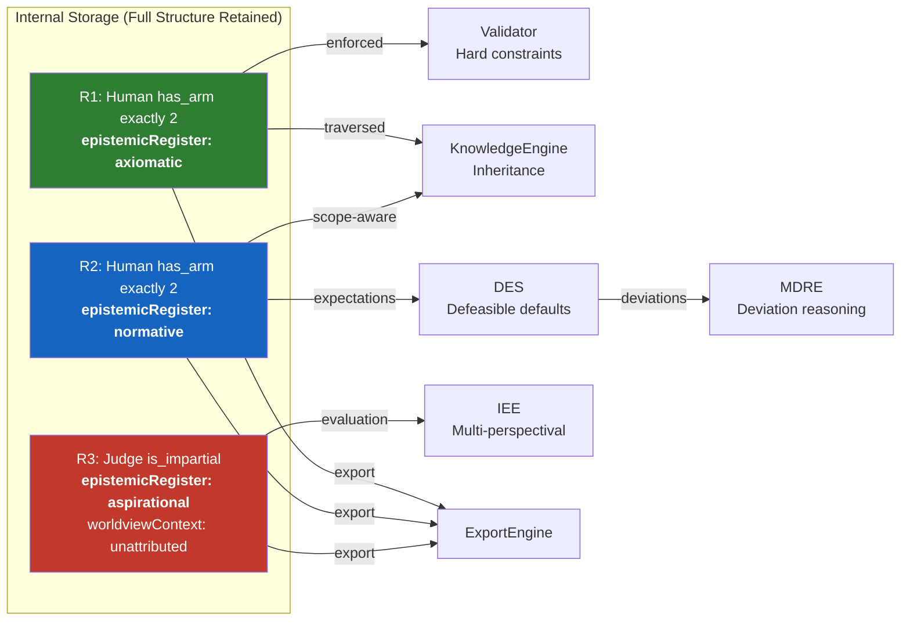
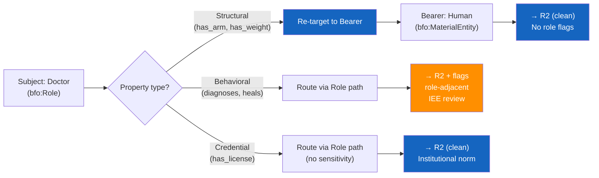
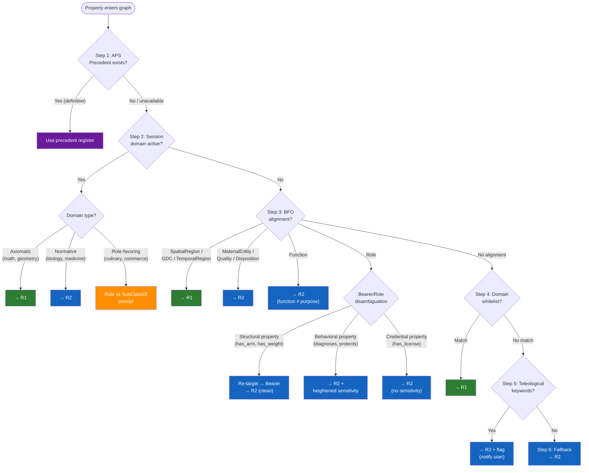

# The Normative-Axiomatic Conflation — Developer's Guide

**Version:** 1.2  
**Phase:** 9 — Fandaws Refactor  
**Author:** Aaron Damiano  
**Organization:** Ontology of Freedom Initiative  
**Date:** February 2026  
**Status:** Team Reference Document

---

## 1. The One-Sentence Version

The Normative-Axiomatic Conflation (NAC) is a specific engineering problem: **when humans describe things in natural language, they silently blend definitional facts, statistical norms, and value judgments into a single statement, and our system currently has no way to tell them apart.**

This document explains why that matters, what breaks when we ignore it, and what Phase 9 delivers to fix it.

---

## 2. The Problem in 60 Seconds

A user enters: **"Humans have two arms."**

That sentence has four possible readings, and they're all different:

| Register | Reading | What It Means | Consequence |
|----------|---------|---------------|-------------|
| **R1** (Axiomatic) | Definitional | Having two arms is part of what makes something human. | A one-armed person is not human. ← Wrong. |
| **R2** (Normative) | Statistical | Most humans have two arms, but exceptions exist and are fine. | A one-armed person is a human with an atypical trait. |
| **R3** (Aspirational) | Evaluative | Humans *should* have two arms — two-armedness is the ideal. | A one-armed person is "deficient." ← Dangerous. |
| — | Ambiguous | The user hasn't decided. The statement is underspecified. | The system has to guess. It will guess wrong. |

Right now, our system treats all four the same way. The property `has_arm` goes into the graph as an OWL axiom: `Human SubClassOf has_arm exactly 2`. That's Register 1 — axiomatic. It means a one-armed person literally fails to be a human according to our ontology.

That's the NAC. **We're accidentally encoding value judgments and statistical norms as logical definitions.** Not because anyone intended it, but because OWL doesn't have a way to say "typically" or "ideally." It only has "always."

---

## 3. Why It Matters for Us

This isn't a theoretical concern. It manifests in three concrete ways in Fandaws.

### 3.1 — Reasoning brittleness

When normative properties are stored as axioms, the reasoner treats exceptions as contradictions. A user adds a one-armed human instance and the Validator flags it as inconsistent. The user either removes the instance (losing real data) or weakens the axiom (losing useful structure). Neither outcome is acceptable.

### 3.2 — Concealed moral judgments

When aspirational properties are stored as axioms or norms, the system silently encodes value judgments as facts. `Mother SubClassOf nurtures_children` looks like biology. It's actually a moral expectation that pressures non-nurturing mothers. The system doesn't know the difference, so downstream services treat it as a factual claim — generating reports, making inferences, flagging deviations — all grounded in an undeclared value judgment.

### 3.3 — Scope contamination on import

When we import external OWL ontologies via the IVNE, every `SubClassOf` axiom arrives without any indication of whether it's definitional, statistical, or aspirational. If a medical ontology says `Patient SubClassOf has_diagnosis`, is that axiomatic (everyone with a diagnosis is a patient), normative (most patients have a diagnosis), or aspirational (patients should receive diagnoses)? The IVNE can't tell. It imports the axiom as-is, and the NAC propagates into our graph.

---

## 4. What We're Building: The Three-Register Model

Phase 9 introduces the **Epistemic Register Service (ERS)** — a routing service that sits between the NLParser and the KnowledgeEngine. Every property that enters the graph gets classified into one of three registers, and that classification controls how the property behaves downstream.

> **THE KEY IDEA**
>
> The register doesn't change the property's content. It changes its *logical strength*. The same statement — "humans have two arms" — can be stored in any register. What changes is whether the system treats exceptions as contradictions (R1), expected deviations (R2), or contested values (R3).

### Register 1: Axiomatic

Properties that are **definitional**. If an instance violates them, it's not an exception — it's a different kind of thing. "Triangles have three sides" is axiomatic. A shape with four sides isn't a weird triangle; it's not a triangle.

**OWL encoding:** Standard `SubClassOf` axioms. The reasoner and Validator enforce them as hard constraints. This is what we already do — the difference is that now, only claims that *actually belong here* get stored here.

### Register 2: Normative

Properties that are **statistically typical but admit exceptions**. "Humans have two arms" is normative. Most humans do, but a one-armed human is still a human. The property describes what's typical, not what's required.

**Internal encoding:** R2 properties retain their full structural definition — cardinality, range, data type restrictions — exactly as they would in R1. The difference is behavioral, not structural. The `fandaws:epistemicRegister: "normative"` annotation tells downstream consumers how to *interpret* the structure, not what structure is present. Internally, `Human has_arm exactly 2` is stored with the same cardinality constraint whether it's R1 or R2. The register controls which services consume it:

- The **Validator** ignores R2 properties entirely — it does not enforce their constraints.
- The **DES** (Phase 14+) reads R2 properties *with their full structure* and generates defeasible expectations from them. It needs the cardinality (`exactly 2`) to know what "typical" means. If R2 were flattened to annotation strings, the DES would have nothing to compute against.
- The standard **OWL reasoner** does not see R2 properties — they are excluded from the reasoning graph.

**Export encoding:** On export, R2 properties are encoded differently depending on the export profile. The `annotation-only` profile strips the structural definition and exports a flat annotation (for OWL consumers that aren't ERS-aware). The `named-graph` profile exports R2 properties with full structure into a separate named graph (for ERS-aware consumers that need the cardinality). The `reified-axiom` profile wraps the structured axiom in `owl:Axiom` reification with register metadata. The internal representation always retains full structure; the export profile controls how much of that structure is visible to external consumers.

### Register 3: Aspirational

Properties that encode **value judgments** — claims about what something *should be*, not what it *is*. "Judges are impartial" is aspirational. It's not describing what judges typically do (many are biased); it's asserting what judges ought to do, from a specific evaluative framework.

**Internal encoding:** Like R2, R3 properties retain their full structural definition internally. The additional requirement is a mandatory `fandaws:worldviewContext` tag that records *which* evaluative framework the claim depends on — or flags it as "evaluative, framework not yet identified" if the user can't name one. Only the Integral Ethics Engine (IEE, Phase 14+) consumes R3 properties. The IEE needs the structural definition to evaluate whether the claim, if treated as an axiom, would exclude or demean a protected group.

**Visual shorthand:** In the graph UI, the register determines line style. R1 = solid line (hard fact). R2 = dashed line (typical, exceptions expected). R3 = dotted gold line (value judgment, contestable).

### How Registers Control Data Flow



> **Internal vs. Export:** The register does NOT change the property's structure. `Human has_arm exactly 2` has the same cardinality whether it's R1 or R2. What changes is which services *see* it and what they *do* with it. The structure is always preserved internally; export profiles control what external consumers receive.

---

## 5. How BFO Categories Drive Routing

The ERS doesn't guess the register from keywords alone. Its primary signal is the **BFO upper-level category** of the subject class. The ontological category of the *thing being described* predicts the epistemic status of claims about it far better than the words used to describe it.

### 5.1 — The BFO-to-Register Map

| Subject's BFO Category | Register | Why |
|------------------------|----------|-----|
| `bfo:SpatialRegion`, `bfo:TemporalRegion` | **R1** (Axiomatic) | Pure geometry / temporal structure. A triangle *is* its dimensions. No variation possible. |
| `bfo:GenericallyDependentContinuant` | **R1** (Axiomatic) | Information artifacts — algorithms, patterns, logical structures. Defined by content. |
| `bfo:MaterialEntity` (`cco:Organism`, `cco:Artifact`) | **R2** (Normative) | Physical things have variation, mutation, damage, and accidents. A one-armed human is still human. |
| `bfo:Quality` | **R2** (Normative) | Color, mass, temperature. These exist in ranges and distributions, not fixed values. |
| `bfo:Disposition` | **R2** (Normative) | Fragility, solubility. Dispositions may never be realized. A fragile vase that never breaks is still fragile. |
| `bfo:Function` | **R2** (Normative) | Biological/artifactual functions grounded in physical structure. See §5.2. |
| `bfo:Role` | **R2** (Normative) | Social/contextual roles. Default normative with heightened sensitivity. See §5.3. |

### 5.2 — Why Function Is R2, Not R3

This is a critical design decision. An earlier architectural draft routed `bfo:Function` to R3 (Aspirational), reasoning that functions imply purpose and purpose implies telos. **The ERS explicitly rejects this.**

A heart's function is to pump blood. That's a `bfo:Function` — a `bfo:RealizableEntity` grounded in the heart's physical structure. A heart that fails to pump is *malfunctioning*: the disposition exists (the structure that enables pumping is present or was present) but is not being realized. The heart hasn't failed a moral obligation; it has failed a physical capacity.

Routing `bfo:Function` to R3 conflates biological function with moral purpose. That is literally the naturalistic fallacy — deriving an "ought" from an "is" — which is the core error the NAC paper identifies. The ERS preserves the distinction: `bfo:Function` → R2 (physical capacity, can fail), `bfo:Role` properties with teleological language → flagged for possible R3 (moral expectation, can be contested).

### 5.3 — Why Role Is R2, Not R3

Another critical correction from the same earlier draft. Routing `bfo:Role` directly to R3 is too aggressive, because most role-properties are genuinely normative:

- "Doctors have medical licenses" → R2 (statistical norm, some practice without licenses)
- "Teachers work in schools" → R2 (statistical norm, some teach privately)
- "Judges wear robes" → R2 (statistical norm, varies by jurisdiction)

Defaulting all role-properties to R3 would flood the aspirational register with mundane claims, diluting its purpose as a container for value judgments.

The ERS defaults `bfo:Role` to R2 with **heightened teleological sensitivity** — it flags the aspirational *risk* without *assuming* it. When the subject is a Role and the property text contains teleological keywords ("should," "meant to," "purpose," "duty"), the ERS attaches a `fandaws:flag/role-adjacent` flag and schedules IEE review. The system says: "This is probably normative, but watch it."

---

## 6. The Bearer/Role Disambiguation

This is one of the trickiest implementation details in the routing pipeline, and getting it wrong generates false positives that erode user trust.

### 6.1 — The Problem

Users constantly conflate the **Bearer** (the material entity that holds a role) with the **Role** itself. Consider:

- **"Doctors have two arms."** — This is a claim about the Bearer (`Human`, a `bfo:MaterialEntity`), not the Role (`Doctor`, a `bfo:Role`). The property `has_arm` applies to the physical person, not to the social role of doctoring.

- **"Doctors diagnose diseases."** — This is a claim about the Role's realization. Diagnosing is what the Doctor role *does*. The property `diagnoses` applies to the Role.

If the system sees "Doctors have two arms" and routes it through the `bfo:Role` path, it will trigger heightened sensitivity, attach a `role-adjacent` flag, and potentially schedule IEE review — all for a perfectly ordinary physical claim that has nothing to do with social expectations. That's a false positive that wastes reviewer time and trains users to ignore flags.

### 6.2 — The Heuristic: Property-Type Detection

The fix is a **property-type heuristic** that runs *before* BFO alignment. When the subject is a `bfo:Role`, the system checks the *property* to determine whether it applies to the Role or to the Bearer:

| Property Type | Applies To | Examples | Route Via |
|--------------|-----------|----------|-----------|
| **Structural** (parts, size, mass, physical attributes) | Bearer (`bfo:MaterialEntity`) | `has_arm`, `has_weight`, `has_height`, `has_eye_color` | Bearer's BFO category → R2 |
| **Behavioral / Functional** (actions, obligations, capacities tied to the role) | Role (`bfo:Role`) | `diagnoses`, `adjudicates`, `nurtures`, `protects`, `teaches` | Role path → R2 + heightened sensitivity |
| **Credential / Institutional** (qualifications, affiliations) | Role (`bfo:Role`) | `has_license`, `works_at`, `reports_to`, `holds_degree` | Role path → R2 (no sensitivity, these are institutional norms) |

### 6.3 — The Re-Targeting Mechanism



When the property-type heuristic detects a structural property on a Role subject, the ERS **re-targets** the BFO lookup:

```
Input:  "Doctors have two arms."
        Subject: Doctor (bfo:Role)
        Property: has_arm (structural)

Step 1: Property-type heuristic detects structural property.
Step 2: Re-target BFO lookup from Doctor (bfo:Role) → Human (bfo:MaterialEntity).
        The re-targeting uses the Role's Bearer class, which is the
        bfo:MaterialEntity that realizes the Role.
Step 3: Route via MaterialEntity path → R2 (Normative).
        No role-adjacent flag. No heightened sensitivity. Clean routing.
```

Compare with:

```
Input:  "Doctors diagnose diseases."
        Subject: Doctor (bfo:Role)
        Property: diagnoses (behavioral)

Step 1: Property-type heuristic detects behavioral property.
Step 2: No re-targeting. Route via Role path.
Step 3: R2 (Normative) + heightened teleological sensitivity.
        flag/role-adjacent attached. IEE review scheduled.
```

### 6.4 — Implementation Notes

The property-type heuristic uses two signals:

1. **BFO alignment of the property's range.** If the property's range (the type of thing the property points to) is a `bfo:MaterialEntity`, `bfo:Quality`, or `bfo:SpatialRegion`, the property is likely structural. If the range is a `bfo:Process`, `bfo:Role`, or `bfo:RealizableEntity`, the property is likely behavioral.

2. **NLParser semantic classification.** The NLParser already classifies predicates into rough categories (physical-attribute, action, state, relation). The ERS can consume this classification as a secondary signal. Physical-attribute predicates on Role subjects trigger re-targeting.

The heuristic is **not infallible.** "Doctors have steady hands" is a structural property (`has_hand_steadiness` → `bfo:Quality`) that is also a role-relevant expectation. The heuristic would re-target it to the Bearer and route to R2 without a flag. That's a false negative — but a safe one, because the claim *is* normative regardless of whether the steadiness is role-relevant. The heightened sensitivity is a bonus, not a requirement, for borderline cases like this.

The re-targeting requires that the Role's **Bearer class** is known. In a well-structured graph, `Doctor has_bearer Human` (or equivalently, `Doctor SubClassOf inheresIn some Human`) provides the link. In a cold-start graph where the Bearer isn't specified, the re-targeting falls back to the Role path. This is another reason session domains matter — a user who declares "I'm building a medical ontology" is more likely to have a well-structured Role-Bearer relationship than a user in a fresh graph.

---

## 7. How the Routing Pipeline Works

When a property enters the graph — whether from user conversation, NLParser output, or IVNE import — the ERS runs a 6-step pipeline to assign a register:

```
Step 1 │ Check APS (Analogical Precedent Service)
       │ Has a similar claim been routed before? Use that precedent.
       │ → Skip if APS unavailable (Phase 14+)
       │
Step 2 │ Check session domain
       │ User declared "I'm doing geometry"? Route to R1.
       │ User declared "I'm building a medical ontology"? Route to R2.
       │
Step 3 │ BFO alignment (with Bearer/Role disambiguation)
       │ Subject is bfo:Quality? → R1.
       │ Subject is bfo:Role + structural property? → Re-target to Bearer.
       │ Subject is bfo:Role + behavioral property? → R2 + sensitivity.
       │ Subject is bfo:Function? → R2 (not R3 — function ≠ purpose).
       │
Step 4 │ Domain whitelist
       │ Subject tagged to mathematics/geometry/logic? → R1.
       │
Step 5 │ Teleological signal detection
       │ Does the property text contain "should," "meant to," "purpose"?
       │ → Flag it, but DON'T auto-route to R3. Notify the user.
       │
Step 6 │ Fallback → R2 (Normative)
       │ If nothing matched, default to the safest register.
```

The pipeline is **biased toward safety**. Register 2 (Normative) is the default because it's the least dangerous mistake. Routing a normative claim to R1 makes the system brittle. Routing a normative claim to R3 makes the system suspicious of ordinary facts. Routing everything to R2 by default means exceptions work correctly even when the heuristics fail.

### Routing Pipeline Flowchart



**Users can always override.** If the system routes "triangles have three sides" to R2 (because there's no BFO alignment in a fresh graph), the user can correct it to R1. That correction is stored as an override and fed back to the APS as a precedent for future similar claims.

### Performance Budget

The pipeline runs on every property insertion, so latency matters. The ERS spec (v2.3 §14) defines a **< 10ms fast-path budget** for Steps 2–6. These steps are all in-memory, local, and deterministic — session domain lookup, BFO category check, whitelist match, keyword scan, fallback. No graph traversals, no external calls.

Step 1 (APS precedent lookup) is the exception. It requires a similarity search across stored routing records, which can exceed 10ms for large precedent stores. The ERS handles this with **optional async enrichment** (`ers:asyncEnrichment` config):

1. The synchronous fast path executes Steps 2–6 and commits the property with the fast-path register immediately.
2. The async enrichment executes Step 1 in the background. If the APS suggests a different register, it emits a `fandaws:flag/precedent-pending` flag and schedules a re-evaluation.
3. If re-evaluation changes the register, the user is notified and a new `RegisterRoutingRecord` is created.

Async enrichment is disabled by default. Safety-critical operations (BFO alignment, teleological detection) are **never** deferred — they always run synchronously in the fast path.

---

## 8. The Data Model

Every property edge in the graph gets three new fields:

```json
{
  "@id": "fandaws:property/{hash}",
  "@type": "fandaws:Property",
  "fandaws:label": "has two arms",
  "fandaws:attachedTo": "fandaws:concept/human",

  "fandaws:epistemicRegister": "fandaws:register/normative",
  "fandaws:routingRecord": "fandaws:routing/{hash}",
  "fandaws:routingFlags": []
}
```

The `epistemicRegister` field is the register assignment. The `routingRecord` is a pointer to a first-class `RegisterRoutingRecord` entity that documents *why* the ERS made this decision:

```json
{
  "@id": "fandaws:routing/{hash}",
  "@type": "fandaws:RegisterRoutingRecord",
  "fandaws:subjectConcept": "fandaws:concept/human",
  "fandaws:property": "fandaws:property/{hash}",
  "fandaws:assignedRegister": "fandaws:register/normative",
  "fandaws:routingMethod": "fandaws:method/structural",
  "fandaws:routingStrength": "fandaws:strength/structural",
  "fandaws:trigger": "bfo:MaterialEntity + biological",
  "fandaws:createdAt": "2026-02-17T10:00:00Z",
  "fandaws:createdBy": "ers:service"
}
```

The routing record is **immutable and auditable**. If a user overrides the assignment, a new routing record is created with `method: "override"` and the old record's `overriddenBy` field points to the new one. The full history of routing decisions is preserved.

**The hash is deterministic.** The `@id` is computed as SHA-256 of the logical payload (subject + property + value + register + method), excluding the timestamp. Identical routing decisions on identical claims produce identical IDs. This makes migration idempotent and deduplication trivial.

---

## 9. Concrete Routing Examples

These trace through the pipeline to show how BFO alignment, Bearer/Role disambiguation, and fallback interact.

### Example 1: "Rectangles have four right angles."

```
Subject:   Rectangle
BFO path:  Rectangle → bfo:SpatialRegion
Pipeline:  Step 3 (BFO alignment) → R1 (Axiomatic)
OWL:       Rectangle SubClassOf (has_angle exactly 4 RightAngle)
Register:  R1 — hard axiom, enforced by Validator
```

A shape with three right angles is not a rectangle. No variation possible.

### Example 2: "Birds fly."

```
Subject:   Bird
BFO path:  Bird → cco:Organism → bfo:MaterialEntity
Pipeline:  Step 3 (BFO alignment) → R2 (Normative)
OWL:       AnnotationProperty with epistemicRegister: "normative"
Register:  R2 — penguins are birds that don't fly, not non-birds
```

The DES (Phase 14+) will generate a defeasible expectation: "birds typically fly." A penguin triggers a recorded defeat, not a logical contradiction.

### Example 3: "Doctors heal patients."

```
Subject:   Doctor
BFO path:  Doctor → bfo:Role
Property:  heals (behavioral → stays on Role path)
Pipeline:  Step 3 (BFO alignment) → R2 + heightened sensitivity
Flags:     fandaws:flag/role-adjacent
Register:  R2 — but flagged for IEE review
```

A doctor who harms patients is a bad doctor, not a non-doctor. The claim is normative (most doctors do heal) but carries aspirational risk (it might encode a moral expectation). The IEE (Phase 14+) will evaluate whether this should be promoted to R3.

### Example 4: "Doctors have two arms."

```
Subject:   Doctor
BFO path:  Doctor → bfo:Role
Property:  has_arm (structural → re-target to Bearer)
Bearer:    Human → bfo:MaterialEntity
Pipeline:  Step 3 (BFO alignment via Bearer) → R2 (Normative)
Flags:     (none — clean routing, no role sensitivity)
Register:  R2 — ordinary physical claim about the person, not the role
```

The Bearer/Role disambiguation detected a structural property on a Role subject and re-targeted to the Bearer's BFO category. No false-positive role-adjacent flag.

### Example 5: "Judges must adjudicate impartially."

```
Subject:   Judge
BFO path:  Judge → bfo:Role
Property:  adjudicates_impartially (behavioral → stays on Role path)
Keywords:  "must" → deontic detection fires
Pipeline:  Step 3 (BFO alignment) → R2 + heightened sensitivity
Flags:     fandaws:flag/role-adjacent, fandaws:flag/deontic-role-definition
Register:  R2 — but double-flagged for IEE review
```

The deontic flag (v2.3) signals that this may be a role-*defining* obligation rather than a behavioral norm. The IEE will determine whether "must adjudicate impartially" is constitutive of the Judge role (R1 candidate) or a moral expectation (R3 candidate).

### Example 6: "Tomatoes are vegetables." (Session domain: culinary)

```
Subject:     Tomato
Assertion:   SubClassOf Vegetable
Session:     culinary (role-favoring domain)
Pipeline:    Role-favoring prompt fires → user chooses modeling
Option A:    Tomato has_role CulinaryVegetable (BFO-correct)
Option B:    Tomato SubClassOf Vegetable (scope: culinary) — scoped subsumption
Register:    R2 either way — scope isolation prevents cross-framework leakage
```

---

## 10. What Downstream Services Do With Registers

The register assignment isn't just metadata — it controls which services consume the property and how they treat it:

| Service | R1 | R2 | R3 | What It Does |
|---------|----|----|-----|-------------|
| **Validator** | ✓ | — | — | Enforces R1 as hard constraints. R2/R3 invisible. |
| **KnowledgeEngine** | ✓ | ✓ | — | Traverses R1 unconditionally. R2 through scope-aware API. |
| **DES** | — | ✓ | — | Generates defeasible expectations from R2. Tracks defeats. |
| **IEE** | — | — | ✓ | Evaluates R3 from multiple worldview perspectives. |
| **MDRE** | — | ✓* | — | Reasons about instance-level deviations from DES expectations. |
| **ExportEngine** | ✓ | ✓ | ✓ | Exports each register with appropriate OWL encoding. |

**Phase 9 delivers the ERS.** The DES, IEE, APS, and MDRE are Phase 14+ deliverables. The ERS degrades gracefully without them — routing works, register metadata is written, overrides function, but the downstream behavioral semantics aren't active yet.

---

## 11. What Phase 9 Delivers

Phase 9 has two core deliverables and one integration point.

### 11.1 — ERS Core (build first)

The 6-step routing pipeline, RegisterRoutingRecord schema, Bearer/Role disambiguation, override mechanism (visual + conversational + batch), session domains with NLParser intent detection, role-favoring prompts for applied domains, scope isolation for normative subsumption, role-sensitivity heuristics with deontic detection, harm-signal screening for Register 3 in shared graphs, and 28 acceptance tests. Zero dependency on IVNE.

### 11.2 — IVNE Core (build second)

OWL ingestion, validation, normalization, and SemanticLossRecord generation. The P1–P7 pipeline. Zero dependency on ERS for its core function.

### 11.3 — ERS ↔ IVNE Integration (build last)

Mode A post-processing: after IVNE imports an ontology, the ERS retroactively annotates the imported axioms with register metadata. Import conflict resolution for cases where IVNE and ERS disagree about an axiom's register. Requires both services to be functional.

> **BUILD ORDER**
>
> ERS core → IVNE core → Integration. The ERS is the keystone of Phase 9 — every downstream service in the FNSR ecosystem depends on the register model it defines. Build it first, validate it with the 28 acceptance tests, then wire it to the IVNE.

---

## 12. What We Aren't Solving Yet

The ERS spec lists six hard problems that Phase 9 acknowledges but does not fully resolve:

- **The Classification Problem.** The ERS routes properties, not class membership. Whether a whale is a fish or a mammal is a subsumption question. The ERS handles subsumption separately with scoped normative SubClassOf, but contested classification remains open.

- **The Worldview Problem.** Register 3 claims require a worldview tag, but most users can't name their evaluative framework. The generic tag ("Evaluative — framework not yet identified") is a participation patch. The IEE (Phase 14+) will begin to address this.

- **The SubClassOf vs. Role Realization Problem.** Users say "tomatoes are vegetables" and mean SubClassOf. The BFO-correct modeling is `has_role`. The ERS tolerates SubClassOf for usability and compensates with scope isolation and role-favoring prompts. This is acknowledged technical debt.

### Scope Isolation: How It Actually Works

Scope isolation is the containment mechanism that prevents normative SubClassOf edges from leaking across framework boundaries. It's defined in ERS v2.3 §2.5, but since the critic flagged it as unclear, here's the concrete mechanism.

**The problem:** If `Tomato SubClassOf Vegetable` (culinary scope) and `Tomato SubClassOf Fruit` (botanical scope) both exist in the graph, a culinary reasoning engine could traverse the botanical parent edge and deduce that tomatoes have seeds *because they are fruits*. That's cross-scope leakage.

**The mechanism has five constraints:**

1. **Scope-gated traversal.** The KnowledgeEngine MUST NOT traverse normative `fandaws:parent` edges unless the query's active scope matches the `fandaws:classificationScope` tag on the edge. A query with `scope: culinary` sees `Tomato → Vegetable`. A query with `scope: botanical` sees `Tomato → Fruit`. A query with no scope sees *neither* — normative subsumption edges are invisible by default.

2. **Inheritance tagging.** Properties inherited through normative subsumption carry `fandaws:inheritedViaScope` with the full chain path. If `Vegetable` has property `used_in_salad`, and `Tomato SubClassOf Vegetable` is scoped to culinary, then `Tomato` inherits `used_in_salad` only when the culinary scope is active — and the inherited property is tagged with its scope origin for auditing.

3. **Intra-scope consistency.** The Validator permits `Tomato SubClassOf Vegetable` (culinary) and `Tomato SubClassOf Fruit` (botanical) — different scopes, no conflict. But it rejects `Tomato SubClassOf Vegetable` and `Tomato SubClassOf NOT-Vegetable` in the *same* scope — that's an intra-scope contradiction.

4. **Scope-safe API enforcement.** All property inheritance through normative subsumption MUST go through the KnowledgeEngine's scope-aware API. Direct graph queries (SPARQL, raw JSON-LD traversal) are NOT scope-safe. Data properties on normative superclasses — like `price_per_pound` on `Vegetable` — can leak to `Tomato` if clients bypass the KnowledgeEngine.

5. **Export isolation.** The ExportEngine exports scoped subsumption as OWL annotation properties (not `SubClassOf`) in the `annotation-only` profile, and as separate named graphs in the `named-graph` profile. Standard OWL reasoners never see normative subsumption edges.

- **The Register Boundary Problem.** Some claims genuinely straddle two registers. "Humans are social creatures" could be normative, aspirational, or axiomatic. The RegisterAmbiguity structure records the boundary case, but three discrete registers are inherently lossy.

- **The Role Trap.** Social roles are where the NAC is most dangerous and hardest to detect. "Mothers nurture children" is grammatically identical to "humans have two arms" but carries hidden moral weight. Heightened sensitivity and deontic detection help; the fundamental ambiguity remains.

- **The Normative Subsumption Problem.** Every scoped SubClassOf edge (`Tomato SubClassOf Vegetable` in the culinary scope) is a BFO category error that scope isolation must actively contain. If scope isolation fails, the error propagates. Role-favoring prompts nudge users toward the correct `has_role` modeling.

These are the problems the ERS *contains* rather than *solves*. They will be addressed iteratively by the DES, IEE, and APS in later phases.

---

## 13. Key Terms

| Term | Definition |
|------|-----------|
| **NAC** | Normative-Axiomatic Conflation. The error of encoding statistical norms or value judgments as logical definitions. |
| **ERS** | Epistemic Register Service. The Phase 9 routing service that classifies properties into registers. |
| **Register 1 (R1)** | Axiomatic. Definitional. Exceptions are contradictions. |
| **Register 2 (R2)** | Normative. Typical. Exceptions are expected and non-contradictory. |
| **Register 3 (R3)** | Aspirational. Evaluative. Value judgments that depend on a philosophical framework. |
| **RegisterRoutingRecord** | First-class entity that documents why a property was assigned to a specific register. |
| **Bearer** | The `bfo:MaterialEntity` that holds a `bfo:Role`. "Doctors have two arms" is about the Bearer (Human), not the Role (Doctor). |
| **DES** | Defeasible Expectation Service. Consumes R2. Generates expectations, tracks defeats. Phase 14+. |
| **IEE** | Integral Ethics Engine. Consumes R3. Multi-perspectival evaluation. Phase 14+. |
| **APS** | Analogical Precedent Service. Learns from routing corrections. Feeds back into ERS Step 1. Phase 14+. |
| **MDRE** | Model-Dependent Reasoning Engine. Reasons about instance-level deviations. Downstream of DES. Phase 14+. |
| **IVNE** | Ingestion, Validation & Normalization Engine. Imports external OWL ontologies. |
| **Worldview Context** | Mandatory tag on R3 properties identifying which evaluative framework the value judgment depends on. |
| **Scope Isolation** | Mechanism preventing normative SubClassOf edges from leaking across framework boundaries. |
| **Session Domain** | User-declared context ("I'm doing geometry") that overrides the fallback register for cold-start graphs. |

---

## 14. Reference Documents

1. **NAC Problem Statement v1.1** — The theoretical foundation. Defines the four readings, the three registers, and why the conflation is dangerous. Read this for the philosophical argument.

2. **ERS Specification v2.3** — The complete engineering spec. 20 sections, 28 acceptance tests, 26 configuration parameters, 25 deliverables. Read this if you're implementing.

3. **IVNE Specification v2.4** — The import engine spec. Relevant for the ERS ↔ IVNE integration point and the P7 consumer obligation.

4. **FNSR Service Dependency Diagram** — Visual map of all sub-services, their dependencies, and the phased implementation order.

---

## Revision History

| Version | Date | Changes |
|---------|------|---------|
| v1.0 | Feb 2026 | Initial developer introduction. Three-register model, routing pipeline, data model, downstream consumer contracts, Phase 9 deliverables, hard problems, glossary. |
| v1.1 | Feb 2026 | Incorporated Bearer/Role disambiguation heuristic (§6) from BFO-native architectural draft. Added §5 (BFO categories drive routing) with explicit corrections: `bfo:Function` → R2 not R3 (§5.2), `bfo:Role` → R2 not R3 (§5.3). Added property-type detection heuristic (structural vs. behavioral vs. credential). Added re-targeting mechanism for structural properties on Role subjects. Expanded routing pipeline (§7) to include Bearer/Role disambiguation at Step 3. Added six concrete routing examples (§9) tracing full pipeline paths including Bearer re-targeting and deontic detection. Added Bearer to glossary. |
| v1.2 | Feb 2026 | Addressed architectural review. **(1) R2/R3 encoding clarified (§4):** Internal encoding retains full structural definition (cardinality, range, data type restrictions) for all registers. Register controls which services consume the property, not what structure is stored. Export encoding varies by profile (annotation-only, named-graph, reified-axiom). Eliminates the "annotation weakness" — the DES can compute against full cardinality constraints. **(2) Performance budget added (§7):** < 10ms fast-path for Steps 2–6 (in-memory, local, deterministic). Optional async enrichment for APS (Step 1) with `fandaws:flag/precedent-pending` for deferred results. Safety-critical operations never deferred. **(3) Scope isolation explained (§12):** Expanded from one-line mention to five-constraint mechanism description: scope-gated traversal, inheritance tagging, intra-scope consistency, scope-safe API enforcement, export isolation. **(4) Three diagrams added:** Register data flow diagram (§4), Bearer/Role disambiguation flowchart (§6.3), full routing pipeline flowchart (§7). |

---

*Questions? Reach out to Aaron directly or raise them in the Phase 9 channel.*
